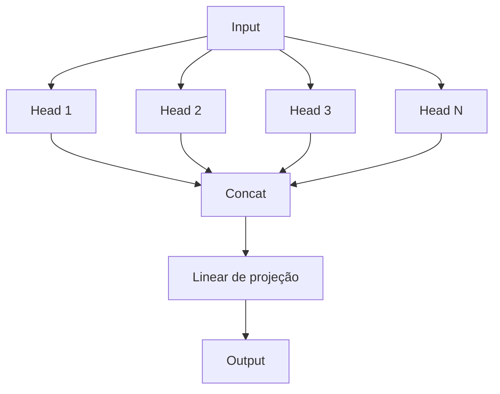

# Arquitetura Transformer

> A revolução de 2017 que mudou tudo: entender o Transformer é a base para entender GPT, BERT, e todos os LLMs modernos.

## Contexto Histórico

Em 2017, o paper **"Attention is All You Need"** (Vaswani et al.) introduziu o Transformer, uma arquitetura que revolucionou o NLP (Processamento de Linguagem Natural).

Antes do Transformer:
- **RNNs/LSTMs** processavam sequências elemento por elemento (sequencial, lento)
- **CNNs** capturavam padrões locais, mas não dependências de longo alcance

O Transformer trouxe:
- **Paralelização total** no treinamento
- **Atenção** como mecanismo principal
- **Escalabilidade** para modelos cada vez maiores

---

## Visão Geral da Arquitetura

O Transformer original tem duas partes:

```
┌─────────────────────────────────────────────────────────────────────────┐
│                        Transformer Completo                               │
├─────────────────────────────┬───────────────────────────────────────────┤
│         ENCODER             │              DECODER                       │
├─────────────────────────────┼───────────────────────────────────────────┤
│                             │                                            │
│  Input Embedding            │  Output Embedding                          │
│  + Positional Encoding      │  + Positional Encoding                     │
│         │                   │         │                                  │
│         ▼                   │         ▼                                  │
│  Multi-Head Self-Attention  │  Masked Multi-Head Self-Attention          │
│         │                   │         │                                  │
│         ▼                   │         ▼                                  │
│  Add & Norm                 │  Cross-Attention ◄──── Encoder output      │
│         │                   │         │                                  │
│         ▼                   │         ▼                                  │
│  Feed Forward               │  Feed Forward                              │
│         │                   │         │                                  │
│         ▼                   │         ▼                                  │
│  Add & Norm                 │  Linear + Softmax                          │
│         │                   │         │                                  │
│         ▼                   │         ▼                                  │
│  [Representações            │  [Saída traduzida]                         │
│   contextuais]              │                                            │
└─────────────────────────────┴───────────────────────────────────────────┘
```

### Encoder
- Processa a entrada (ex: texto em português)
- Gera representações contextuais

### Decoder
- Gera a saída (ex: tradução em inglês)
- Usa representações do encoder via cross-attention

---

## O ChessLM usa apenas o Decoder

Language Models como GPT usam **apenas o Decoder**:

```
Arquitetura Decoder-Only (GPT-like)
════════════════════════════════════════════════════════════

    Input Tokens
         │
         ▼
┌─────────────────────┐
│ Embeddings          │
│ Token + Positional  │
└──────────┬──────────┘
           │
           ▼
┌─────────────────────┐
│ Transformer Block 1 │
└──────────┬──────────┘
           │
           ▼
┌─────────────────────┐
│ Transformer Block 2 │
└──────────┬──────────┘
           │
           ▼
          ...
           │
           ▼
┌─────────────────────┐
│ Transformer Block N │
└──────────┬──────────┘
           │
           ▼
┌─────────────────────┐
│     LayerNorm       │
└──────────┬──────────┘
           │
           ▼
┌─────────────────────┐
│      Linear         │
└──────────┬──────────┘
           │
           ▼
┌─────────────────────┐
│ Logits / Probs      │
│ (próximo token)     │
└─────────────────────┘
```

### Por que Decoder-Only?

1. **Simplicidade**: Não precisa de encoder
2. **Geração autoregressiva**: Ideal para gerar texto token por token
3. **Escalabilidade**: Funciona muito bem em larga escala (GPT-3, LLaMA)

---

## Componentes do Transformer

### 1. Embeddings (Incorporações)

Convertem tokens (inteiros) em vetores densos.

```python
# Token Embedding
embedding = nn.Embedding(vocab_size, d_model)  # (vocab_size, 256)

# Positional Encoding (codificação posicional)
# Como o transformer não tem noção de ordem, adicionamos informação posicional
```

#### Tipos de Positional Encoding

| Tipo | Descrição |
|------|-----------|
| **Sinusoidal** | Original do paper, fixo, não aprendido |
| **Learned** | Embeddings aprendidos (GPT-2, ChessLM) |
| **RoPE** | Rotary Position Embedding (LLaMA, moderno) |

ChessLM usa **learned position embeddings**:

```python
self.wpe = nn.Embedding(block_size, d_model)  # Position embeddings
```

---

### 2. Self-Attention (Auto-Atenção) (Self-Attention)

O mecanismo mais importante do Transformer.

#### Intuição

Cada token "pergunta" para todos os outros tokens: "Quanto você é relevante para mim?"

```
Para o token 'gato' na frase "O gato subiu":

   token: "O"     ──► relevância: 0.1  ──┐
                                            │
   token: "gato"  ──► relevância: 1.0  ──┼──► Contexto agregado
                                            │    para 'gato'
   token: "subiu" ──► relevância: 0.3  ──┘

Cada token contribui proporcionalmente à sua relevância.
A "gato" mesmo tem a maior relevância (auto-atenção).
```

#### Mecanismo

```
                    ┌─────────────┐
                    │   Input X   │
                    └──────┬──────┘
             ┌────────────┼────────────┐
             ▼            ▼            ▼
      ┌───────────┐ ┌───────────┐ ┌───────────┐
      │ Linear Q  │ │ Linear K  │ │ Linear V  │
      └─────┬─────┘ └─────┬─────┘ └─────┬─────┘
            │             │             │
            ▼             ▼             ▼
      ┌───────────┐ ┌───────────┐ ┌───────────┐
      │ Query (Q) │ │  Key (K)  │ │ Value (V) │
      └─────┬─────┘ └─────┬─────┘ └─────┬─────┘
            │             │             │
            └──────┬──────┘             │
                   ▼                    │
          ┌────────────────┐            │
          │   Q × K^T      │            │
          │  (Similaridade)│            │
          └───────┬────────┘            │
                  │                     │
                  ▼                     │
          ┌────────────────┐            │
          │    Softmax     │            │
          │(Attn Weights)  │            │
          └───────┬────────┘            │
                  │                     │
                  └──────────┬──────────┘
                             ▼
                   ┌────────────────┐
                   │  Attn × V      │
                   │ (Valores pond.)│
                   └───────┬────────┘
                           │
                           ▼
                   ┌────────────────┐
                   │    Output      │
                   └────────────────┘
```

#### Fórmula Matemática

$$\text{Attention}(Q, K, V) = \text{softmax}\left(\frac{QK^T}{\sqrt{d_k}}\right)V$$

Onde:
- $Q$ (Query): "o que estou procurando"
- $K$ (Key): "o que cada token oferece"
- $V$ (Value): "o conteúdo real de cada token"
- $\sqrt{d_k}$: fator de escala para estabilidade numérica

#### Implementação Simplificada

```python
class SelfAttention:
    def forward(self, x):
        # x: (batch, seq_len, d_model)
        
        # Projeções lineares
        Q = self.q_proj(x)  # (batch, seq_len, d_model)
        K = self.k_proj(x)
        V = self.v_proj(x)
        
        # Scores de atenção
        scores = Q @ K.transpose(-2, -1)  # (batch, seq_len, seq_len)
        scores = scores / math.sqrt(d_k)
        
        # Softmax
        attn_weights = F.softmax(scores, dim=-1)
        
        # Agrega valores
        output = attn_weights @ V
        
        return output
```

---

### 3. Multi-Head Attention (Atenção Multi-Cabeça) (Multi-Head Attention)

Divide a atenção em múltiplas "cabeças", cada uma aprendendo diferentes relações.



#### Por que múltiplas cabeças?

Cada cabeça pode aprender diferentes tipos de relações:
- Cabeça 1: Relações sintáticas
- Cabeça 2: Relações semânticas
- Cabeça 3: Relações posicionais
- ...

#### Implementação

```python
class MultiHeadAttention:
    def __init__(self, d_model, n_heads):
        self.n_heads = n_heads
        self.head_dim = d_model // n_heads
        
        # Projeções combinadas para eficiência
        self.qkv_proj = nn.Linear(d_model, 3 * d_model)
        self.out_proj = nn.Linear(d_model, d_model)
    
    def forward(self, x):
        B, T, C = x.shape
        
        # Calcula Q, K, V de uma vez
        qkv = self.qkv_proj(x)  # (B, T, 3*C)
        q, k, v = qkv.split(C, dim=-1)
        
        # Reshape para múltiplas cabeças
        q = q.view(B, T, self.n_heads, self.head_dim).transpose(1, 2)
        k = k.view(B, T, self.n_heads, self.head_dim).transpose(1, 2)
        v = v.view(B, T, self.n_heads, self.head_dim).transpose(1, 2)
        
        # Atenção por cabeça
        attn = (q @ k.transpose(-2, -1)) / math.sqrt(self.head_dim)
        attn = F.softmax(attn, dim=-1)
        out = attn @ v
        
        # Concatena cabeças
        out = out.transpose(1, 2).contiguous().view(B, T, C)
        
        return self.out_proj(out)
```

---

### 4. Causal Mask (Máscara Causal) (Causal Mask)

No Decoder, cada token só pode "ver" tokens anteriores.

```
Matriz de Atenção Causal:

Token 1  →  vê posições [1]
Token 2  →  vê posições [1, 2]
Token 3  →  vê posições [1, 2, 3]
Token 4  →  vê posições [1, 2, 3, 4]
```

Matriz de atenção com máscara:

```
Para sequência [A, B, C, D]:

Atenção permitida:
    A  B  C  D
A [ 1  0  0  0 ]   ← A só vê A
B [ 1  1  0  0 ]   ← B vê A, B
C [ 1  1  1  0 ]   ← C vê A, B, C
D [ 1  1  1  1 ]   ← D vê todos

0 = posição mascarada (não pode ver)
1 = posição permitida
```

Implementação:

```python
# Matriz triangular inferior
mask = torch.tril(torch.ones(seq_len, seq_len))

# Aplica máscara
scores = scores.masked_fill(mask == 0, float('-inf'))
# -inf antes do softmax = 0 após softmax
```

---

### 5. Feed-Forward Network (Rede Feed-Forward) (Feed-Forward)

Após a atenção, cada posição passa por uma MLP independente.

```python
class FeedForward:
    def __init__(self, d_model, d_ff):
        self.fc1 = nn.Linear(d_model, d_ff)    # Expande
        self.fc2 = nn.Linear(d_ff, d_model)    # Contrai
        self.activation = nn.GELU()             # ou ReLU
    
    def forward(self, x):
        return self.fc2(self.activation(self.fc1(x)))
```

Tipicamente $d_{ff} = 4 \times d_{model}$.

---

### 6. Layer Normalization (Normalização de Camada) (LayerNorm)

Normaliza as ativações para estabilidade no treinamento.

```python
# LayerNorm normaliza ao longo da última dimensão
ln = nn.LayerNorm(d_model)

# Fórmula:
# output = (x - mean) / std * gamma + beta
```

#### Pre-LN vs Post-LN

```
Comparação: Pre-LN vs Post-LN
───────────────────────────────────────────────────────────────────

Post-LN (Original):              Pre-LN (Moderno - ChessLM usa):

       x                               x
       │                               │
       ▼                               ▼
┌─────────────┐                 ┌─────────────┐
│  Attention  │                 │  LayerNorm  │
└──────┬──────┘                 └──────┬──────┘
       │                               │
       ▼                               ▼
   ┌───┴───┐                       ┌─────────────┐
   │  Add  │◄───── x ────┐         │  Attention  │
   └───┬───┘             │         └──────┬──────┘
       │                 │                │
       ▼                 │                ▼
┌─────────────┐          │            ┌───┴───┐
│  LayerNorm  │          │            │  Add  │◄───── x ────┐
└─────────────┘          │            └───┬───┘             │
                         │                │                 │
                         └────────────────┴─────────────────┘
```

Pre-LN é mais estável para redes profundas.

---

### 7. Residual Connections (Conexões Residuais)

Adiciona a entrada à saída de cada bloco:

```python
# Residual connection
x = x + attention(layer_norm(x))
x = x + feed_forward(layer_norm(x))
```

Benefícios:
- Melhora fluxo de gradientes
- Permite treinar redes muito profundas

---

## Bloco Transformer Completo

```
Transformer Block (repete N vezes)
════════════════════════════════════════════════════════════

            x (Input)
               │
               ▼
       ┌─────────────┐
       │ LayerNorm 1 │
       └──────┬──────┘
              │
              ▼
   ┌────────────────────┐
   │ Multi-Head         │
   │ Self-Attention     │
   └──────────┬─────────┘
              │
              ▼
        ┌──────────┐
        │ Dropout  │
        └────┬─────┘
             │
             ▼
           (+)◄────────────── x (Residual)
             │
             ▼
       ┌─────────────┐
       │ LayerNorm 2 │
       └──────┬──────┘
              │
              ▼
       ┌─────────────┐
       │    MLP      │
       │ (4x expand) │
       └──────┬──────┘
              │
              ▼
        ┌──────────┐
        │ Dropout  │
        └────┬─────┘
             │
             ▼
           (+)◄────────────── (Residual)
             │
             ▼
           x' (Output)
```

No ChessLM:

```python
class Block(nn.Module):
    def __init__(self, cfg):
        self.ln1 = nn.LayerNorm(cfg.n_embd)
        self.attn = CausalSelfAttention(cfg)
        self.ln2 = nn.LayerNorm(cfg.n_embd)
        self.mlp = MLP(cfg)
    
    def forward(self, x):
        x = x + self.attn(self.ln1(x))  # Pre-LN + Residual
        x = x + self.mlp(self.ln2(x))   # Pre-LN + Residual
        return x
```

---

## Arquitetura Completa do ChessLM

```
Arquitetura ChessLM
════════════════════════════════════════════════════════════

    ┌────────────────────────────────────────────────┐
    │              INPUT: Token IDs                  │
    │            (batch, seq_len)                    │
    └─────────────────────┬──────────────────────────┘
                          │
          ┌───────────────┴───────────────┐
          ▼                               ▼
  ┌────────────────┐             ┌────────────────┐
  │ Token Embed    │             │ Position Embed │
  │     (wte)      │             │     (wpe)      │
  │ vocab → n_embd │             │  pos → n_embd  │
  └───────┬────────┘             └───────┬────────┘
          │                               │
          └───────────────┬───────────────┘
                          ▼
                    ┌──────────┐
                    │  + Add   │
                    └────┬─────┘
                         ▼
                    ┌──────────┐
                    │ Dropout  │
                    └────┬─────┘
                         │
          ┌──────────────┼──────────────┐
          ▼              ▼              ▼
    ┌──────────┐   ┌──────────┐   ┌──────────┐
    │ Block 1  │──►│   ...    │──►│ Block 6  │
    │(Transf.) │   │ Block 2  │   │(Transf.) │
    └──────────┘   └──────────┘   └────┬─────┘
                                       │
                                       ▼
                                ┌──────────────┐
                                │  LayerNorm   │
                                │    (ln_f)    │
                                └──────┬───────┘
                                       │
                                       ▼
                                ┌──────────────┐
                                │   Linear     │
                                │  (lm_head)   │
                                │ n_embd→vocab │
                                └──────┬───────┘
                                       │
                                       ▼
    ┌────────────────────────────────────────────────┐
    │              OUTPUT: Logits                    │
    │       (batch, seq_len, vocab_size)             │
    └────────────────────────────────────────────────┘
```

### Contagem de Parâmetros

Para ChessLM com `d_model=256`, `n_heads=8`, `n_layers=6`:

```
Embeddings:
  - Token:    vocab_size × d_model = 64 × 256 = 16,384
  - Position: block_size × d_model = 512 × 256 = 131,072

Por Bloco:
  - Attention: 4 × d_model² ≈ 262,144
  - MLP: 2 × 4 × d_model² ≈ 524,288
  - LayerNorm: 2 × 2 × d_model ≈ 1,024
  - Total por bloco: ≈ 787K

6 Blocos: ≈ 4.7M

Output:
  - Linear: d_model × vocab_size = 256 × 64 = 16,384
  - Weight tying: compartilha com token embedding!

Total: ≈ 5M parâmetros
```

---

## Comparação com Outras Arquiteturas

| Modelo | Ano | Arquitetura | Parâmetros | Notas |
|--------|-----|-------------|------------|-------|
| **BERT** | 2018 | Encoder-only | 340M | Bidirecional, NLU |
| **GPT-2** | 2019 | Decoder-only | 1.5B | Generativo |
| **GPT-3** | 2020 | Decoder-only | 175B | Few-shot learning |
| **LLaMA** | 2023 | Decoder-only | 7B-65B | Open-source |
| **ChessLM** | 2024 | Decoder-only | 5M | Didático |

---

## Para Ir Mais Longe

### Otimizações Modernas

- [ ] **Flash Attention**: Atenção eficiente em memória
- [ ] **Rotary Position Embeddings (RoPE)**: Codificação posicional melhor
- [ ] **Grouped Query Attention (GQA)**: Atenção mais eficiente
- [ ] **Sliding Window Attention**: Atenção com janela local
- [ ] **KV Cache**: Cache de key/value na inferência

### Leituras Recomendadas

- [ ] [The Illustrated Transformer](http://jalammar.github.io/illustrated-transformer/) - Jay Alammar
- [ ] [The Annotated Transformer](http://nlp.seas.harvard.edu/annotated-transformer/) - Harvard NLP
- [ ] [Attention is All You Need](https://arxiv.org/abs/1706.03762) - Paper original

### Experimentos

- [ ] Visualizar matrizes de atenção de um modelo treinado
- [ ] Comparar Pre-LN vs Post-LN em treinos longos
- [ ] Implementar RoPE e comparar com embeddings posicionais
- [ ] Medir consumo de memória com diferentes sequências

---

## Links Relacionados

- [[00-Conceitos-Fundamentais/O-que-e-um-Language-Model|O que é um Language Model]]
- [[00-Conceitos-Fundamentais/Tokenizacao|Tokenização]]
- [[02-Modelo/model|Implementação no ChessLM]]
- [[exercicios/exercicio-02-atencao|Exercício: Atenção]]
