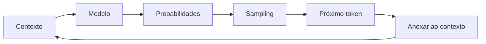

# O que é um Language Model?

> A base de tudo: entender como modelos de linguagem aprendem a prever texto.

## Definição Intuitiva

Um **Language Model (Modelo de Linguagem)** é um modelo que aprende a **prever o próximo token** em uma sequência de texto.

Dado um contexto, o modelo calcula a probabilidade de cada possível próximo token:

```
Contexto: "O gato subiu no"
                ↓
         ┌──────────────┐
         │ Language     │
         │ Model        │
         └──────────────┘
                ↓
    P("telhado") = 0.45
    P("muro")    = 0.25
    P("sofá")    = 0.15
    P("carro")   = 0.08
    P(...)       = ...
```

O modelo aprende estatísticas da linguagem observando grandes quantidades de texto.

---

## Formalização

### Objetivo

Dado uma sequência de tokens $x_1, x_2, ..., x_t$, o modelo aprende a distribuição condicional:

$$P(x_{t+1} | x_1, x_2, ..., x_t)$$

### Treinamento

O modelo é treinado para **maximizar a verossimilhança** (likelihood) dos dados:

$$\mathcal{L} = \sum_{t} \log P(x_{t+1} | x_1, ..., x_t)$$

Na prática, isso é equivalente a **minimizar a cross-entropy loss**:

$$\text{Loss} = -\sum_{t} \log P(x_{t+1} | x_1, ..., x_t)$$

### Inferência

Para gerar texto, amostramos do modelo:



---

## Evolução dos Language Models

```
Evolução dos Language Models
════════════════════════════════════════════════════════════════════

1980s ──► N-gram Models
           └── Estatísticas simples de contagem

2000s ──► Neural Language Models
           └── RNNs, LSTMs

2017  ──► Transformer
           └── "Attention is All You Need"

2018  ──► GPT
           └── Decoder-only Transformer

2020  ──► GPT-3
           └── 175B parâmetros

2022  ──► ChatGPT
           └── RLHF, Instruction Tuning

2023  ──► GPT-4, LLaMA
           └── Modelos multilocais
```

### N-gram Models

- Contam frequências de sequências de N palavras
- Simples, mas limitados pelo problema da explosão combinatória
- Não capturam dependências de longo alcance

### Neural Language Models (RNN/LSTM)

- Redes neurais processam sequências
- Podem capturar dependências mais longas
- Treinamento sequencial (lento)
- Problema do vanishing gradient

### Transformers

- Processam toda a sequência em paralelo
- Atenção permite conexões de longo alcance
- Escaláveis: maiores modelos = melhores resultados
- Base de todos os LLMs modernos

---

## Como um Language Model "Entende" Xadrez

No caso do ChessLM, o modelo aprende padrões de partidas:

```
Input                           O que o Modelo Aprende              Output
────────────────────────────────────────────────────────────────────────────

                                ┌─────────────────────────┐
                                │ Regras implícitas       │
                                │ e4 → resposta: e5       │
                                └───────────┬─────────────┘
                                            │
"1. e4 e5 2. Nf3 Nc6 3. Bb5" ──►┌───────────┴─────────────┐──► P(a6) = alta
                                │ Padrões de abertura      │    (Resposta padrão
                                │ Ruy Lopez, Italian, etc. │     da Ruy Lopez)
                                └───────────┬─────────────┘
                                            │
                                ┌───────────┴─────────────┐
                                │ Relações posicionais    │
                                │ peças ativas, controle  │
                                └─────────────────────────┘
```

### O que NÃO é aprendido

- Regras explícitas do xadrez
- O que é xeque, xeque-mate
- Validação de movimentos ilegais

### O que É aprendido

- Padrões estatísticos de jogos
- Sequências comuns de movimentos
- "Estilo" dos jogadores do conjunto de treino

---

## Componentes de um Language Model

Todo Language Model moderno tem:

```
┌─────────────────────────────────────────────────────────────────┐
│                     Language Model                               │
└───────────┬─────────────┬───────────────┬───────────────────────┘
            │             │               │
            ▼             ▼               ▼                    ▼
     ┌──────────────┐ ┌──────────────┐ ┌──────────────┐ ┌──────────────┐
     │  Tokenizador │ │  Embeddings  │ │   Backbone   │ │Head de Saída │
     └──────┬───────┘ └──────┬───────┘ └──────┬───────┘ └──────┬───────┘
            │                │                │                │
            ▼                ▼                ▼                ▼
     Texto → IDs      IDs → Vetores   Processa sequência  Vetores → Probs
     numéricos        densos          (Transformer)       
```

### 1. Tokenizador
Converte texto em números (IDs) que o modelo entende.
Ver [[00-Conceitos-Fundamentais/Tokenizacao|Tokenização]].

### 2. Embeddings
Representa cada token como um vetor denso (ex: 256 dimensões).

### 3. Backbone
Rede neural que processa a sequência. No ChessLM, é um Transformer.
Ver [[00-Conceitos-Fundamentais/Arquitetura-Transformer|Arquitetura Transformer]].

### 4. Head de Saída
Camada linear que transforma embeddings em logits (scores para cada token do vocabulário).

---

## Métricas Importantes

### Loss (Perda)
- Cross-entropy negativa
- Menor = melhor
- Típico em language models: 2.0 - 5.0

### Perplexity (Perplexidade)
- Exponencial da loss: $\text{PPL} = e^{\text{loss}}$
- Interpretável: "quão incerto o modelo está"
- PPL=10 significa ~10 opções igualmente prováveis

### Exemplo
```
Loss = 2.5 → PPL = e^2.5 ≈ 12.2
"Em média, o modelo considera ~12 tokens como possíveis próximos"
```

---

## Comparação de Abordagens

| Característica | N-gram | RNN/LSTM | Transformer |
|----------------|--------|----------|-------------|
| Dependência de longo alcance | ❌ Limitada | ✅ Melhor | ✅✅ Excelente |
| Treinamento paralelo | ✅ | ❌ Sequencial | ✅✅ Total |
| Escalabilidade | ❌ | ❌ | ✅✅ |
| Complexidade | Baixa | Média | Alta |
| Estado da arte | Não | Não | Sim |

---

## Para Ir Mais Longe

### Leituras Recomendadas
- [ ] [The Unreasonable Effectiveness of Recurrent Neural Networks](http://karpathy.github.io/2015/05/21/rnn-effectiveness/) - Andrej Karpathy
- [ ] [The Illustrated GPT-2](http://jalammar.github.io/illustrated-gpt2/) - Jay Alammar
- [ ] [State of GPT](https://www.youtube.com/watch?v=bZQun8Y4L2A) - Andrej Karpathy (vídeo)

### Experimentos
- [ ] Treinar um modelo n-gram em um corpus pequeno
- [ ] Comparar perplexidade de diferentes modelos
- [ ] Visualizar embeddings (t-SNE, PCA)

### Projetos Relacionados
- [nanoGPT](https://github.com/karpathy/nanogpt) - Minimo GPT treinável
- [minGPT](https://github.com/karpathy/minGPT) - Versão ainda mais minimalista
- [llm.c](https://github.com/karpathy/llm.c) - GPT-2 em C puro

---

## Links Relacionados

- [[00-Conceitos-Fundamentais/Arquitetura-Transformer|Arquitetura Transformer]] - Como funciona o backbone
- [[00-Conceitos-Fundamentais/Tokenizacao|Tokenização]] - Como texto vira números
- [[02-Modelo/model|Implementação no ChessLM]]
