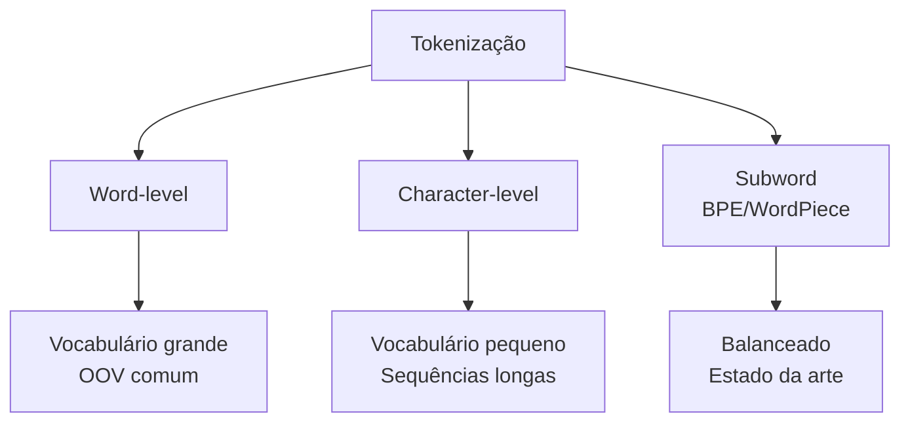
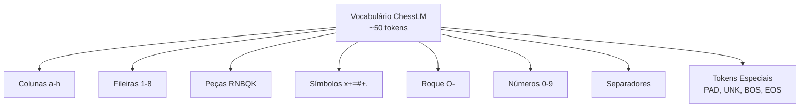
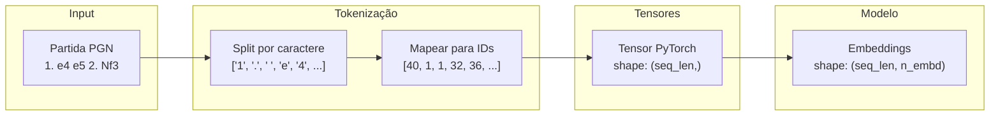
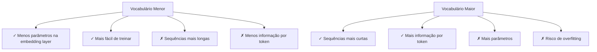

# Tokenização

> Converter texto em números é o primeiro passo para qualquer Language Model.

## O Problema

Redes neurais trabalham com números, não com texto. Precisamos converter:

```
"1. e4 e5 2. Nf3"  →  [49, 1, 32, 1, 33, 1, 49, 2, 1, 28, ...]
     texto                    tensors (IDs numéricos)
```

A **tokenização** é o processo de dividir texto em unidades menores (tokens) e converter cada unidade em um identificador numérico.

---

## Tipos de Tokenização



### 1. Word-level (Nível de Palavra) (Word-level)

Divide o texto em palavras.

```
"o gato subiu no telhado" → ["o", "gato", "subiu", "no", "telhado"]
```

**Vantagens:**
- Sequências curtas (poucos tokens)

**Desvantagens:**
- Vocabulário enorme (centenas de milhares)
- Problema OOV (Out of Vocabulary): palavras novas são desconhecidas
- Não lida bem com erros ortográficos, variações

### 2. Character-level (Nível de Caractere) (Character-level)

Divide o texto em caracteres individuais.

```
"o gato" → ["o", " ", "g", "a", "t", "o"]
```

**Vantagens:**
- Vocabulário pequeno (dezenas de caracteres)
- Nunca tem OOV: qualquer texto pode ser representado
- Simples de implementar

**Desvantagens:**
- Sequências muito longas (cada caractere é um token)
- Modelo precisa aprender a "formar" palavras do zero
- Menos eficiente que subword

### 3. Subword (Nível de Subpalavra) (Subword)

Divide em unidades intermediárias, aprendendo do corpus. A língua portuguesa tem muitas palavras derivadas de raízes comuns. O subword captura isso.

```
"desconhecido" → ["des", "##conhec", "##ido"]
```

Algoritmos comuns: BPE (Byte Pair Encoding), WordPiece, Unigram

**Vantagens:**
- Balanceia vocabulário e tamanho de sequência
- Lida bem com palavras raras e compostas
- Estado da arte em LLMs modernos

**Desvantagens:**
- Mais complexo de implementar
- Vocabulário específico do corpus

---

## Comparação

| Critério | Word-level | Character-level | Subword |
|----------|------------|-----------------|---------|
| **Vocabulário** | Grande (100k+) | Pequeno (~50-100) | Médio (10k-50k) |
| **Sequência** | Curta | Longa | Média |
| **OOV** | Comum | Nunca | Raro |
| **Complexidade** | Baixa | Baixa | Alta |
| **Eficiência** | Baixa | Baixa | Alta |

---

## Por que Character-level para Xadrez?

O ChessLM usa **character-level** por várias razões:

### 1. Vocabulário Natural de Xadrez

A notação PGN usa um conjunto bem definido de caracteres:

```python
CHESS_CHARS = (
    "abcdefgh"      # colunas (files)
    "12345678"      # linhas (ranks)
    "RNBQK"         # peças (maiúsculas)
    "x+=#+."        # captura, promoção, xeque, mate
    "O-"            # roque
    "0123456789"    # numeração de lances
    " \n/"          # separadores
    "*"             # resultado
)
```

Total: **~50 caracteres** — um vocabulário naturalmente pequeno!

### 2. Não há OOV

Qualquer partida de xadrez válida pode ser representada.

### 3. Generalização

O modelo aprende a "soletrar" movimentos, o que ajuda a generalizar para padrões não vistos.

### 4. Simplicidade

Não precisamos treinar um tokenizador BPE — o tokenizador é determinístico.

---

## O Tokenizador do ChessLM

### Vocabulário Completo



### Tokens Especiais

| Token | ID | Uso |
|-------|-----|-----|
| `<PAD>` | 0 | Padding (preencher sequências) |
| `<UNK>` | 1 | Token desconhecido |
| `<BOS>` | 2 | Beginning of Sequence |
| `<EOS>` | 3 | End of Sequence |

### Exemplo de Tokenização

```python
# Input
texto = "1. e4 e5 2. Nf3"

# Tokenização
ids = tokenizer.encode(texto)
# [40, 1, 32, 1, 33, 1, 40, 2, 1, 28, ...]

# Cada caractere vira um ID
# '1' → 40
# '.' → 1
# ' ' → 1
# 'e' → 32
# '4' → 36
# etc.
```

---

## Implementação

```python
class ChessTokenizer:
    def __init__(self):
        # Vocabulário: tokens especiais + caracteres
        all_tokens = ["<PAD>", "<UNK>", "<BOS>", "<EOS>"] + list(CHESS_CHARS)
        
        # Mapeamentos bidirecionais
        self.stoi = {ch: i for i, ch in enumerate(all_tokens)}  # string → id
        self.itos = {i: ch for i, ch in enumerate(all_tokens)}  # id → string
    
    def encode(self, text: str) -> list[int]:
        """Converte string em lista de IDs."""
        return [self.stoi.get(ch, self.unk_id) for ch in text]
    
    def decode(self, ids: list[int]) -> str:
        """Converte IDs de volta para string."""
        return "".join(self.itos.get(i, "") for i in ids)
```

### Propriedades Importantes

```python
@property
def vocab_size(self) -> int:
    return len(self.stoi)  # ~50-60
```

---

## Diagrama: Tokenização End-to-End



---

## Trade-offs no Design

### Vocabulário Menor vs Maior



### Para ChessLM

- Vocabulário natural é pequeno (~50)
- Character-level funciona bem
- Sequências de até 512 caracteres cobrem a maioria das partidas

---

## Tokenização em LLMs Modernos

### GPT-4 / Tiktoken

- BPE com ~100k tokens
- Treinado em corpus massivo
- Eficiente para texto geral

### LLaMA / SentencePiece

- BPE com 32k-64k tokens
- Open source
- Treinado em dados multilíngues

### Comparação

```
Texto: "O cavalo move em L."

Character-level: ['O', ' ', 'c', 'a', 'v', 'a', 'l', 'o', ...]  # ~20 tokens
Word-level:       ['O', 'cavalo', 'move', 'em', 'L.']           # 5 tokens
BPE:              ['O', ' cavalo', ' move', ' em', ' L.']       # ~5-8 tokens
```

---

## Para Ir Mais Longe

### Experimentos Sugeridos

- [ ] Implementar um tokenizador BPE simples do zero
- [ ] Comparar tamanho de sequências character vs. BPE para o mesmo corpus
- [ ] Testar diferentes tamanhos de vocabulário e medir impacto no treino

### Leituras Recomendadas

- [ ] [Byte Pair Encoding](https://leimao.github.io/blog/Byte-Pair-Encoding/) - Lei Mao
- [ ] [SentencePiece](https://github.com/google/sentencepiece) - Google
- [ ] [Tiktoken](https://github.com/openai/tiktoken) - OpenAI

### Implementações Alternativas

Para projetos mais complexos, considere:

```python
# BPE com tiktoken (OpenAI)
import tiktoken
enc = tiktoken.get_encoding("cl100k_base")
ids = enc.encode("Hello world")

# SentencePiece (Google)
import sentencepiece as spm
sp = spm.SentencePieceProcessor(model_file='model.model')
ids = sp.encode("Hello world")
```

---

## Links Relacionados

- [[00-Conceitos-Fundamentais/O-que-e-um-Language-Model|O que é um Language Model]]
- [[00-Conceitos-Fundamentais/Arquitetura-Transformer|Arquitetura Transformer]]
- [[02-Modelo/tokenizer|Implementação no ChessLM]]
- [[exercicios/exercicio-01-tokenizador|Exercício: Tokenizador]]
