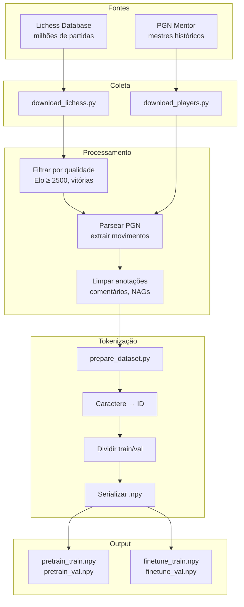
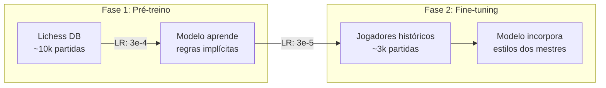
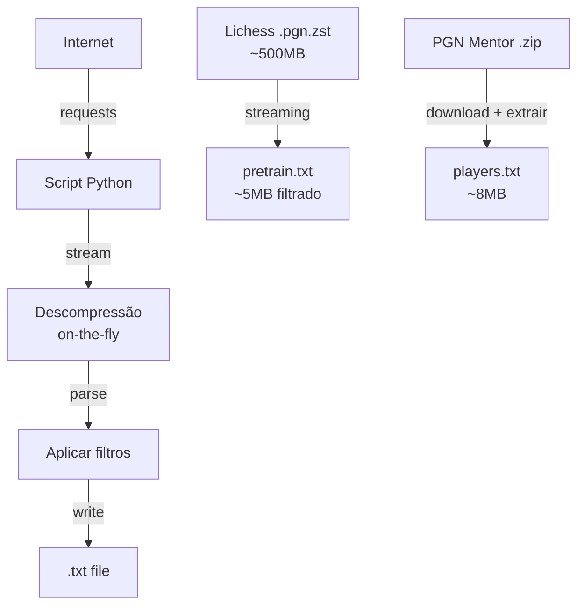

# Visão Geral - Data Pipeline

> Dados de qualidade são a base de qualquer modelo de linguagem. Esta seção explica como coletamos, filtramos e preparamos os dados de xadrez para o ChessLM.

## Por que Dados Importam?

A frase "garbage in, garbage out" (lixo entra, lixo sai) é especialmente verdadeira para Language Models. O modelo aprenderá os padrões presentes nos dados de treino, então:

- **Dados ruins** → Modelo aprende padrões errados
- **Dados bons** → Modelo aprende padrões úteis

Para xadrez:
- Partidas de iniciantes → Movimentos questionáveis
- Partidas de mestres → Estratégias refinadas

---

## Pipeline de Dados do ChessLM



---

## Fontes de Dados

### 1. Lichess Database (Pré-treino)

**URL**: https://database.lichess.org/

**Características:**
- Dumps mensais público s
- Formato: `.pgn.zst` (PGN comprimido com zstandard)
- Tamanho: ~100MB - 1GB por mês (comprimido)
- Cobertura: Todos os jogos de todos os níveis

**Por que Lichess?**
- Gratuito e acessível
- Grande volume de dados
- Metadados completos (Elo, resultado, abertura)

**Filtros aplicados:**
- Elo mínimo de **2500** para ambos jogadores
- Apenas partidas **decisivas** (sem empates)
- Isso garante jogos de alta qualidade

### 2. PGN Mentor (Fine-tuning)

**URL**: https://www.pgnmentor.com/

**Características:**
- Coleções de partidas de grandes mestres
- Arquivos `.pgn` individuais por jogador
- Alta qualidade histórica

**Jogadores incluídos:**

| Jogador | Período | Estilo |
|---------|---------|--------|
| **Bobby Fischer** | 1950s-1970s | Posicional, preciso |
| **Garry Kasparov** | 1980s-2000s | Agressivo, dinâmico |
| **Mikhail Tal** | 1950s-1980s | Tático, sacrifícios |
| **José Capablanca** | 1910s-1930s | Simplificações elegantes |
| **Magnus Carlsen** | 2000s-presente | Versátil, precisão endgame |
| **Praggnanandhaa** | 2010s-presente | Talento moderno |

---

## Estratégia: Pré-treino → Fine-tuning



### Por que duas fases?

1. **Pré-treino**: Grande volume de dados para aprender o básico
   - "Como o xadrez funciona"
   - Padrões comuns de abertura
   - Relações básicas entre peças

2. **Fine-tuning**: Menor volume de dados de alta qualidade
   - Estilos específicos de jogadores
   - Decisões refinadas
   - Conhecimento especializado

Learning rate menor no fine-tuning preserva o conhecimento do pré-treino.

---

## Fluxo de Dados Detalhado

### 1. Download



### 2. Processamento

```python
# Exemplo de limpeza de PGN
raw = "1. e4 { Abertura do peão do rei } e5 2. Nf3! Nc6?! 3. Bb5+ $1"

# Remove comentários
clean = re.sub(r'\{[^}]*\}', '', raw)
# "1. e4 e5 2. Nf3! Nc6?! 3. Bb5+ $1"

# Remove anotações (!, ?, etc)
clean = re.sub(r'[!?]+', '', clean)
# "1. e4 e5 2. Nf3 Nc6 3. Bb5+ $1"

# Remove NAGs ($1, $2...)
clean = re.sub(r'\$\d+', '', clean)
# "1. e4 e5 2. Nf3 Nc6 3. Bb5+ "

# Normaliza espaços
clean = re.sub(r'\s+', ' ', clean).strip()
# "1. e4 e5 2. Nf3 Nc6 3. Bb5+"
```

### 3. Tokenização

```mermaid
graph LR
    A["1. e4 e5"] --> B[Split chars]
    B --> C["1", ".", " ", "e", "4", " ", "e", "5"]
    C --> D[Map to IDs]
    D --> E[40, 1, 1, 32, 36, 1, 32, 33]
    E --> F[Numpy array]
```

### 4. Divisão Train/Val

```
Dataset completo: 1,000,000 tokens
          ↓
    ┌─────┴─────┐
    ↓           ↓
Train: 95%   Val: 5%
950,000      50,000
```

---

## Arquivos Gerados

Após executar todo o pipeline:

```
data/
├── pretrain.txt           # Partidas Lichess filtradas
├── pretrain_train.npy     # Tokens de treino (pré-treino)
├── pretrain_val.npy       # Tokens de validação (pré-treino)
│
├── players.txt            # Partidas dos mestres
├── finetune_train.npy     # Tokens de treino (fine-tuning)
├── finetune_val.npy       # Tokens de validação (fine-tuning)
│
└── tokenizer.json         # Vocabulário serializado
```

### Formato .npy

```python
import numpy as np

# Salvar
np.save("train.npy", np.array(ids, dtype=np.uint16))

# Carregar
data = np.load("train.npy")
# array([40, 1, 32, ...], dtype=uint16)
```

**Por que .npy?**
- Carregamento rápido (binário)
- Memória eficiente (uint16 = 2 bytes por token)
- Suportado nativamente pelo NumPy

---

## Métricas dos Dados

Tamanhos típicos após processamento:

| Dataset | Caracteres | Tokens | Arquivo .npy |
|---------|------------|--------|--------------|
| pretrain.txt | ~4.5M | ~4.5M | ~9MB train, ~500KB val |
| players.txt | ~7.7M | ~7.7M | ~15MB train, ~800KB val |

Notas:
- 1 caractere ≈ 1 token (character-level)
- uint16: 2 bytes por token
- 5% do dataset vai para validação

---

## Scripts do Pipeline

| Script | Função | Input | Output |
|--------|--------|-------|--------|
| `download_lichess.py` | Baixar DB Lichess | URL | `pretrain.txt` |
| `download_players.py` | Baixar partidas dos mestres | URLs PGN Mentor | `players.txt` |
| `prepare_dataset.py` | Tokenizar e serializar | `.txt` | `.npy` |

Ver:
- [[01-Data-Pipeline/download_lichess|download_lichess.py detalhado]]
- [[01-Data-Pipeline/download_players|download_players.py detalhado]]
- [[01-Data-Pipeline/prepare_dataset|prepare_dataset.py detalhado]]
- [[01-Data-Pipeline/pgn_utils|pgn_utils.py detalhado]]

---

## Para Ir Mais Longe

### Melhorias no Pipeline

- [ ] **Balancear dados**: Igualar partidas com vitória de brancas e pretas
- [ ] **Expandir Lichess**: Baixar múltiplos meses
- [ ] **Mais jogadores**: Adicionar outros mestres (Karpov, Anand, etc.)
- [ ] **Filtrar por abertura**: Criar datasets especializados
- [ ] **Data augmentation**: Adicionar variações (rotação do tabuleiro)

### Controle de Qualidade

- [ ] Validar movimentos com `python-chess`
- [ ] Detectar partidas duplicadas
- [ ] Análise estatística do dataset (distribuição de aberturas, tamanhos)

### Experimentos

- [ ] Comparar treino com diferentes perfis de dados
- [ ] Medir impacto da quantidade de dados na qualidade do modelo

---

## Links Relacionados

- [[ChessLM]] - Visão geral do projeto
- [[01-Data-Pipeline/download_lichess]] - Download Lichess
- [[01-Data-Pipeline/download_players]] - Download jogadores
- [[01-Data-Pipeline/prepare_dataset]] - Preparação
- [[02-Modelo/tokenizer]] - Tokenizador
