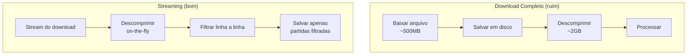
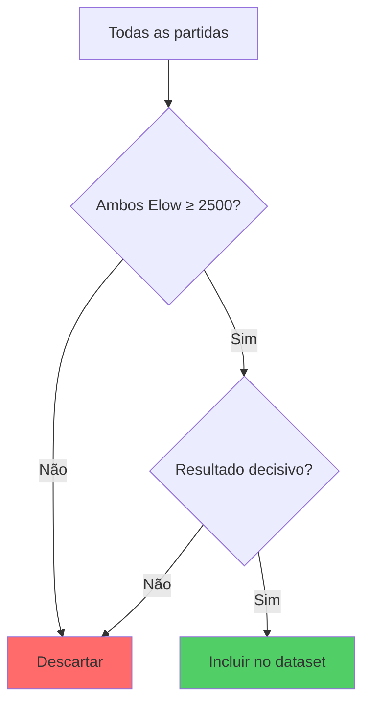
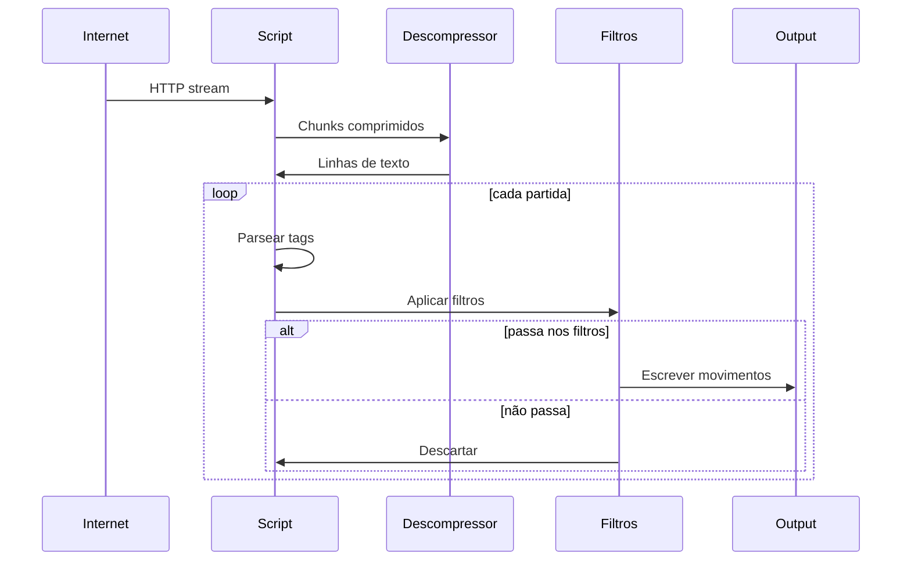
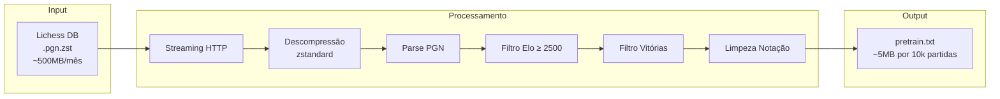

# download_lichess.py

> Baixar e filtrar milhões de partidas do Lichess Database de forma eficiente.

## Objetivo

Fazer streaming do Lichess Database, filtrar partidas por qualidade (Elo ≥ 2500, apenas vitórias), e salvar os movimentos para treinamento.

---

## Conceitos

### Lichess Database

O Lichess disponibiliza dumps mensais de todas as partidas jogadas na plataforma:

- **URL base**: `https://database.lichess.org/standard/lichess_db_standard_rated_{YYYY-MM}.pgn.zst`
- **Formato**: PGN comprimido com zstandard (.zst)
- **Tamanho**: ~100MB a 1GB por mês (comprimido)

### Streaming vs Download Completo



**Vantagens do streaming:**
- Não precisa de espaço para arquivo descomprimido
- Processa enquanto baixa
- Pode parar ao atingir limite de partidas

### Formato PGN

```pgn
[Event "Rated Blitz game"]
[White "Player1"]
[Black "Player2"]
[WhiteElo "2650"]
[BlackElo "2580"]
[Result "1-0"]

1. e4 e5 2. Nf3 Nc6 3. Bb5 a6 1-0
```

- **Tags** (`[...]`): Metadados da partida
- **Movimentos**: Sequência de lances em notação algébrica
- **Resultado**: `1-0` (brancas), `0-1` (pretas), `1/2-1/2` (empate)

---

## Filtros Aplicados



### Critérios

| Filtro | Valor | Justificativa |
|--------|-------|---------------|
| **Elo mínimo** | 2500 | Garante jogadores fortes |
| **Resultado** | Apenas 1-0 ou 0-1 | Partidas decisivas são mais didáticas |
| **Empates** | Excluídos | Não demonstram caminho para vitória |

---

## Código Explicado

### 1. Configuração Inicial

```python
import zstandard as zstd
import requests
from io import TextIOWrapper

# URL do dump mensal
BASE_URL = "https://database.lichess.org/standard/lichess_db_standard_rated_{month}.pgn.zst"

# Regex para extrair tags
_RE_TAG = re.compile(r'\[(\w+)\s+"([^"]*)"\]')
```

### 2. Streaming com Descompressão

```python
def stream_lichess(month, min_elo, only_decisive, max_games, output):
    url = BASE_URL.format(month=month)
    
    # Descompressor zstandard
    dctx = zstd.ZstdDecompressor()
    
    # Abre conexão HTTP em modo stream
    with requests.get(url, stream=True) as r:
        # Stream reader para descomprimir on-the-fly
        with dctx.stream_reader(r.raw) as reader:
            # Wrapper de texto para ler linha a linha
            text_stream = TextIOWrapper(reader, encoding="utf-8")
            
            # Processa cada linha
            for line in text_stream:
                # ... processamento
```

### 3. Parsing de Partidas

```python
game_lines = []
tags = {}
buffer = []
in_moves = False

for line in text_stream:
    line = line.rstrip()
    
    if line.startswith("["):
        # Linha de tag: [WhiteElo "2650"]
        m = _RE_TAG.match(line)
        if m:
            tags[m.group(1)] = m.group(2)
        game_lines.append(line)
    
    elif line == "":
        # Linha em branco = fim da partida
        if in_moves and game_lines:
            # Aplica filtros
            if filter_game(tags, min_elo, only_decisive):
                moves = clean_moves(" ".join(buffer))
                output_file.write(moves + "\n")
        
        # Reset para próxima partida
        game_lines = []
        buffer = []
        tags = {}
        in_moves = False
    
    else:
        # Linha de movimentos
        in_moves = True
        buffer.append(line)
        game_lines.append(line)
```

### 4. Aplicação de Filtros

```python
def filter_game(tags, min_elo=2500, only_decisive=True):
    # Extrai Elo dos jogadores
    try:
        white_elo = int(tags.get("WhiteElo", 0))
        black_elo = int(tags.get("BlackElo", 0))
    except ValueError:
        return False
    
    # Verifica Elo mínimo para ambos
    if white_elo < min_elo or black_elo < min_elo:
        return False
    
    # Verifica resultado
    result = tags.get("Result", "")
    if only_decisive and result not in ("1-0", "0-1"):
        return False
    
    return True
```

Ver [[01-Data-Pipeline/pgn_utils|pgn_utils.py]] para `filter_game()` e `clean_moves()`.

---

## Fluxo Completo



---

## Execução

### Uso Básico

```bash
# Baixar 10.000 partidas de janeiro 2024
python data/download_lichess.py --month 2024-01 --max-games 10000

# Output: data/pretrain.txt
```

### Parâmetros

```bash
python data/download_lichess.py \
    --month 2024-01 \        # Mês do dump (YYYY-MM)
    --output data/pretrain.txt \  # Arquivo de saída
    --min-elo 2500 \         # Elo mínimo
    --max-games 10000        # Limite de partidas (0 = sem limite)
    --keep-draws             # Incluir empates (opcional)
```

### Saída

```
Conectando a https://database.lichess.org/standard/lichess_db_standard_rated_2024-01.pgn.zst
Download: 45%|████▌     | 225M/500M [02:15<02:45, 1.67MB/s]

  10,000 partidas salvas (150,000 processadas)
  Limite de 10,000 partidas atingido.

Concluído: 10,000 partidas salvas de 150,000 processadas
Arquivo: data/pretrain.txt (4.6 MB)
```

---

## Diagrama de Dados



---

## Taxa de Filtragem

Típico para um mês do Lichess:

```
Total de partidas no dump:     ~3,000,000
Após filtro Elo ≥ 2500:        ~150,000 (5%)
Após filtro vitórias:          ~75,000 (2.5%)
```

**Por que a taxa é baixa?**
- A maioria das partidas tem Elo < 2500
- Cerca de metade dos jogos termina em empate

---

## Considerações Práticas

### Uso de Memória

- **Streaming**: Usa pouca memória (~MBs)
- **Sem streaming**: Precisaria descomprimir arquivo completo (~GBs)

### Tempo de Execução

Para 10.000 partidas filtradas:
- Download: ~3 minutos (depende da conexão)
- Processamento: Realizado durante download
- Total: ~3-5 minutos

### Interrupção

O script pode ser interrompido a qualquer momento com `Ctrl+C`. As partidas já processadas são salvas no arquivo de saída.

---

## Estrutura do Arquivo de Saída

`pretrain.txt` contém uma partida por linha:

```
1.e4 e5 2.Nf3 Nc6 3.Bb5 a6 4.Ba4 Nf6 5.O-O Be7 6.Re1 b5 7.Bb3 d6 8.c3 O-O 9.h3 Nb8 10.d4 Nbd7
1.d4 d5 2.c4 e6 3.Nc3 Nf6 4.Bg5 Be7 5.e3 O-O 6.Nf3 h6 7.Bh4 b6 8.cxd5 Nxd5 9.Bxe7 Qxe7
1.e4 c5 2.Nf3 d6 3.d4 cxd4 4.Nxd4 Nf6 5.Nc3 a6 6.Be3 e5 7.Nb3 Be6 8.f3 Nbd7 9.Qd2 b5
...
```

Características:
- Uma partida por linha
- Movimentos limpos (sem comentários, anotações)
- Sem numeração das pretas (`1... e5` → `e5`)
- Resultado removido

---

## Para Ir Mais Longe

### Melhorias Sugeridas

- [ ] **Baixar múltiplos meses**: Loop sobre vários meses
- [ ] **Paralelizar download**: Usar threads para múltiplos arquivos
- [ ] **Filtro por abertura**: Selecionar apenas certas aberturas
- [ ] **Balancear resultados**: Igualar vitórias brancas/pretas
- [ ] **Cache local**: Não reprocessar meses já baixados

### Exemplo: Loop de Múltiplos Meses

```python
months = ["2024-01", "2024-02", "2024-03"]
for month in months:
    output = f"data/pretrain_{month}.txt"
    stream_lichess(month, min_elo=2500, output=output)
```

### Validação

```python
# Verificar se os movimentos são legais
import chess.pgn
import io

game = chess.pgn.read_game(io.StringIO(pgn_text))
board = game.board()
for move in game.mainline_moves():
    if move not in board.legal_moves:
        print(f"Movimento ilegal: {move}")
        break
    board.push(move)
```

---

## Links Relacionados

- [[01-Data-Pipeline/Visao-Geral-Dados|Visão Geral de Dados]]
- [[01-Data-Pipeline/pgn_utils|Utilitários PGN]]
- [[01-Data-Pipeline/prepare_dataset|Preparação do Dataset]]
- [[03-Treinamento/train|Treinamento]]
