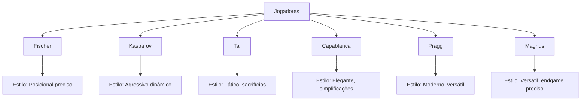
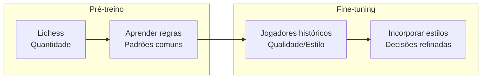
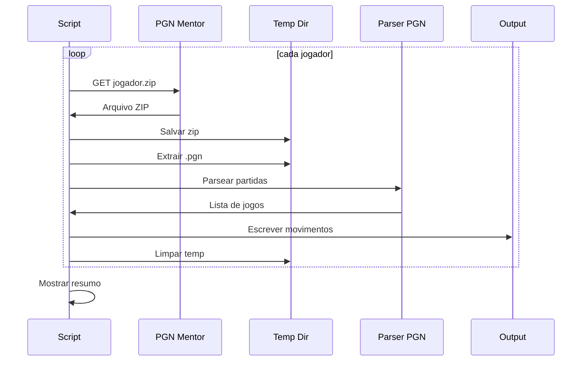
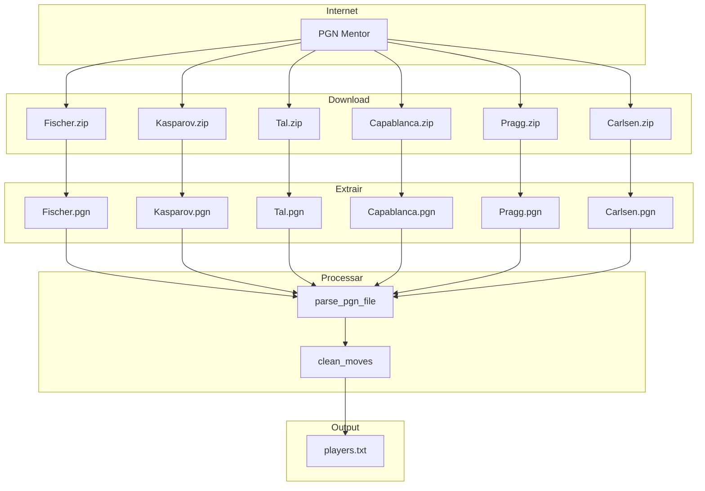

# download_players.py

> Baixar partidas dos grandes mestres da história do xadrez para fine-tuning.

## Objetivo

Baixar arquivos PGN de jogadores históricos do PGN Mentor e consolidar em um único arquivo para fine-tuning.

---

## Conceitos

### PGN Mentor

**URL**: https://www.pgnmentor.com/

Repositório de partidas de xadrez em formato PGN, organizado por jogador. Características:

- Gratuito (com limitações de taxa)
- Alta qualidade histórica
- Arquivos .zip contendo .pgn

### Jogadores Selecionados



| Jogador | Apelido | Período | Partidas (~) | Estilo |
|---------|---------|---------|--------------|--------|
| **Bobby Fischer** | "O Genio Solitário" | 1950s-1970s | ~600 | Precisão posicional |
| **Garry Kasparov** | "O Ogro de Baku" | 1980s-2000s | ~2000 | Agressivo, dinâmico |
| **Mikhail Tal** | "O Mago de Riga" | 1950s-1980s | ~2500 | Tático, sacrifícios |
| **José Capablanca** | "A Máquina de Jogar" | 1910s-1930s | ~600 | Simplificações elegantes |
| **Praggnanandhaa** | "Pragg" | 2010s-presente | ~400 | Talento moderno |
| **Magnus Carlsen** | "O Tubarão" | 2000s-presente | ~3000 | Versátil, endgame |

---

## Por que Fine-tuning?



**Benefícios:**
- Modelo aprende com os melhores
- Incorpora "estilo" de jogar
- Fine-tuning com LR menor preserva conhecimento pré-treino

---

## Código Explicado

### 1. URLs dos Jogadores

```python
PLAYER_URLS = {
    "fischer": {
        "name": "Bobby Fischer",
        "url": "https://www.pgnmentor.com/players/Fischer.zip",
        "zip": True,
        "file": "Fischer.pgn",
    },
    "kasparov": {
        "name": "Garry Kasparov",
        "url": "https://www.pgnmentor.com/players/Kasparov.zip",
        "zip": True,
        "file": "Kasparov.pgn",
    },
    # ... outros jogadores
}
```

### 2. Download com Headers

O PGN Mentor requer headers de navegador para aceitar a requisição:

```python
def download_file(url: str, dest: str):
    headers = {
        "User-Agent": "Mozilla/5.0 ...",
        "Accept": "text/html,application/xhtml+xml,...",
        "Referer": "https://www.pgnmentor.com/",
    }
    
    r = requests.get(url, stream=True, headers=headers)
    r.raise_for_status()
    
    # Barra de progresso
    total = int(r.headers.get("content-length", 0))
    with open(dest, "wb") as f:
        with tqdm(total=total, unit="B", unit_scale=True) as pbar:
            for chunk in r.iter_content(chunk_size=8192):
                f.write(chunk)
                pbar.update(len(chunk))
```

### 3. Extração de ZIP

```python
def extract_zip(zip_path: str, filename: str, dest: str):
    import zipfile
    
    with zipfile.ZipFile(zip_path) as z:
        # Encontra o arquivo PGN (pode estar em subpasta)
        candidates = [n for n in z.namelist() if n.endswith(filename)]
        if not candidates:
            raise FileNotFoundError(f"{filename} não encontrado")
        
        # Extrai
        with z.open(candidates[0]) as src, open(dest, "wb") as dst:
            dst.write(src.read())
```

### 4. Processamento por Jogador

```python
def process_player(key: str, info: dict, output_file, stats: dict):
    print(f"\n{'─'*50}")
    print(f"  {info['name']}")
    print(f"{'─'*50}")
    
    with tempfile.TemporaryDirectory() as tmpdir:
        zip_path = os.path.join(tmpdir, f"{key}.zip")
        pgn_path = os.path.join(tmpdir, f"{key}.pgn")
        
        # Download
        print(f"  Baixando de {info['url']}")
        download_file(info['url'], zip_path)
        
        # Extrai
        if info.get("zip"):
            extract_zip(zip_path, info['file'], pgn_path)
        
        # Processa partidas
        count = 0
        for game in parse_pgn_file(pgn_path):
            moves = game["moves"]
            if moves and len(moves) > 10:  # Ignora partidas muito curtas
                output_file.write(moves + "\n")
                count += 1
        
        stats[info["name"]] = count
        print(f"  ✓ {count:,} partidas processadas")
```

### 5. Fluxo Principal

```python
def main():
    stats = {}
    
    with open("data/players.txt", "w", encoding="utf-8") as out:
        for key in args.players:
            info = PLAYER_URLS[key]
            process_player(key, info, out, stats)
    
    # Resumo
    print(f"\n{'═'*50}")
    print("  Resumo")
    print(f"{'═'*50}")
    total = sum(stats.values())
    for name, count in stats.items():
        print(f"  {name:<25} {count:>6,} partidas")
    print(f"{'─'*50}")
    print(f"  {'Total':<25} {total:>6,} partidas")
```

---

## Fluxo de Execução



---

## Execução

### Uso Básico

```bash
# Baixar todos os jogadores
python data/download_players.py

# Output: data/players.txt
```

### Selecionar Jogadores Específicos

```bash
# Baixar apenas Kasparov e Tal
python data/download_players.py --players kasparov tal --output data/kasparov_tal.txt
```

### Parâmetros

```bash
python data/download_players.py \
    --output data/players.txt \    # Arquivo de saída
    --players fischer kasparov tal # Jogadores específicos (opcional)
```

---

## Saída Esperada

```
Salvando em: data/players.txt

──────────────────────────────────────────────────
  Bobby Fischer
──────────────────────────────────────────────────
  Baixando de https://www.pgnmentor.com/players/Fischer.zip
  100%|████████████| 245k/245k [00:01<00:00, 156kB/s]
  ✓ 589 partidas processadas

──────────────────────────────────────────────────
  Garry Kasparov
──────────────────────────────────────────────────
  Baixando de https://www.pgnmentor.com/players/Kasparov.zip
  100%|████████████| 1.2M/1.2M [00:03<00:00, 356kB/s]
  ✓ 1,945 partidas processadas

...

════════════════════════════════════════════════
  Resumo
════════════════════════════════════════════════
  Bobby Fischer              589 partidas
  Garry Kasparov           1,945 partidas
  Mikhail Tal              2,487 partidas
  José Capablanca            602 partidas
  Praggnanandhaa             412 partidas
  Magnus Carlsen           2,956 partidas
──────────────────────────────────────────────────
  Total                    8,991 partidas

Arquivo: data/players.txt (7.7 MB)
```

---

## Diagrama de Dados



---

## Estrutura do Arquivo de Saída

`players.txt` contém partidas de todos os jogadores:

```
1.e4 c5 2.Nf3 d6 3.d4 cxd4 4.Nxd4 Nf6 5.Nc3 a6 6.Be2 e5 7.Nb3 Be7 8.O-O O-O 9.Be3 Be6
1.d4 Nf6 2.c4 e6 3.Nc3 Bb4 4.e3 b6 5.Bd3 Bb7 6.Nf3 c5 7.O-O cxd4 8.exd4 Nc6 9.Bd2
1.e4 e5 2.Nf3 Nc6 3.Bb5 a6 4.Ba4 Nf6 5.O-O Be7 6.Re1 b5 7.Bb3 d6 8.c3 O-O 9.h3 Na5
...
```

Cada linha é uma partida de um dos mestres.

---

## Diferenças vs Lichess

| Aspecto | Lichess | Jogadores Históricos |
|---------|---------|---------------------|
| **Fonte** | Amadores + Mestres | Grandes Mestres |
| **Quantidade** | Milhões | Milhares |
| **Elo** | Variável | Todos alto nível |
| **Qualidade** | Mista | Alta |
| **Estilo** | Genérico | Individual |
| **Uso** | Pré-treino | Fine-tuning |

---

## Considerações Práticas

### Dependências

```python
import requests      # Download HTTP
import zipfile       # Extração de ZIP (biblioteca padrão)
import tempfile      # Diretório temporário (biblioteca padrão)
from tqdm import tqdm  # Barra de progresso
```

### Taxa de Requisição

O PGN Mentor pode bloquear muitas requisições em sequência. O script inclui:
- Headers de navegador
- Delay natural entre downloads

### Erros Comuns

```python
try:
    download_file(info["url"], zip_path)
except Exception as e:
    print(f"  ✗ Erro no download: {e}")
    return  # Pula para próximo jogador
```

---

## Para Ir Mais Longe

### Adicionar Mais Jogadores

```python
PLAYER_URLS = {
    # ... existentes
    
    "karpov": {
        "name": "Anatoly Karpov",
        "url": "https://www.pgnmentor.com/players/Karpov.zip",
        "zip": True,
        "file": "Karpov.pgn",
    },
    "anand": {
        "name": "Viswanathan Anand",
        "url": "https://www.pgnmentor.com/players/Anand.zip",
        "zip": True,
        "file": "Anand.pgn",
    },
}
```

### Filtrar por Período

```python
def filter_by_year(tags, min_year=1900, max_year=2024):
    date = tags.get("Date", "")
    if not date:
        return True
    year = int(date.split(".")[0])
    return min_year <= year <= max_year
```

### Separar por Jogador

```python
# Criar um arquivo por jogador
for key in PLAYER_URLS:
    with open(f"data/{key}.txt", "w") as f:
        process_player(key, info, f, stats)
```

### Análise de Estilo

```python
# Contar aberturas preferidas de cada jogador
from collections import Counter
openings = Counter()

for game in parse_pgn_file(pgn_path):
    moves = game["moves"].split()
    opening = " ".join(moves[:4])  # Primeiros 2 lances
    openings[opening] += 1

print(f"Aberturas favoritas de {info['name']}:")
for opening, count in openings.most_common(5):
    print(f"  {opening}: {count} jogos")
```

---

## Links Relacionados

- [[01-Data-Pipeline/Visao-Geral-Dados|Visão Geral de Dados]]
- [[01-Data-Pipeline/download_lichess|Download Lichess]]
- [[01-Data-Pipeline/pgn_utils|Utilitários PGN]]
- [[03-Treinamento/finetune|Fine-tuning]]
