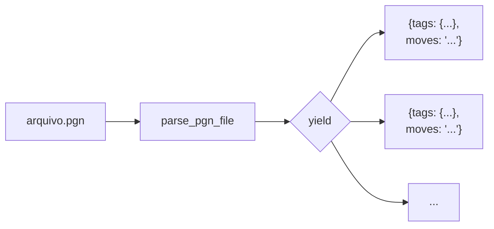
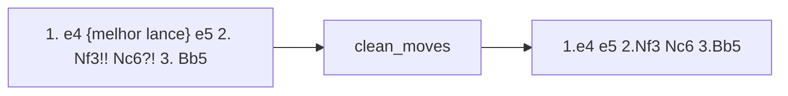
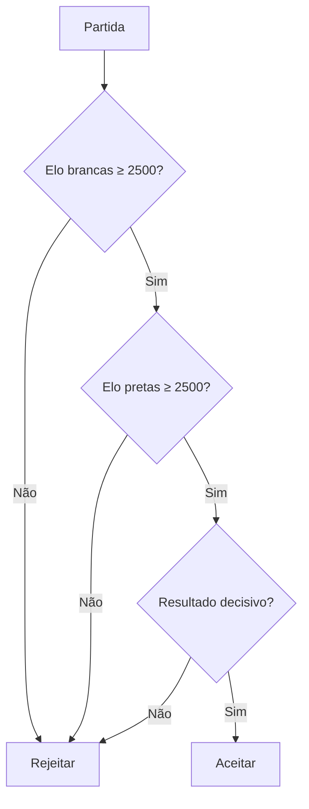
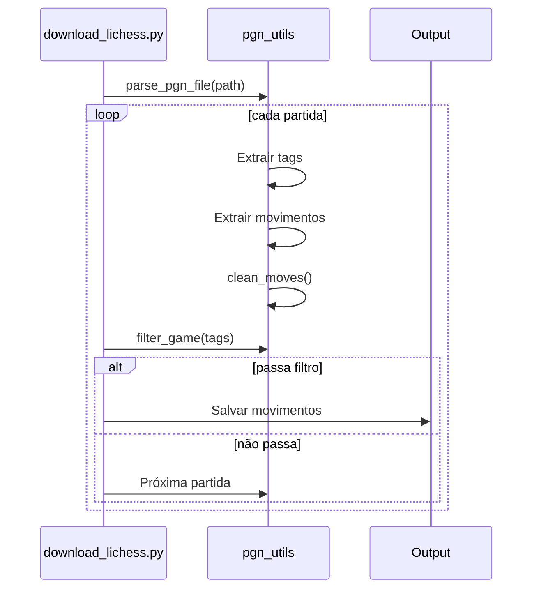

# pgn_utils.py

> Utilitários para parsing, limpeza e filtragem de arquivos PGN.

## Objetivo

Fornecer funções reutilizáveis para processar arquivos PGN (Portable Game Notation) de xadrez.

---

## Conceitos

### Formato PGN

PGN (Portable Game Notation) é o formato padrão para registrar partidas de xadrez.

```pgn
[Event "World Championship"]
[Site "Moscow"]
[Date "1985.10.15"]
[Round "1"]
[White "Kasparov, Garry"]
[Black "Karpov, Anatoly"]
[Result "1-0"]
[WhiteElo "2700"]
[BlackElo "2720"]

1. e4 c5 2. Nf3 d6 3. d4 cxd4 4. Nxd4 Nf6 5. Nc3 a6 6. Be2 e5 7. Nb3 Be7 8. O-O O-O 9. Be3 Be6 10. f3 Nbd7 11. Qd2 Rc8 12. Rfd1 Qc7 13. a4 b6 14. Qf2 Rfd8 15. Rd2 Nc5 16. Nxc5 Bxc5 17. Nd5 Nxd5 18. exd5 Bf8 19. Bf1 Re8 20. Rxd5 Rxe3 21. Qxe3 Bb7 22. Rxd6 Bxd6 23. Qxd6 Qa5 24. Bd3 Rf8 25. Qd2 Qc5 26. Qxc5 bxc5 27. b3 Rb8 28. Bc2 Rb4 29. d6 Kf8 30. a5 Ke8 31. d4 exd4 32. Bxf5 Bxf5 33. Rxd4 Rxd4 34. Bxf5 Rxf5 35. Rxd5 Rxd5 36. Kf2 Kd7 37. Ke3 Rf5 38. g4 Rb5 39. Kd3 Rxb3+ 40. Kc4 Rb1 41. Kxc5 Re1 42. Kd5 Rc1 43. Ke5 Re1+ 44. Kd5 Rc1 45. Kd4 Rd1+ 46. Ke4 Rxh1 47. Ke5 Rh5+ 48. Ke4 Rxh2 49. d7 h5 50. gxh5 Rxh5 51. Kf4 Rh1 52. Ke5 Rf1 53. d8=Q+ Kxd8 54. Kf6 Rf8 55. Kg7 Rf1 56. h4 Kd7 57. h5 Ke8 58. h6 Kf7 59. h7 1-0
```

**Estrutura:**
1. **Tags** (`[Nome "Valor"]`): Metadados da partida
2. **Movimentos**: Sequência de lances em notação algébrica
3. **Resultado**: `1-0`, `0-1`, `1/2-1/2`, ou `*`

### Tags Importantes

| Tag | Exemplo | Descrição |
|-----|---------|-----------|
| `Event` | "World Championship" | Nome do torneio |
| `White` | "Kasparov, Garry" | Nome das brancas |
| `Black` | "Karpov, Anatoly" | Nome das pretas |
| `Result` | "1-0" | Resultado da partida |
| `WhiteElo` | "2700" | Elo das brancas |
| `BlackElo` | "2720" | Elo das pretas |
| `Date` | "1985.10.15" | Data da partida |
| `Opening` | "Sicilian Defense" | Nome da abertura |

---

## Funções Principais

### 1. `parse_pgn_file()`

Lê um arquivo PGN e retorna cada partida como dicionário.



```python
def parse_pgn_file(path: str) -> Iterator[dict]:
    """
    Lê arquivo PGN e yield cada partida.
    
    Yields:
        {
            'tags': {'White': ..., 'Black': ..., ...},
            'moves': '1. e4 e5 2. Nf3 ...'
        }
    """
    with open(path, "r", encoding="utf-8", errors="ignore") as f:
        content = f.read()
    
    # Divide o arquivo em blocos de partidas
    games = re.split(r'\n\n(?=\[)', content.strip())
    
    for block in games:
        if not block.strip():
            continue
        
        tags = {}
        for match in _RE_TAG.finditer(block):
            tags[match.group(1)] = match.group(2)
        
        # Extrai movimentos (tudo após os tags)
        move_section = re.sub(r'\[.*?\]\s*', '', block, flags=re.DOTALL).strip()
        moves = clean_moves(move_section)
        
        if moves:
            yield {"tags": tags, "moves": moves}
```

**Uso:**

```python
for game in parse_pgn_file("kasparov.pgn"):
    print(game["tags"]["White"])
    print(game["moves"][:50])
```

---

### 2. `clean_moves()`

Remove comentários, anotações e normaliza a string de movimentos.



#### O que é removido:

| Elemento | Regex | Exemplo |
|----------|-------|---------|
| Comentários | `\{[^}]*\}` | `{Brilhante jogada}` |
| NAGs | `\$\d+` | `$1`, `$18` |
| Anotações | `[!?]+` | `!!`, `?!`, `?` |
| Numeração pretas | `\d+\.\.\.` | `1... e5` |
| Resultado | `(1-0\|0-1\|1/2-1/2\|*)` | `1-0` |

#### Código:

```python
# Regex compiladas para performance
_RE_TAG        = re.compile(r'\[(\w+)\s+"([^"]*)"\]')
_RE_MOVES      = re.compile(r'\{[^}]*\}')       # Comentários {..}
_RE_EVAL       = re.compile(r'\$\d+')           # NAGs ($1, $2...)
_RE_RESULT     = re.compile(r'(1-0|0-1|1/2-1/2|\*)\s*$')
_RE_ANNOTATION = re.compile(r'[!?]+')           # !, ?, !!, ??
_RE_BLACK_NUM  = re.compile(r'\d+\.\.\.')       # 1..., 2...

def clean_moves(raw: str) -> str:
    s = _RE_MOVES.sub("", raw)            # Remove comentários
    s = _RE_EVAL.sub("", s)               # Remove NAGs
    s = _RE_ANNOTATION.sub("", s)         # Remove anotações
    s = _RE_BLACK_NUM.sub("", s)          # Remove numeração pretas
    s = _RE_RESULT.sub("", s)             # Remove resultado
    
    # Normaliza: "1. " → "1." (remove espaço após número)
    s = re.sub(r'(\d+)\. ', r'\1.', s)
    
    # Normaliza espaços múltiplos para um único espaço
    s = re.sub(r'\s+', ' ', s)
    
    return s.strip()
```

---

### 3. `filter_game()`

Filtra partidas baseado em critérios de qualidade.



```python
def filter_game(tags: dict, min_elo: int = 2500, only_decisive: bool = True) -> bool:
    """
    Retorna True se a partida passa nos filtros.
    
    Args:
        tags: Dicionário com metadados da partida
        min_elo: Elo mínimo para ambos jogadores
        only_decisive: Se True, exclui empates
    
    Returns:
        bool: True se a partida deve ser incluída
    """
    # Verifica Elo
    try:
        white_elo = int(tags.get("WhiteElo", 0))
        black_elo = int(tags.get("BlackElo", 0))
    except (ValueError, TypeError):
        return False
    
    if white_elo < min_elo or black_elo < min_elo:
        return False
    
    # Verifica resultado
    result = tags.get("Result", "")
    if only_decisive and result not in ("1-0", "0-1"):
        return False
    
    return True
```

---

### 4. `extract_winner_moves()` (Opcional)

Extrai apenas os movimentos do vencedor.

```python
def extract_winner_moves(game: dict) -> str | None:
    """
    Extrai os movimentos do vencedor.
    
    Para partidas 1-0: retorna movimentos das brancas
    Para partidas 0-1: retorna movimentos das pretas
    
    Returns:
        String com movimentos do vencedor, ou None se empate
    """
    result = game["tags"].get("Result", "")
    moves_str = game["moves"]
    
    tokens = moves_str.split()
    white_moves = []
    black_moves = []
    
    i = 0
    while i < len(tokens):
        token = tokens[i]
        
        # É um número de movimento? (ex: "1.")
        if re.match(r'^\d+\.$', token):
            # Próximo token é movimento das brancas
            if i + 1 < len(tokens):
                white_moves.append(tokens[i + 1])
            
            # Token após é movimento das pretas (se não for número)
            if i + 2 < len(tokens) and not re.match(r'^\d+', tokens[i + 2]):
                black_moves.append(tokens[i + 2])
            
            i += 3
        else:
            i += 1
    
    if result == "1-0":
        return " ".join(white_moves)
    elif result == "0-1":
        return " ".join(black_moves)
    
    return None
```

---

## Fluxo de Uso



---

## Exemplos de Uso

### Exemplo 1: Filtrar e salvar partidas de alto nível

```python
from utils.pgn_utils import parse_pgn_file, filter_game, clean_moves

output = []

for game in parse_pgn_file("lichess_db.pgn"):
    if filter_game(game["tags"], min_elo=2500, only_decisive=True):
        moves = game["moves"]
        output.append(moves)

with open("filtered.txt", "w") as f:
    f.write("\n".join(output))
```

### Exemplo 2: Contar aberturas mais comuns

```python
from collections import Counter

openings = Counter()

for game in parse_pgn_file("players.pgn"):
    moves = game["moves"].split()
    opening = " ".join(moves[:4])  # Primeiros 2 lances completos
    openings[opening] += 1

for opening, count in openings.most_common(10):
    print(f"{opening}: {count}")
```

### Exemplo 3: Estatísticas por jogador

```python
from collections import defaultdict

by_player = defaultdict(int)

for game in parse_pgn_file("world_championship.pgn"):
    white = game["tags"].get("White", "Unknown")
    result = game["tags"].get("Result", "*")
    
    key = f"{white} ({result})"
    by_player[key] += 1

for key, count in sorted(by_player.items()):
    print(f"{key}: {count}")
```

---

## Regex Usadas

| Padrão | Regex | Captura |
|--------|-------|---------|
| Tags | `\[(\w+)\s+"([^"]*)"\]` | `[White "Kasparov"]` |
| Comentários | `\{[^}]*\}` | `{Brilhante!}` |
| NAG | `\$\d+` | `$1`, `$18` |
| Anotações | `[!?]+` | `!!`, `?!`, `?` |
| Número pretas | `\d+\.\.\.` | `1...` |
| Resultado | `(1-0\|0-1\|1/2-1/2\|*)` | `1-0` |

---

## Considerações de Performance

### Arquivos Grandes

Para arquivos muito grandes (GBs), processar em streaming:

```python
def parse_pgn_stream(path: str) -> Iterator[dict]:
    """Versão streaming para arquivos grandes."""
    with open(path, "r", encoding="utf-8") as f:
        current_game = []
        
        for line in f:
            current_game.append(line)
            
            # Linha em branco após tags = início dos movimentos
            # Próxima linha em branco = fim da partida
            if line.strip() == "" and current_game:
                yield parse_game_block(current_game)
                current_game = []
```

### Regex Compiladas

```python
# Compilar regex uma vez (no módulo)
_RE_TAG = re.compile(r'\[(\w+)\s+"([^"]*)"\]')

# É mais rápido que:
def parse(poor):
    re.findall(r'\[(\w+)\s+"([^"]*)"\]', text)  # Recompila toda vez
```

---

## Para Ir Mais Longe

### Validação de Movimentos

```python
import chess
import chess.pgn
import io

def validate_game(moves_str: str) -> tuple[bool, str]:
    """
    Valida se todos os movimentos são legais.
    
    Returns:
        (valid, error_message)
    """
    pgn = io.StringIO(moves_str)
    game = chess.pgn.read_game(pgn)
    board = game.board()
    
    for move in game.mainline_moves():
        if move not in board.legal_moves:
            return False, f"Movimento ilegal: {move}"
        board.push(move)
    
    return True, "OK"
```

### Extrair FEN de Posições

```python
def get_fen_at_move(moves_str: str, move_number: int) -> str:
    """Retorna FEN após N movimentos."""
    pgn = io.StringIO(moves_str)
    game = chess.pgn.read_game(pgn)
    board = game.board()
    
    for i, move in enumerate(game.mainline_moves()):
        if i >= move_number:
            break
        board.push(move)
    
    return board.fen()
```

### Análise de Resultados

```python
def analyze_results(pgn_path: str) -> dict:
    """Estatísticas de resultados."""
    results = {"1-0": 0, "0-1": 0, "1/2-1/2": 0, "*": 0}
    
    for game in parse_pgn_file(pgn_path):
        result = game["tags"].get("Result", "*")
        if result in results:
            results[result] += 1
    
    total = sum(results.values())
    
    return {
        "white_wins": results["1-0"],
        "black_wins": results["0-1"],
        "draws": results["1/2-1/2"],
        "unknown": results["*"],
        "white_win_rate": results["1-0"] / total if total > 0 else 0,
    }
```

---

## Links Relacionados

- [[01-Data-Pipeline/download_lichess|Download Lichess]]
- [[01-Data-Pipeline/download_players|Download Players]]
- [[01-Data-Pipeline/prepare_dataset|Prepare Dataset]]
