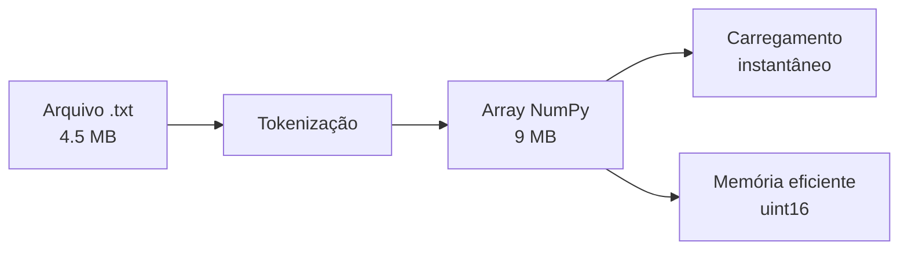
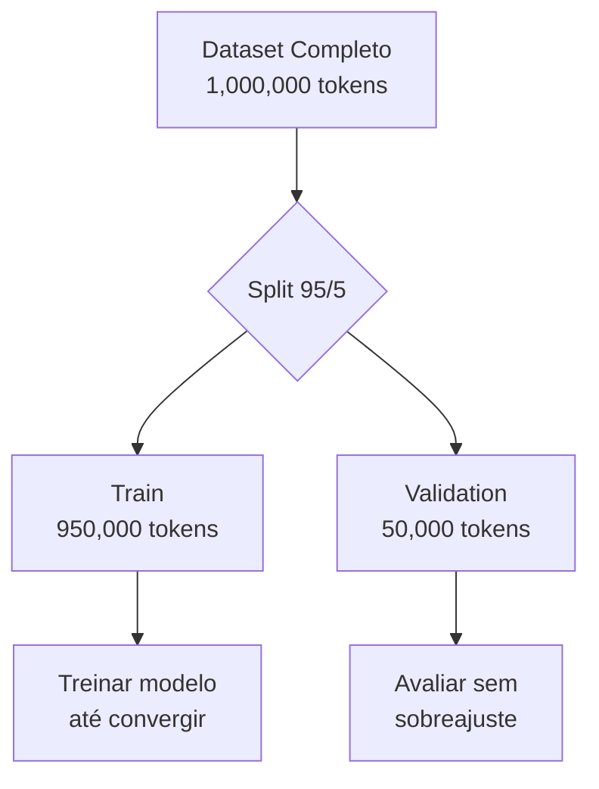
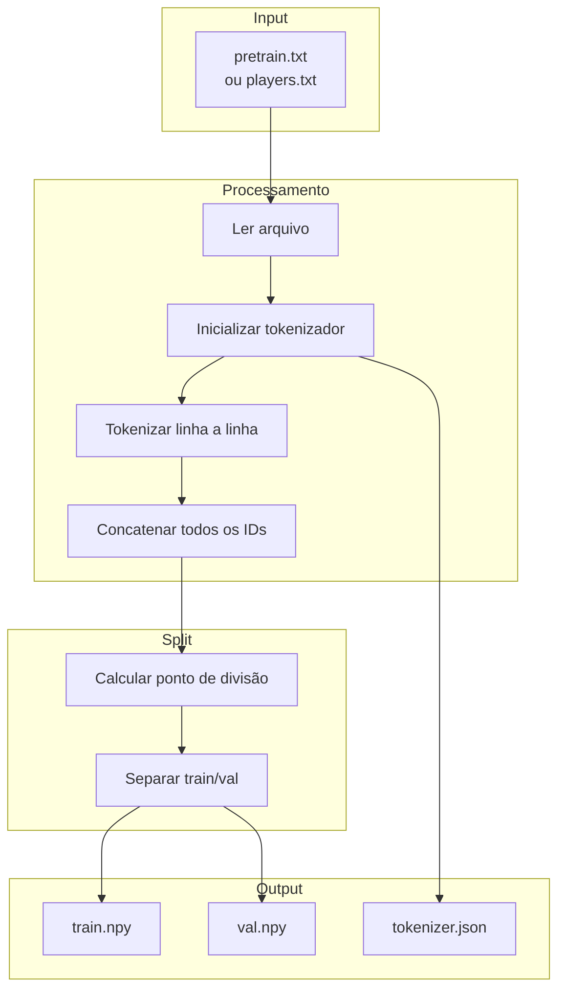
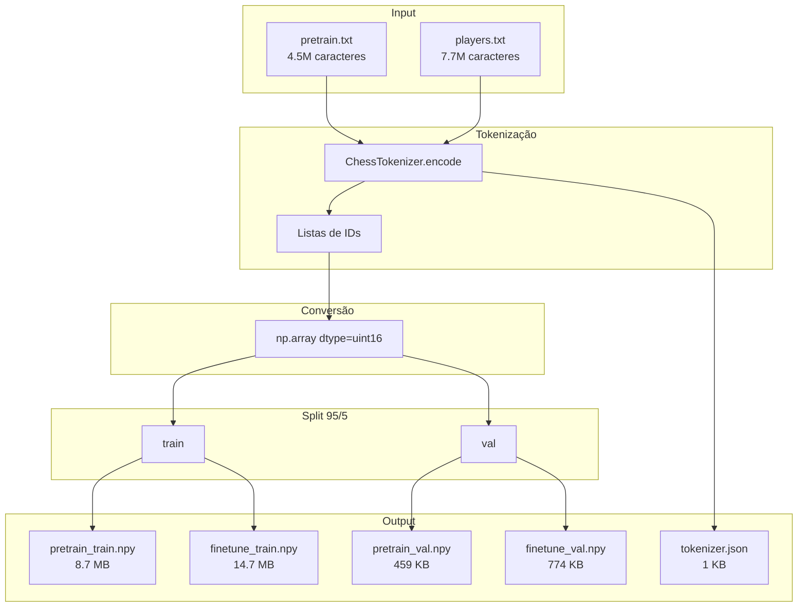

# prepare_dataset.py

> Transformar texto em tensores: tokenização e serialização do dataset.

## Objetivo

Converter arquivos `.txt` com partidas em PGN para arrays NumPy prontos para treinamento.

---

## Conceitos

### Por que Preparar o Dataset?



**Vantagens de pré-processar:**
- **Carregamento rápido**: `.npy` é binário e otimizado
- **Memória eficiente**: `uint16` (2 bytes) vs string (1+ byte por caractere)
- **Evita retokenização**: Tokeniza uma vez, usa muitas

### NumPy Binary Format

```python
import numpy as np

# Salvar
data = np.array([1, 2, 3, 4, 5], dtype=np.uint16)
np.save("data.npy", data)

# Carregar
loaded = np.load("data.npy")
# array([1, 2, 3, 4, 5], dtype=uint16)
```

### Divisão Train/Validation



**Por que separar?**
- **Train**: Usado para ajustar pesos
- **Validation**: Medir generalização (não usado no treino)

---

## Pipeline de Preparação



---

## Código Explicado

### 1. Leitura do Arquivo

```python
def prepare(input_path: str, name: str, val_split: float = 0.05):
    input_path = Path(input_path)
    out_dir = input_path.parent
    
    print(f"Lendo {input_path}...")
    with open(input_path, "r", encoding="utf-8") as f:
        text = f.read()
    
    print(f"  Caracteres total: {len(text):,}")
```

### 2. Tokenização

```python
    # Inicializa tokenizador
    tok = ChessTokenizer()
    
    # Salva tokenizador para uso futuro
    tok_path = out_dir / "tokenizer.json"
    tok.save(str(tok_path))
    print(f"  Tokenizador: vocab_size={tok.vocab_size}")
    
    # Tokeniza em batches para não estourar memória
    print("Tokenizando...")
    lines = text.split("\n")
    all_ids = []
    
    for line in tqdm(lines, unit="linhas"):
        if line.strip():
            ids = tok.encode(line + "\n", add_special_tokens=False)
            all_ids.extend(ids)
```

**Por que adicionar "\n"?**
- Mantém separação entre partidas
- Ajuda modelo a identificar início/fim de jogos

### 3. Conversão para NumPy

```python
    # Converte lista para array NumPy
    data = np.array(all_ids, dtype=np.uint16)
    print(f"  Tokens total: {len(data):,}")
    
    # uint16: 2 bytes por token, suporta até 65536 valores
    # suficiente para vocab_size ~50
```

### 4. Divisão Train/Val

```python
    # Calcula tamanho da validação
    n_val = int(len(data) * val_split)  # 5% do total
    n_train = len(data) - n_val         # 95% do total
    
    # Divide sequencialmente
    train_data = data[:n_train]
    val_data = data[n_train:]
```

**Por que divisão sequencial e não aleatória?**
- Partidas similares tendem a estar juntas (mesmo período, jogador)
- Preserva ordem temporal dos dados
- Evita "vazamento" de informação entre sets

### 5. Salvamento

```python
    train_path = out_dir / f"{name}_train.npy"
    val_path = out_dir / f"{name}_val.npy"
    
    np.save(str(train_path), train_data)
    np.save(str(val_path), val_data)
    
    print(f"\nDataset salvo:")
    print(f"  train: {len(train_data):,} tokens → {train_path}")
    print(f"  val:   {len(val_data):,} tokens  → {val_path}")
    print(f"  ratio: {len(val_data)/len(data)*100:.1f}% val")
```

---

## Execução

### Preparar Dataset de Pré-treino

```bash
python data/prepare_dataset.py --input data/pretrain.txt --name pretrain
```

Saída:
```
Lendo data/pretrain.txt...
  Caracteres total: 4,589,332

Tokenizando...
100%|████████████| 10,000/10,000 [00:02<00:00, 3,847 linhas/s]
  Tokens total: 4,589,332

Dataset salvo:
  train: 4,359,865 tokens → data/pretrain_train.npy
  val:   229,467 tokens  → data/pretrain_val.npy
  ratio: 5.0% val
```

### Preparar Dataset de Fine-tuning

```bash
python data/prepare_dataset.py --input data/players.txt --name finetune
```

Saída:
```
Lendo data/players.txt...
  Caracteres total: 7,741,301

Tokenizando...
100%|████████████| 8,991/8,991 [00:03<00:00, 2,654 linhas/s]
  Tokens total: 7,741,301

Dataset salvo:
  train: 7,354,236 tokens → data/finetune_train.npy
  val:   387,065 tokens  → data/finetune_val.npy
  ratio: 5.0% val
```

---

## Parâmetros

| Parâmetro | Default | Descrição |
|-----------|---------|-----------|
| `--input` | (obrigatório) | Arquivo .txt de entrada |
| `--name` | "dataset" | Prefixo dos arquivos de saída |
| `--val-split` | 0.05 | Fração para validação (5%) |

---

## Arquivos Gerados

```
data/
├── tokenizer.json         # Vocabulário serializado
│
├── pretrain_train.npy     # Treino (pré-treino)
├── pretrain_val.npy       # Validação (pré-treino)
│
├── finetune_train.npy     # Treino (fine-tuning)
└── finetune_val.npy       # Validação (fine-tuning)
```

### Estrutura do tokenizer.json

```json
{
  "stoi": {
    "<PAD>": 0,
    "<UNK>": 1,
    "<BOS>": 2,
    "<EOS>": 3,
    "a": 4,
    "b": 5,
    "c": 6,
    ...
  },
  "itos": {
    "0": "<PAD>",
    "1": "<UNK>",
    "2": "<BOS>",
    "3": "<EOS>",
    "4": "a",
    "5": "b",
    ...
  }
}
```

---

## Consumo no Treinamento

No `training/train.py`:

```python
# Carrega datasets
train_data = np.load("data/pretrain_train.npy")
val_data = np.load("data/pretrain_val.npy")

# Cria data loader
class DataLoader:
    def __init__(self, data, block_size, batch_size, device):
        self.data = torch.from_numpy(data.astype(np.int64))
        self.batch_size = batch_size
        self.block_size = block_size
    
    def get_batch(self):
        # Amostra posições aleatórias
        ix = torch.randint(len(self.data) - self.block_size, (self.batch_size,))
        
        # Cria input e target
        x = torch.stack([self.data[i:i+self.block_size] for i in ix])
        y = torch.stack([self.data[i+1:i+self.block_size+1] for i in ix])
        
        return x.to(device), y.to(device)
```

---

## Diagrama de Dados



---

## Tamanhos de Arquivos

| Arquivo | Caracteres | Tokens | Tamanho (.npy) |
|---------|------------|--------|----------------|
| pretrain_train | 4.36M | 4.36M | 8.7 MB |
| pretrain_val | 229K | 229K | 459 KB |
| finetune_train | 7.35M | 7.35M | 14.7 MB |
| finetune_val | 387K | 387K | 774 KB |

**Nota**: Um caractere ≈ um token (character-level tokenization)

---

## Considerações de Memória

### Processamento por Linhas

```python
# Ruim: Carregar tudo de uma vez
all_text = f.read()
all_ids = tok.encode(all_text)  # Pode estourar memória

# Bom: Processar linha a linha
all_ids = []
for line in f:
    all_ids.extend(tok.encode(line))
```

### Dtype uint16

- 2 bytes por token
- Suporta vocabulário até 65,536 tokens
- ChessLM precisa de apenas ~50 tokens

```python
# Comparação de tamanhos
float32: 4 bytes/token → 18 MB para 4.5M tokens
uint16:  2 bytes/token → 9 MB para 4.5M tokens
# Economia de 50%!
```

---

## Para Ir Mais Longe

### Data Augmentation

```python
# Rotação do tabuleiro (espelhamento)
def flip_board(moves: str) -> str:
    # Converter "e4" → "d5", "Nf3" → "Nc6", etc.
    # Treina modelo a reconhecer simetrias
    pass
```

### Balanceamento de Classes

```python
# Separar vitórias de brancas e pretas
white_wins = []
black_wins = []

for game in parse_pgn_file(path):
    result = game["tags"]["Result"]
    if result == "1-0":
        white_wins.append(game["moves"])
    elif result == "0-1":
        black_wins.append(game["moves"])

# Balancear para 50/50
min_len = min(len(white_wins), len(black_wins))
balanced = white_wins[:min_len] + black_wins[:min_len]
```

### Validação com python-chess

```python
import chess
import chess.pgn
import io

def validate_moves(moves_str: str) -> bool:
    pgn = io.StringIO(moves_str)
    game = chess.pgn.read_game(pgn)
    board = game.board()
    
    for move in game.mainline_moves():
        if move not in board.legal_moves:
            return False
        board.push(move)
    
    return True
```

### Chunking para Datasets Gigantes

```python
# Para datasets muito grandes (>1B tokens)
# Salvar em múltiplos arquivos

chunk_size = 100_000_000  # 100M tokens por arquivo
for i, chunk in enumerate(chunks(all_ids, chunk_size)):
    np.save(f"data/train_chunk_{i}.npy", np.array(chunk, dtype=np.uint16))
```

---

## Links Relacionados

- [[01-Data-Pipeline/Visao-Geral-Dados|Visão Geral de Dados]]
- [[02-Modelo/tokenizer|Tokenizador]]
- [[03-Treinamento/train|Treinamento]]
- [[03-Treinamento/finetune|Fine-tuning]]
