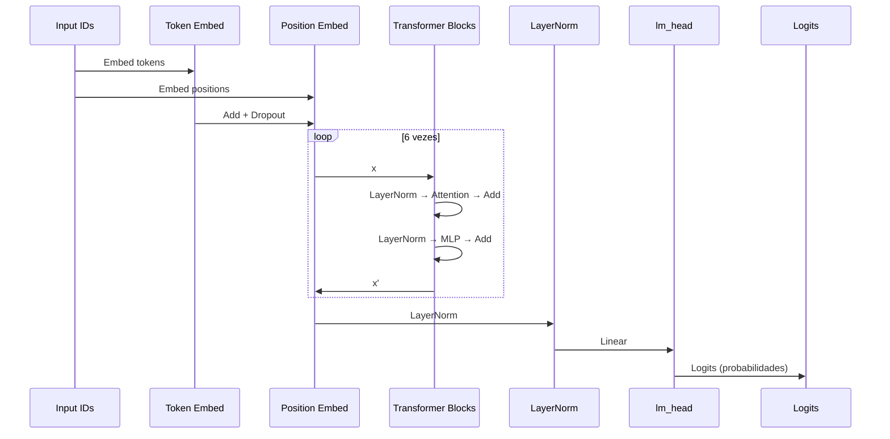
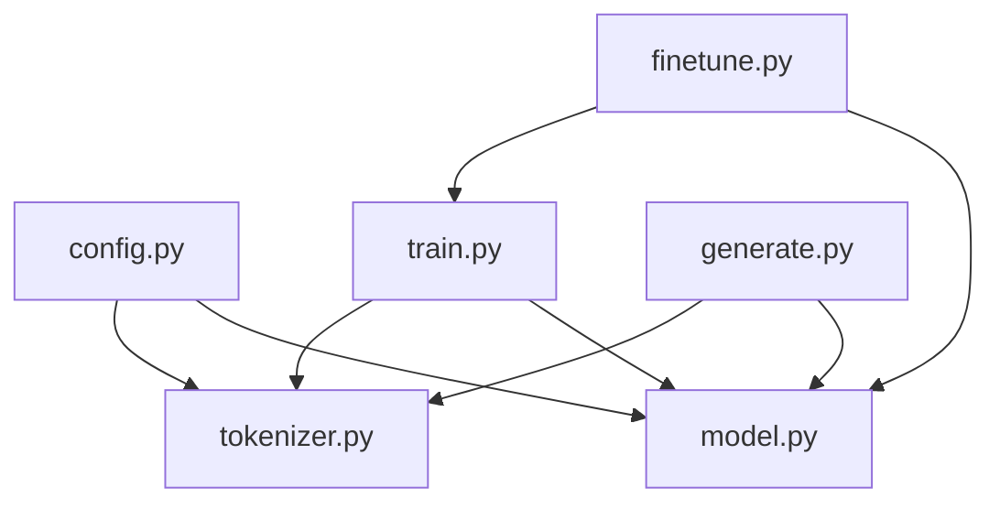

# Visão Geral - Modelo

> A arquitetura centerpiece do ChessLM: um transformer decoder-only otimizado para xadrez.

## Objetivo

Esta seção detalha a implementação do modelo de linguagem, desde a configuração de hiperparâmetros até a arquitetura completa.

---

## Arquitetura do ChessLM

```
Arquitetura ChessLM
════════════════════════════════════════════════════════════

    ┌────────────────────────────────────────────────┐
    │              INPUT: Token IDs                  │
    │            (batch, seq_len)                    │
    └─────────────────────┬──────────────────────────┘
                          │
          ┌───────────────┴───────────────┐
          ▼                               ▼
  ┌────────────────┐             ┌────────────────┐
  │ Token Embed    │             │ Position Embed │
  │     (wte)      │             │     (wpe)      │
  │ vocab → n_embd │             │  pos → n_embd  │
  └───────┬────────┘             └───────┬────────┘
          │                               │
          └───────────────┬───────────────┘
                          ▼
                    ┌──────────┐
                    │  + Add   │
                    └────┬─────┘
                         ▼
                    ┌──────────┐
                    │ Dropout  │
                    └────┬─────┘
                         │
          ┌──────────────┼──────────────┐
          ▼              ▼              ▼
    ┌──────────┐   ┌──────────┐   ┌──────────┐
    │ Block 1  │──►│   ...    │──►│ Block 6  │
    │(Transf.) │   │ Block 2  │   │(Transf.) │
    └──────────┘   └──────────┘   └────┬─────┘
                                       │
                                       ▼
                                ┌──────────────┐
                                │  LayerNorm   │
                                │    (ln_f)    │
                                └──────┬───────┘
                                       │
                                       ▼
                                ┌──────────────┐
                                │   Linear     │
                                │  (lm_head)   │
                                │ n_embd→vocab │
                                └──────┬───────┘
                                       │
                                       ▼
    ┌────────────────────────────────────────────────┐
    │              OUTPUT: Logits                    │
    │       (batch, seq_len, vocab_size)             │
    └────────────────────────────────────────────────┘
```

---

## Especificações

### Hiperparâmetros da Arquitetura

| Parâmetro | Valor | Descrição |
|-----------|-------|-----------|
| `vocab_size` | 64 | Tamanho do vocabulário (~50 chars + tokens especiais) |
| `block_size` | 512 | Contexto máximo em tokens |
| `n_embd` | 256 | Dimensão dos embeddings |
| `n_head` | 8 | Número de cabeças de atenção |
| `n_layer` | 6 | Número de blocos transformer |
| `dropout` | 0.1 | Probabilidade de dropout |

### Hiperparâmetros de Treinamento

| Parâmetro | Pré-treino | Fine-tuning |
|-----------|------------|-------------|
| `batch_size` | 64 | 64 |
| `learning_rate` | 3e-4 | 3e-5 |
| `max_iters` | 50,000 | 5,000 |
| `weight_decay` | 0.1 | 0.1 |
| `warmup_iters` | 1,000 | 100 |

---

## Contagem de Parâmetros

```
Distribuição de Parâmetros (~5M total)
════════════════════════════════════════════════════════════

MLP (Feed-Forward)  ████████████████████  63%  (3.14M)
Attention           ████████████          31%  (1.57M)
Embeddings          █                      3%  (0.15M)
LayerNorm                                  <1% (0.01M)
```

| Componente | Parâmetros | Porcentagem |
|------------|------------|-------------|
| MLP (Feed-Forward) | 3.14M | 63% |
| Attention | 1.57M | 31% |
| Embeddings | 0.15M | 3% |
| LayerNorm | 0.01M | <1% |

### Detalhamento

```
Embeddings:
  Token:    vocab_size × n_embd = 64 × 256 = 16,384
  Position: block_size × n_embd = 512 × 256 = 131,072
  Subtotal: ~147K

Por Bloco Transformer:
  Attention (Q, K, V, Out):
    4 × n_embd × n_embd = 4 × 256 × 256 = 262,144
  
  MLP:
    fc1: n_embd × 4×n_embd = 256 × 1024 = 262,144
    fc2: 4×n_embd × n_embd = 1024 × 256 = 262,144
    Subtotal: ~524K
  
  LayerNorms:
    2 × 2 × n_embd = 4 × 256 = 1,024
  
  Total por bloco: ~787K

6 Blocos: 6 × 787K ≈ 4.7M

Output Layer:
  lm_head: n_embd × vocab_size = 256 × 64 = 16,384
  (Weight tying: compartilha com token embedding!)

Total Final: ~5M parâmetros
```

---

## Componentes Principais

### 1. Configuração (`config.py`)

Define hiperparâmetros em dataclasses:

- `ModelConfig`: Parâmetros da arquitetura
- `TrainConfig`: Parâmetros de treinamento
- `FinetuneConfig`: Extende TrainConfig para fine-tuning

Ver: [[02-Modelo/config|config.py detalhado]]

### 2. Tokenizador (`tokenizer.py`)

Tokenização character-level para notação PGN:

- Vocabulário de ~50 caracteres
- Encode/decode determinístico
- Tokens especiais (PAD, UNK, BOS, EOS)

Ver: [[02-Modelo/tokenizer|tokenizer.py detalhado]]

### 3. Modelo (`model.py`)

Implementação do transformer:

- `CausalSelfAttention`: Multi-head self-attention com máscara causal
- `MLP`: Feed-forward com GELU
- `Block`: Transformer block completo
- `ChessLM`: Modelo principal

Ver: [[02-Modelo/model|model.py detalhado]]

---

## Fluxo Forward Pass



---

## Geração Autoregressiva

```
Geração Autoregressiva
────────────────────────────────────────────────────────────

    Contexto: "1. e4"
         │
         ▼
    ┌──────────┐
    │  Modelo  │
    └────┬─────┘
         │
         ▼
    Logits: P(e5)=0.25, P(c5)=0.20, ...
         │
         ▼
    ┌────────────────┐
    │    Sampling    │
    │ temp, top_k    │
    └───────┬────────┘
            │
            ▼
    Próximo token: "e5"
            │
            ▼
    Contexto: "1. e4 e5"
            │
            └──────────► (volta ao início)
```

### Parâmetros de Geração

| Parâmetro | Valor Típico | Efeito |
|-----------|--------------|--------|
| `temperature` | 0.8 - 1.0 | Menor = mais determinístico |
| `top_k` | 10 | Limita aos K tokens mais prováveis |
| `max_new_tokens` | Variável | Quantos tokens gerar |

---

## Comparação com Outros Modelos

| Modelo | Parâmetros | Vocabulário | Contexto | Camadas |
|--------|------------|-------------|----------|---------|
| **ChessLM** | ~5M | 64 | 512 | 6 |
| **GPT-2 Small** | 124M | 50,257 | 1024 | 12 |
| **GPT-2 Medium** | 355M | 50,257 | 1024 | 24 |
| **nanoGPT** | ~10M | 65 | 256 | 6 |
| **LLaMA 7B** | 7B | 32,000 | 2048 | 32 |

ChessLM é propositalmente pequeno para:
- Treino rápido (horas em GPU comum)
- Didático (código claro)
- Fácil experimentação

---

## Design Decisions

### Por que Decoder-Only?

```
Opções de Arquitetura
────────────────────────────────────────────────────────────

┌─────────────────────────────────────────────────────────┐
│                      Opções                              │
└───────────────┬─────────────────┬───────────────────────┘
                │                 │
                ▼                 ▼
        ┌───────────────┐  ┌───────────────┐  ┌───────────────┐
        │ Encoder-only  │  │Encoder-Decoder│  │ Decoder-only  │
        │  (BERT style) │  │  (T5 style)   │  │  (GPT style)  │
        └───────┬───────┘  └───────┬───────┘  └───────┬───────┘
                │                  │                  │
                ▼                  ▼                  ▼
        ✗ Não gera           ✗ Mais            ✓ Simples,
           texto            complexo         eficaz para
                                             geração
```

### Por que Character-Level?

- Vocabulário natural de xadrez é pequeno
- Sem OOV (Out of Vocabulary)
- Modelo aprende a "soletrar" movimentos
- Implementação simples

### Por que Pre-LN (Layer Normalization)?

```
Post-LN (original):
x → Attention → Add → LN

Pre-LN (ChessLM):
x → LN → Attention → Add
```

Vantagens do Pre-LN:
- Treinamento mais estável
- Melhor para redes profundas
- Padrão moderno em Transformers

### Por que Weight Tying?

```python
# Token embedding e lm_head compartilham pesos
self.transformer.wte.weight = self.lm_head.weight
```

Benefícios:
- Reduz parâmetros
- Melhora generalização
- Padrão em GPT-2 e modelos modernos

---

## Arquivos do Módulo

| Arquivo | Responsabilidade | Linhas |
|---------|------------------|--------|
| `config.py` | Hiperparâmetros | ~80 |
| `tokenizer.py` | Tokenização | ~130 |
| `model.py` | Arquitetura | ~260 |

---

## Diagrama de Dependências



---

## Para Ir Mais Longe

### Escalar o Modelo

```python
# ChessLM Small (~10M params)
n_embd = 384
n_head = 6
n_layer = 6

# ChessLM Medium (~50M params)
n_embd = 512
n_head = 8
n_layer = 12

# ChessLM Large (~100M params)
n_embd = 768
n_head = 12
n_layer = 12
```

### Otimizações Modernas

- [ ] **Flash Attention 2**: Atenção mais rápida e eficiente em memória
- [ ] **Rotary Position Embeddings (RoPE)**: Melhor codificação posicional
- [ ] **Grouped Query Attention (GQA)**: Inferência mais eficiente
- [ ] **Sliding Window Attention**: Para contextos muito longos
- [ ] **Gradient Checkpointing**: Economizar memória em treino

### Experimentos

- [ ] Aumentar `block_size` para 1024 (partidas mais longas)
- [ ] Adicionar mais camadas e medir melhoria
- [ ] Comparar Pre-LN vs Post-LN
- [ ] Testar diferentes estratégias de inicialização

---

## Links Relacionados

- [[00-Conceitos-Fundamentais/Arquitetura-Transformer|Arquitetura Transformer]]
- [[02-Modelo/config|config.py]]
- [[02-Modelo/tokenizer|tokenizer.py]]
- [[02-Modelo/model|model.py]]
- [[03-Treinamento/train|Treinamento]]
