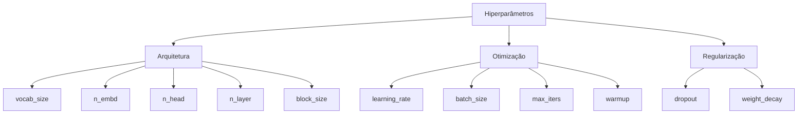
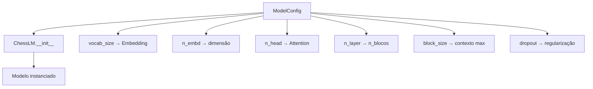

# config.py - Configurações

> Centralizar hiperparâmetros é uma boa prática que facilita experimentação e reprodutibilidade.

## Objetivo

Definir todos os hiperparâmetros do modelo e treinamento em dataclasses organizadas.

---

## Conceitos

### O que são Hiperparâmetros?

Hiperparâmetros são configurações definidas **antes** do treinamento que controlam:

- **Arquitetura**: Como o modelo é construído
- **Otimização**: Como o modelo aprende
- **Regularização**: Como evitar overfitting



### Por que Dataclasses?

```python
class ModelConfig:
    vocab_size: int = 64
    n_embd: int = 256
    # ...
```

**Vantagens:**
- Sintaxe limpa e declarativa
- Valores padrão explícitos
- Fácil de serializar (salvar em JSON/checkpoint)
- Validação automática com `__post_init__`

---

## Estrutura de Configurações

```
Estrutura de Configurações
────────────────────────────────────────────────────────────

                         config.py
                             │
            ┌────────────────┼────────────────┐
            ▼                ▼                ▼
     ┌───────────┐    ┌───────────┐    ┌──────────────┐
     │ModelConfig│    │TrainConfig│    │FinetuneConfig│
     └─────┬─────┘    └─────┬─────┘    └──────┬───────┘
           │                │                  │
           │                └────────┬─────────┘
           │                         │
           ▼                         ▼
   Hiperparâmetros            Herda de TrainConfig
   da arquitetura             + Overrides para
                              fine-tuning
```

---

## Código Explicado

### 1. ModelConfig

Configurações da arquitetura do modelo:

```python
@dataclass
class ModelConfig:
    # Tamanho do vocabulário (definido pelo tokenizador)
    vocab_size: int = 64
    
    # Contexto máximo em tokens (caracteres)
    block_size: int = 512
    
    # Dimensão dos embeddings
    n_embd: int = 256
    
    # Número de cabeças de atenção
    # n_embd deve ser divisível por n_head
    n_head: int = 8
    
    # Número de blocos transformer (profundidade)
    n_layer: int = 6
    
    # Probabilidade de dropout
    dropout: float = 0.1
    
    def __post_init__(self):
        # Validação: n_embd deve ser divisível por n_head
        assert self.n_embd % self.n_head == 0, \
            f"n_embd ({self.n_embd}) deve ser divisível por n_head ({self.n_head})"
```

#### Explicação dos Parâmetros

| Parâmetro | Valor | Impacto |
|-----------|-------|---------|
| `vocab_size` | 64 | Determinado pelo tokenizador |
| `block_size` | 512 | Partidas mais longas = mais contexto, mas mais memória |
| `n_embd` | 256 | Maior = representações mais ricas, mais parâmetros |
| `n_head` | 8 | Mais cabeças = aprender mais relações paralelas |
| `n_layer` | 6 | Mais camadas = maior capacidade, mais lento |
| `dropout` | 0.1 | Regularização, previne overfitting |

#### Por que n_embd % n_head == 0?

Cada cabeça de atenção precisa de dimensão igual (`head_dim = n_embd / n_head`):

```python
# Se n_embd = 256, n_head = 8:
head_dim = 256 / 8 = 32  # OK

# Se n_embd = 256, n_head = 7:
head_dim = 256 / 7 = 36.57  # ERRO: dimensão fracionária
```

---

### 2. TrainConfig

Configurações do loop de treinamento:

```python
@dataclass
class TrainConfig:
    # ── Dados ──
    dataset_name: str = "pretrain"
    data_dir: str = "data"
    val_split: float = 0.05         # 5% para validação
    tokenizer_path: str = "tokenizer.json"
    
    # ── Treino ──
    batch_size: int = 64            # Amostras por batch
    max_iters: int = 50_000         # Iterações totais
    eval_interval: int = 500        # Avaliar validação a cada N iters
    eval_iters: int = 100           # Batches por avaliação
    log_interval: int = 100         # Log de progresso
    
    # ── Otimizador ──
    learning_rate: float = 3e-4     # Taxa de aprendizado inicial
    weight_decay: float = 0.1       # Regularização L2
    beta1: float = 0.9              # Adam beta1
    beta2: float = 0.95             # Adam beta2
    grad_clip: float = 1.0          # Clipping de gradientes
    
    # ── Learning Rate Schedule ──
    warmup_iters: int = 1000        # Warmup inicial
    lr_decay_iters: int = 50_000    # Início do decay
    min_lr: float = 3e-5            # LR mínimo (final)
    
    # ── Checkpoints ──
    checkpoint_dir: str = "checkpoints"
    checkpoint_name: str = "pretrain"
    save_interval: int = 2000       # Salvar a cada N iters
    
    # ── Device ──
    device: str = "cuda"            # "cuda" ou "cpu"
    dtype: str = "bfloat16"         # Precisão numérica
    compile: bool = True            # torch.compile (PyTorch 2.0+)
```

---

### 3. Learning Rate Schedule

```
Learning Rate Schedule
────────────────────────────────────────────────────────────

Iteração 0 ──► Warmup ──► LR Max (iter 1000) ──► Cosine Decay ──► LR Min (iter 50000)

│ Warmup               │ Cosine Decay           │
│ ─────────────────    │ ─────────────────      │
│ LR cresce linearmente│ LR decresce suavemente │
```

#### Fórmula

```python
def get_lr(iteration: int, cfg: TrainConfig) -> float:
    # Warmup linear
    if iteration < cfg.warmup_iters:
        return cfg.learning_rate * iteration / cfg.warmup_iters
    
    # Decay já terminou
    if iteration > cfg.lr_decay_iters:
        return cfg.min_lr
    
    # Cosine decay
    progress = (iteration - cfg.warmup_iters) / (cfg.lr_decay_iters - cfg.warmup_iters)
    coeff = 0.5 * (1.0 + math.cos(math.pi * progress))
    
    return cfg.min_lr + coeff * (cfg.learning_rate - cfg.min_lr)
```

#### Por que esse schedule?

- **Warmup**: Evita gradientes instáveis no início
- **Cosine decay**: Decaimento suave, melhor convergência
- **Min LR**: Evita que LR vá a zero

---

### 4. FinetuneConfig

Extende TrainConfig com overrides para fine-tuning:

```python
@dataclass
class FinetuneConfig(TrainConfig):
    # Override do nome do dataset
    dataset_name: str = "finetune"
    checkpoint_name: str = "finetune"
    
    # Learning rate muito menor para não destruir pré-treino
    learning_rate: float = 3e-5     # 10× menor que pré-treino
    min_lr: float = 3e-6
    
    # Menos iterações (dataset menor)
    warmup_iters: int = 100
    max_iters: int = 5_000
    lr_decay_iters: int = 5_000
    save_interval: int = 500
    
    # Checkpoint de pré-treino para carregar
    pretrain_checkpoint: str = "checkpoints/pretrain_final.pt"
```

#### Por que LR menor no fine-tuning?

```
Por que Learning Rate menor no Fine-tuning?
────────────────────────────────────────────────────────────

┌──────────────────────────────────────────────────────────┐
│           Modelo pré-treinado (conhecimento estável)      │
└─────────────────────────┬────────────────────────────────┘
                          │
          ┌───────────────┴───────────────┐
          ▼                               ▼
┌─────────────────────┐          ┌─────────────────────┐
│  Fine-tuning        │          │  Fine-tuning        │
│  LR ALTO            │          │  LR BAIXO           │
└──────────┬──────────┘          └──────────┬──────────┘
           │                                │
           ▼                                ▼
┌─────────────────────┐          ┌─────────────────────┐
│ ❌ Catastrophic     │          │ ✅ Adapta suavemente│
│    Forgetting       │          │    preserva         │
│    (esquece         │          │    conhecimento     │
│    pré-treino)      │          │                     │
└─────────────────────┘          └─────────────────────┘
```

---

### 5. Instâncias Prontas

```python
# Config padrão do modelo
DEFAULT_MODEL = ModelConfig()

# Config de pré-treino
PRETRAIN_CFG = TrainConfig()

# Config de fine-tuning
FINETUNE_CFG = FinetuneConfig()
```

**Uso:**

```python
from model.config import ModelConfig, PRETRAIN_CFG

# Usar config padrão
model = ChessLM(ModelConfig())

# Usar config de pré-treino
train(cfg_model=ModelConfig(), cfg_train=PRETRAIN_CFG)
```

---

## Validação Automática

```python
def __post_init__(self):
    # Verifica compatibilidade
    assert self.n_embd % self.n_head == 0
    
    # Verifica valores positivos
    assert self.dropout >= 0 and self.dropout < 1
    assert self.learning_rate > 0
    assert self.batch_size > 0
```

---

## Serialização

Configurações são salvas nos checkpoints:

```python
checkpoint = {
    "iter": iteration,
    "model": model.state_dict(),
    "optimizer": optimizer.state_dict(),
    "cfg_model": cfg_model.__dict__,   # Salva como dict
    "cfg_train": cfg_train.__dict__,
}

torch.save(checkpoint, "checkpoint.pt")
```

**Loading:**

```python
ckpt = torch.load("checkpoint.pt")
cfg_model = ModelConfig(**ckpt["cfg_model"])
cfg_train = TrainConfig(**ckpt["cfg_train"])
```

---

## Diagrama: Config → Modelo



---

## Tabela de Trade-offs

### Aumentar n_embd

| Efeito | Positivo | Negativo |
|--------|----------|----------|
| Capacidade | ✅ Mais representações | ❌ Mais parâmetros |
| Velocidade | — | ❌ Mais lento |
| Memória | — | ❌ Mais VRAM |

### Aumentar n_layer

| Efeito | Positivo | Negativo |
|--------|----------|----------|
| Profundidade | ✅ Relações mais complexas | ❌ Mais parâmetros |
| Gradientes | — | ⚠️ Risco de vanishing |

### Aumentar block_size

| Efeito | Positivo | Negativo |
|--------|----------|----------|
| Contexto | ✅ Partidas mais longas | ❌ Mais memória |
| Atenção | — | ❌ O(n²) no tamanho |

---

## Configurações Alternativas

### Para CPU / Sem GPU

```python
cfg = TrainConfig()
cfg.device = "cpu"
cfg.dtype = "float32"
cfg.compile = False
cfg.batch_size = 16  # Menor para CPU
```

### Para GPU com Pouca Memória

```python
cfg = TrainConfig()
cfg.batch_size = 32  # Menor batch
cfg.n_embd = 128     # Modelo menor
cfg.n_layer = 4
cfg.block_size = 256
```

### Para Treino Mais Rápido (menos qualidade)

```python
cfg = TrainConfig()
cfg.max_iters = 10_000
cfg.eval_interval = 200
cfg.save_interval = 1000
```

---

## Para Ir Mais Longe

### Configs Dinâmicas

```python
@dataclass
class ModelConfig:
    # ...
    
    @classmethod
    def small(cls):
        return cls(n_embd=128, n_layer=4, n_head=4)
    
    @classmethod
    def medium(cls):
        return cls(n_embd=384, n_layer=8, n_head=6)
    
    @classmethod
    def large(cls):
        return cls(n_embd=512, n_layer=12, n_head=8)
```

### Validação Estendida

```python
def __post_init__(self):
    # Validações existentes...
    
    # Memória estimada
    params = self.estimate_params()
    memory_mb = params * 4 / 1e6  # float32
    print(f"Parâmetros estimados: {params/1e6:.1f}M")
    print(f"Memória de treino estimada: {memory_mb:.0f}MB")

def estimate_params(self):
    # Embeddings
    params = (self.vocab_size + self.block_size) * self.n_embd
    
    # Por bloco
    block_params = (
        4 * self.n_embd ** 2 +           # Attention
        2 * 4 * self.n_embd ** 2 +        # MLP
        4 * self.n_embd                   # LayerNorms
    )
    params += self.n_layer * block_params
    
    return params
```

### Hyperparameter Sweeps

```python
import itertools

learning_rates = [1e-4, 3e-4, 1e-3]
batch_sizes = [32, 64, 128]
dropouts = [0.0, 0.1, 0.2]

for lr, bs, do in itertools.product(learning_rates, batch_sizes, dropouts):
    cfg = TrainConfig()
    cfg.learning_rate = lr
    cfg.batch_size = bs
    cfg.dropout = do
    
    # Treinar e avaliar
    train_and_evaluate(cfg)
```

---

## Links Relacionados

- [[02-Modelo/Visao-Geral-Modelo|Visão Geral do Modelo]]
- [[02-Modelo/model|model.py]]
- [[03-Treinamento/train|Treinamento]]
- [[exercicios/exercicio-04-melhorias|Exercício: Melhorias]]
