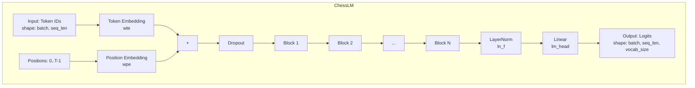
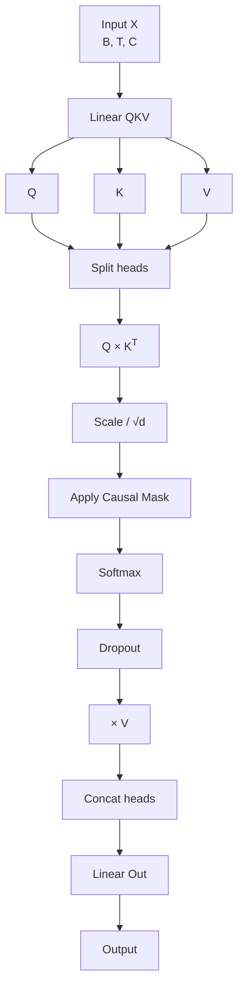
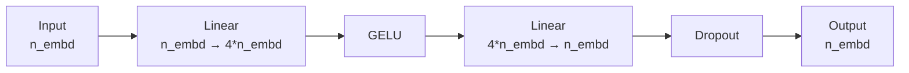
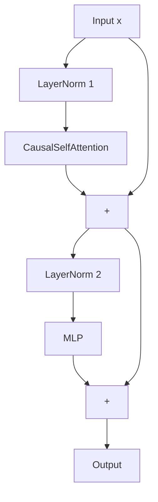
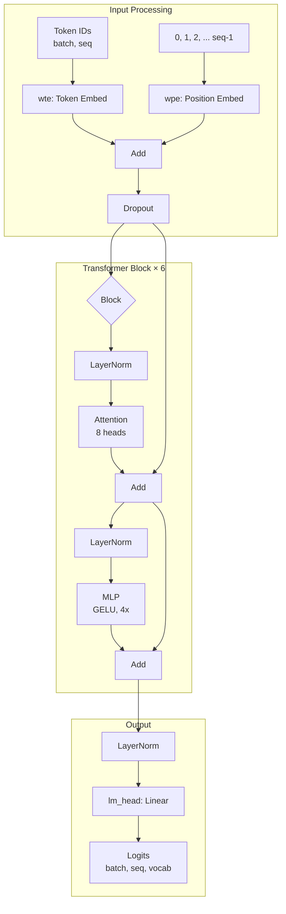

# model.py - Arquitetura do Modelo

> O coração do projeto: implementação completa do transformer decoder-only.

## Objetivo

Implementar a arquitetura GPT-like (decoder-only transformer) para modelar sequências de movimentos de xadrez.

---

## Visão Geral da Arquitetura



---

## Componentes

### 1. CausalSelfAttention

Multi-head self-attention com máscara causal (tokens só veem o passado):



#### Código

```python
class CausalSelfAttention(nn.Module):
    """Multi-head self-attention com máscara causal."""
    
    def __init__(self, cfg: ModelConfig):
        super().__init__()
        assert cfg.n_embd % cfg.n_head == 0
        
        self.n_head = cfg.n_head
        self.n_embd = cfg.n_embd
        self.dropout = cfg.dropout
        
        # Projeções Q, K, V combinadas para eficiência
        self.c_attn = nn.Linear(cfg.n_embd, 3 * cfg.n_embd, bias=False)
        self.c_proj = nn.Linear(cfg.n_embd, cfg.n_embd, bias=False)
        
        self.attn_drop = nn.Dropout(cfg.dropout)
        self.resid_drop = nn.Dropout(cfg.dropout)
        
        # Máscara causal (triangular inferior)
        self.register_buffer(
            "bias",
            torch.tril(torch.ones(cfg.block_size, cfg.block_size))
            .view(1, 1, cfg.block_size, cfg.block_size)
        )
    
    def forward(self, x: torch.Tensor) -> torch.Tensor:
        B, T, C = x.size()  # batch, sequência, embedding
        
        # Calcula Q, K, V
        q, k, v = self.c_attn(x).split(self.n_embd, dim=2)
        head_dim = C // self.n_head
        
        # Reorganiza para (B, n_head, T, head_dim)
        q = q.view(B, T, self.n_head, head_dim).transpose(1, 2)
        k = k.view(B, T, self.n_head, head_dim).transpose(1, 2)
        v = v.view(B, T, self.n_head, head_dim).transpose(1, 2)
        
        # Atenção escalonada
        scale = 1.0 / math.sqrt(head_dim)
        att = (q @ k.transpose(-2, -1)) * scale
        
        # Máscara causal (tokens futuros = -inf)
        att = att.masked_fill(self.bias[:, :, :T, :T] == 0, float("-inf"))
        att = F.softmax(att, dim=-1)
        att = self.attn_drop(att)
        
        # Agrega valores
        y = att @ v                                          # (B, n_head, T, head_dim)
        y = y.transpose(1, 2).contiguous().view(B, T, C)    # (B, T, C)
        
        return self.resid_drop(self.c_proj(y))
```

#### Máscara Causal

```
Para sequência [A, B, C, D]:

Matriz de atenção permitida (triangular inferior):
    A  B  C  D
A [ 1, 0, 0, 0 ]   A vê apenas A
B [ 1, 1, 0, 0 ]   B vê A, B
C [ 1, 1, 1, 0 ]   C vê A, B, C
D [ 1, 1, 1, 1 ]   D vê todos

Após masked_fill com -inf:
    A    B    C    D
A [ 0,  -∞,  -∞,  -∞]
B [ 0,   0,  -∞,  -∞]
C [ 0,   0,   0,  -∞]
D [ 0,   0,   0,   0]

Após softmax (0 vira prob, -inf vira 0):
    A     B     C     D
A [1.0,  0.0,  0.0,  0.0]
B [0.5,  0.5,  0.0,  0.0]
C [0.33, 0.33, 0.33, 0.0]
D [0.25, 0.25, 0.25, 0.25]
```

---

### 2. MLP (Feed-Forward)

Rede feed-forward com expansão 4x e ativação GELU:



#### Código

```python
class MLP(nn.Module):
    """Feed-forward com ativação GELU."""
    
    def __init__(self, cfg: ModelConfig):
        super().__init__()
        self.fc1 = nn.Linear(cfg.n_embd, 4 * cfg.n_embd, bias=False)
        self.fc2 = nn.Linear(4 * cfg.n_embd, cfg.n_embd, bias=False)
        self.drop = nn.Dropout(cfg.dropout)
        self.act = nn.GELU()
    
    def forward(self, x: torch.Tensor) -> torch.Tensor:
        return self.drop(self.fc2(self.act(self.fc1(x))))
```

#### Por que 4x?

```
O tamanho intermediário é 4× n_embd:
- Aumenta capacidade de processamento dentro de cada posição
- Permite aprender transformações não-lineares complexas
- Padrão original do transformer e usado universalmente

Exemplo: n_embd = 256
  Input:  256
  Hidden: 1024 (4×)
  Output: 256
```

---

### 3. Block (Transformer Block)

Bloco completo do transformer com Pre-LN:



#### Código

```python
class Block(nn.Module):
    """Bloco transformer: Pre-LN com conexões residuais."""
    
    def __init__(self, cfg: ModelConfig):
        super().__init__()
        self.ln1 = nn.LayerNorm(cfg.n_embd)
        self.ln2 = nn.LayerNorm(cfg.n_embd)
        self.attn = CausalSelfAttention(cfg)
        self.mlp = MLP(cfg)
    
    def forward(self, x: torch.Tensor) -> torch.Tensor:
        # Pre-LN: Normaliza ANTES da operação
        x = x + self.attn(self.ln1(x))   # Residual + Attention
        x = x + self.mlp(self.ln2(x))    # Residual + MLP
        return x
```

#### Pre-LN vs Post-LN

```
Post-LN (Original do paper 2017):
x → Attention → Add → LayerNorm
x → MLP → Add → LayerNorm

Pre-LN (ChessLM - Mais estável):
x → LayerNorm → Attention → Add
x → LayerNorm → MLP → Add
```

---

### 4. ChessLM (Modelo Principal)

```python
class ChessLM(nn.Module):
    """
    Language model para xadrez.
    
    Recebe sequência de tokens (caracteres PGN) e prevê o próximo token.
    """
    
    def __init__(self, cfg: ModelConfig):
        super().__init__()
        self.cfg = cfg
        
        self.transformer = nn.ModuleDict(dict(
            wte = nn.Embedding(cfg.vocab_size, cfg.n_embd),  # Token embeddings
            wpe = nn.Embedding(cfg.block_size, cfg.n_embd),  # Position embeddings
            drop = nn.Dropout(cfg.dropout),
            h = nn.ModuleList([Block(cfg) for _ in range(cfg.n_layer)]),
            ln_f = nn.LayerNorm(cfg.n_embd),
        ))
        
        self.lm_head = nn.Linear(cfg.n_embd, cfg.vocab_size, bias=False)
        
        # Weight tying: embedding e lm_head compartilham pesos
        self.transformer.wte.weight = self.lm_head.weight
        
        # Inicialização
        self.apply(self._init_weights)
        
        # Escala residual (conforme GPT-2)
        for pn, p in self.named_parameters():
            if pn.endswith("c_proj.weight"):
                nn.init.normal_(p, mean=0.0, std=0.02 / math.sqrt(2 * cfg.n_layer))
        
        n_params = sum(p.numel() for p in self.parameters())
        print(f"ChessLM inicializado — {n_params/1e6:.1f}M parâmetros")
```

#### Inicialização

```python
def _init_weights(self, module: nn.Module):
    """Inicialização padrão para transformer."""
    if isinstance(module, nn.Linear):
        nn.init.normal_(module.weight, mean=0.0, std=0.02)
        if module.bias is not None:
            nn.init.zeros_(module.bias)
    elif isinstance(module, nn.Embedding):
        nn.init.normal_(module.weight, mean=0.0, std=0.02)
```

---

## Forward Pass

```python
def forward(
    self,
    idx: torch.Tensor,
    targets: torch.Tensor | None = None
) -> tuple[torch.Tensor, torch.Tensor | None]:
    """
    Args:
        idx:     (B, T) tensor de IDs de tokens
        targets: (B, T) tensor de IDs alvo (para loss)
    
    Returns:
        logits: (B, T, vocab_size)
        loss:   escalar (se targets fornecido) ou None
    """
    B, T = idx.size()
    assert T <= self.cfg.block_size, \
        f"Sequência de tamanho {T} excede block_size={self.cfg.block_size}"
    
    device = idx.device
    pos = torch.arange(0, T, dtype=torch.long, device=device)
    
    # Embeddings de token + posição
    tok_emb = self.transformer.wte(idx)   # (B, T, n_embd)
    pos_emb = self.transformer.wpe(pos)   # (T, n_embd)
    x = self.transformer.drop(tok_emb + pos_emb)
    
    # Blocos transformer
    for block in self.transformer.h:
        x = block(x)
    
    x = self.transformer.ln_f(x)
    logits = self.lm_head(x)              # (B, T, vocab_size)
    
    # Calcula loss se targets fornecidos
    loss = None
    if targets is not None:
        loss = F.cross_entropy(
            logits.view(-1, logits.size(-1)),
            targets.view(-1),
            ignore_index=-1
        )
    
    return logits, loss
```

---

## Geração Autoregressiva

```mermaid
graph TD
    A[Contexto inicial<br/>"1. e4"] --> B[Forward]
    B --> C[Logits último token]
    C --> D[Scale por temperature]
    D --> E[Top-k filtering]
    E --> F[Softmax]
    F --> G[Sample]
    G --> H[Próximo token]
    H --> I[Concatenar ao contexto]
    I --> J{max_tokens?}
    J -->|Não| B
    J -->|Sim| K[Retornar sequência]
```

### Código

```python
@torch.no_grad()
def generate(
    self,
    idx: torch.Tensor,
    max_new_tokens: int,
    temperature: float = 1.0,
    top_k: int | None = None,
) -> torch.Tensor:
    """
    Gera novos tokens autoregressivamente.
    
    Args:
        idx:            (B, T) contexto inicial
        max_new_tokens: quantos tokens gerar
        temperature:    >1 = mais aleatório, <1 = mais determinístico
        top_k:          filtra para os k tokens mais prováveis
    
    Returns:
        (B, T + max_new_tokens) sequência estendida
    """
    for _ in range(max_new_tokens):
        # Trunca contexto se exceder block_size
        idx_cond = idx if idx.size(1) <= self.cfg.block_size \
                   else idx[:, -self.cfg.block_size:]
        
        # Forward
        logits, _ = self(idx_cond)
        logits = logits[:, -1, :] / temperature  # Última posição
        
        # Top-k filtering
        if top_k is not None:
            v, _ = torch.topk(logits, min(top_k, logits.size(-1)))
            logits[logits < v[:, [-1]]] = float("-inf")
        
        # Sample
        probs = F.softmax(logits, dim=-1)
        next_id = torch.multinomial(probs, num_samples=1)
        
        # Concatena
        idx = torch.cat((idx, next_id), dim=1)
    
    return idx
```

### Parâmetros de Geração

| Parâmetro | Valor | Efeito |
|-----------|-------|--------|
| `temperature=0.5` | Baixo | Determinístico, repete padrões |
| `temperature=1.0` | Médio | Balanceado |
| `temperature=1.5` | Alto | Criativo, imprevisível |
| `top_k=5` | Restrito | Apenas 5 candidatos |
| `top_k=50` | Amplo | 50 candidatos |
| `top_k=None` | Sem filtro | Todos tokens |

---

## Otimizador

```python
def configure_optimizers(self, cfg) -> torch.optim.Optimizer:
    """
    AdamW com weight decay apenas em parâmetros 2D (pesos),
    não em biases e LayerNorms.
    """
    decay = set()
    no_decay = set()
    whitelist = (nn.Linear,)
    blacklist = (nn.LayerNorm, nn.Embedding)
    
    for mn, m in self.named_modules():
        for pn, _ in m.named_parameters():
            fpn = f"{mn}.{pn}" if mn else pn
            if pn.endswith("bias"):
                no_decay.add(fpn)
            elif pn.endswith("weight") and isinstance(m, whitelist):
                decay.add(fpn)
            elif pn.endswith("weight") and isinstance(m, blacklist):
                no_decay.add(fpn)
    
    param_dict = {pn: p for pn, p in self.named_parameters()}
    decay = decay & param_dict.keys()
    no_decay = no_decay & param_dict.keys()
    
    optim_groups = [
        {"params": [param_dict[pn] for pn in sorted(decay)],
         "weight_decay": cfg.weight_decay},
        {"params": [param_dict[pn] for pn in sorted(no_decay)],
         "weight_decay": 0.0},
    ]
    
    optimizer = torch.optim.AdamW(
        optim_groups,
        lr=cfg.learning_rate,
        betas=(cfg.beta1, cfg.beta2),
    )
    return optimizer
```

---

## Contagem de Parâmetros

```python
model = ChessLM(ModelConfig())

print(f"Parâmetros: {sum(p.numel() for p in model.parameters())/1e6:.1f}M")

# Detalhado:
for name, param in model.named_parameters():
    if param.requires_grad:
        print(f"{name}: {param.numel():,} params")
```

Saída típica:

```
transformer.wte.weight: 16,384
transformer.wpe.weight: 131,072
transformer.h.0.ln1.weight: 256
transformer.h.0.ln1.bias: 256
transformer.h.0.attn.c_attn.weight: 196,608
transformer.h.0.attn.c_proj.weight: 65,536
transformer.h.0.ln2.weight: 256
transformer.h.0.ln2.bias: 256
transformer.h.0.mlp.fc1.weight: 262,144
transformer.h.0.mlp.fc2.weight: 262,144
...
lm_head.weight: (tied with wte)

Total: ~5M parâmetros
```

---

## Diagrama Completo



---

## Para Ir Mais Longe

### Flash Attention 2

```python
# Instalar: pip install flash-attn --no-build-isolation
from flash_attn import flash_attn_func

# Substituir atenção manual por Flash Attention
# Mais rápido e eficiente em memória
```

### Rotary Position Embeddings (RoPE)

```python
# Em vez de position embeddings aprendidos
# Usar codificação rotacional para melhor generalização
# Ver paper: "RoFormer: Enhanced Transformer with Rotary Position Embedding"
```

### Gradient Checkpointing

```python
# Economizar memória durante treino
model.gradient_checkpointing_enable()
```

### Modelos de Diferentes Tamanhos

```python
def get_model_config(size: str) -> ModelConfig:
    configs = {
        "nano": ModelConfig(n_embd=128, n_layer=4, n_head=4),
        "small": ModelConfig(n_embd=256, n_layer=6, n_head=8),
        "medium": ModelConfig(n_embd=512, n_layer=8, n_head=8),
        "large": ModelConfig(n_embd=768, n_layer=12, n_head=12),
    }
    return configs[size]
```

---

## Links Relacionados

- [[00-Conceitos-Fundamentais/Arquitetura-Transformer|Arquitetura Transformer]]
- [[02-Modelo/config|config.py]]
- [[02-Modelo/tokenizer|tokenizer.py]]
- [[03-Treinamento/train|Treinamento]]
- [[exercicios/exercicio-02-atencao|Exercício: Atenção]]
