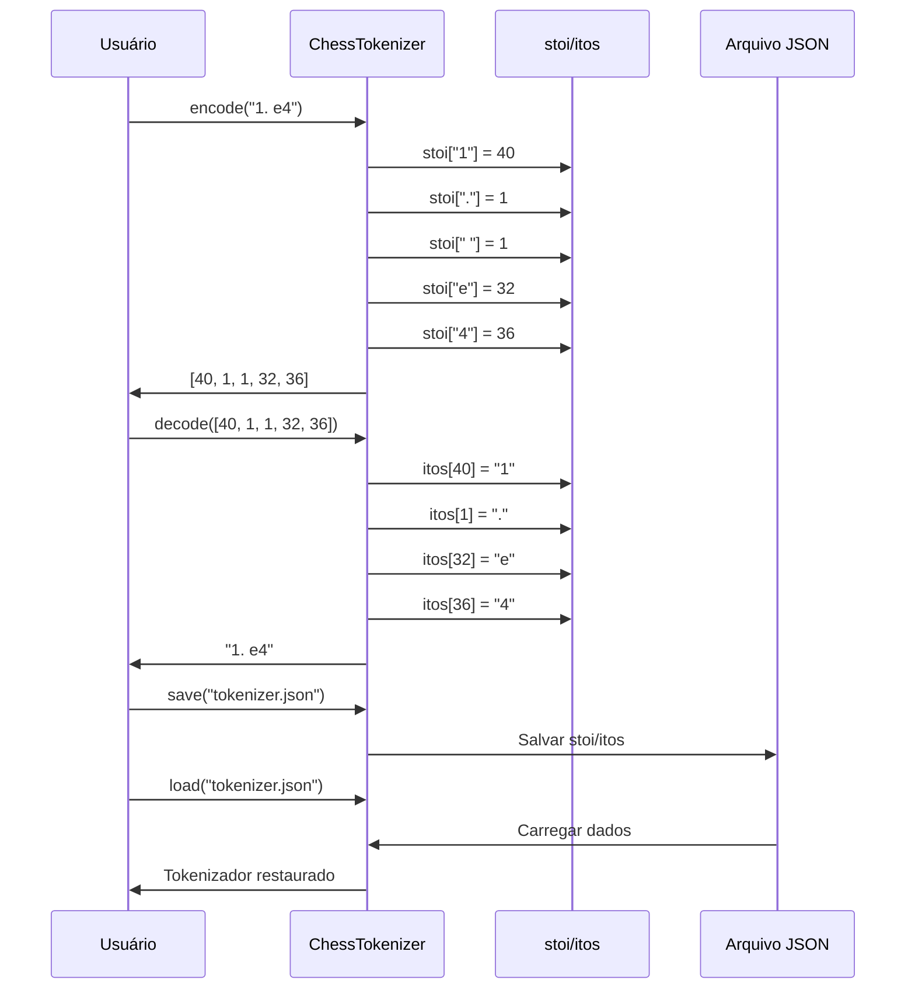

# tokenizer.py - Tokenizador

> A ponte entre texto e tensores: tokenização character-level para notação PGN.

## Objetivo

Converter partidas de xadrez em notação PGN para sequências de IDs numéricos que o modelo possa processar.

---

## Conceitos

### Tokenização Character-Level

Cada caractere do texto vira um token (ID numérico):

```
Tokenização Character-Level
────────────────────────────────────────────────────────────

    "1. e4 e5"
         │
         ▼
    ┌─────────────┐
    │ Split chars │
    └─────────────┘
         │
         ▼
    ['1', '.', ' ', 'e', '4', ' ', 'e', '5']
         │
         ▼
    ┌─────────────┐
    │  Map to IDs │
    └─────────────┘
         │
         ▼
    [40, 1, 1, 32, 36, 1, 32, 37]
```

### Vocabulário de Xadrez

A notação PGN usa um conjunto limitado de caracteres:

```python
CHESS_CHARS = (
    "abcdefgh"      # Colunas (files)
    "12345678"      # Linhas (ranks)
    "RNBQK"         # Peças (Rook, kNight, Bishop, Queen, King)
    "x+=#+."        # Captura (x), promoção (=), xeque (+), mate (#), ponto
    "O-"            # Roque (O-O ou O-O-O)
    "0123456789"    # Numeração de movimentos
    " \n/"          # Separadores
    "*"             # Resultado indeterminado
)
```

Total: ~(letras)+(números)+(símbolos) = ~30-40 caracteres únicos

### Tokens Especiais

| Token | ID | Uso |
|-------|-----|-----|
| `<PAD>` | 0 | Padding de sequências |
| `<UNK>` | 1 | Caractere desconhecido |
| `<BOS>` | 2 | Beginning of Sequence (início) |
| `<EOS>` | 3 | End of Sequence (fim) |

---

## Arquitetura do Tokenizador

```
Arquitetura do Tokenizador
────────────────────────────────────────────────────────────

┌─────────────────────────────────────────────────┐
│             INICIALIZAÇÃO                        │
│                                                  │
│  Vocabulário + Tokens Especiais                  │
│         │                                        │
│    ┌────┴────┐                                   │
│    ▼         ▼                                   │
│  stoi:     itos:                                 │
│  String→ID ID→String                             │
└─────────────────────────────────────────────────┘

┌─────────────────────────────────────────────────┐
│               ENCODE                             │
│                                                  │
│  Texto PGN → Para cada caractere → Lookup stoi  │
│                                     │            │
│                                     ▼            │
│                              Lista de IDs        │
└─────────────────────────────────────────────────┘

┌─────────────────────────────────────────────────┐
│               DECODE                             │
│                                                  │
│  Lista de IDs → Para cada ID → Lookup itos      │
│                                  │               │
│                                  ▼               │
│                          Concatenar → Texto PGN  │
└─────────────────────────────────────────────────┘
```

---

## Código Explicado

### 1. Definição do Vocabulário

```python
# Caracteres usados na notação PGN
CHESS_CHARS = (
    "abcdefgh"          # colunas
    "12345678"          # linhas
    "RNBQK"             # peças (maiúsculas)
    "x+=#+."            # captura, promoção, xeque, mate, ponto
    "O-"                # roque (letra O e hífen)
    "0123456789"        # numeração dos movimentos
    " \n/"              # separadores
    "*"                 # resultado indeterminado
    "1/2"               # empate (caracteres já cobertos)
)

# Remove duplicatas mantendo ordem
_seen = set()
VOCAB_CHARS = []
for c in CHESS_CHARS:
    if c not in _seen:
        VOCAB_CHARS.append(c)
        _seen.add(c)

# Tokens especiais
PAD_TOKEN = "<PAD>"
UNK_TOKEN = "<UNK>"
BOS_TOKEN = "<BOS>"
EOS_TOKEN = "<EOS>"
SPECIAL_TOKENS = [PAD_TOKEN, UNK_TOKEN, BOS_TOKEN, EOS_TOKEN]
```

### 2. Classe ChessTokenizer

```python
class ChessTokenizer:
    """
    Tokenizador por caractere para partidas de xadrez em PGN.
    
    Uso:
        tok = ChessTokenizer()
        ids = tok.encode("1. e4 e5 2. Nf3")
        text = tok.decode(ids)
    """
    
    def __init__(self):
        # Constrói vocabulário: especiais primeiro, depois caracteres
        all_tokens = SPECIAL_TOKENS + VOCAB_CHARS
        
        # Mapeamentos bidirecionais
        self.stoi = {ch: i for i, ch in enumerate(all_tokens)}  # String to Index
        self.itos = {i: ch for ch, i in self.stoi.items()}      # Index to String
        
        # IDs de tokens especiais (para acesso rápido)
        self.pad_id = self.stoi[PAD_TOKEN]
        self.unk_id = self.stoi[UNK_TOKEN]
        self.bos_id = self.stoi[BOS_TOKEN]
        self.eos_id = self.stoi[EOS_TOKEN]
    
    @property
    def vocab_size(self) -> int:
        return len(self.stoi)
```

### 3. Encode (Texto → IDs)

```python
def encode(self, text: str, add_special_tokens: bool = False) -> list[int]:
    """
    Converte string PGN em lista de IDs.
    
    Args:
        text: Texto em notação PGN
        add_special_tokens: Se True, adiciona BOS e EOS
    
    Returns:
        Lista de IDs numéricos
    """
    ids = []
    
    # Token de início (opcional)
    if add_special_tokens:
        ids.append(self.bos_id)
    
    # Cada caractere vira um ID
    for ch in text:
        # Se caractere não está no vocabulário, usa UNK
        ids.append(self.stoi.get(ch, self.unk_id))
    
    # Token de fim (opcional)
    if add_special_tokens:
        ids.append(self.eos_id)
    
    return ids
```

### 4. Decode (IDs → Texto)

```python
def decode(self, ids: list[int], skip_special: bool = True) -> str:
    """
    Converte lista de IDs de volta para string.
    
    Args:
        ids: Lista de IDs
        skip_special: Se True, remove tokens especiais do output
    
    Returns:
        String reconstruída
    """
    chars = []
    
    for i in ids:
        token = self.itos.get(i, "")
        
        # Pula tokens especiais se pedido
        if skip_special and token in SPECIAL_TOKENS:
            continue
        
        chars.append(token)
    
    return "".join(chars)
```

### 5. Salvar e Carregar

```python
def save(self, path: str):
    """Salva o vocabulário em arquivo JSON."""
    data = {
        "stoi": self.stoi,
        "itos": {str(k): v for k, v in self.itos.items()},
    }
    with open(path, "w", encoding="utf-8") as f:
        json.dump(data, f, ensure_ascii=False, indent=2)
    print(f"Tokenizador salvo em {path} (vocab_size={self.vocab_size})")

@classmethod
def load(cls, path: str) -> "ChessTokenizer":
    """Carrega tokenizador de arquivo JSON."""
    with open(path, "r", encoding="utf-8") as f:
        data = json.load(f)
    
    # Cria instância sem __init__
    tok = cls.__new__(cls)
    tok.stoi = data["stoi"]
    tok.itos = {int(k): v for k, v in data["itos"].items()}
    
    # Reconstrói IDs especiais
    tok.pad_id = tok.stoi[PAD_TOKEN]
    tok.unk_id = tok.stoi[UNK_TOKEN]
    tok.bos_id = tok.stoi[BOS_TOKEN]
    tok.eos_id = tok.stoi[EOS_TOKEN]
    
    return tok
```

---

## Exemplos de Uso

### Uso Básico

```python
tok = ChessTokenizer()

# Encode
ids = tok.encode("1. e4 e5 2. Nf3")
# [40, 1, 32, 36, 1, 32, 37, 1, 40, 2, 1, 28, ...]

# Decode
text = tok.decode(ids)
# "1. e4 e5 2. Nf3"

# Com tokens especiais
ids = tok.encode("e4", add_special_tokens=True)
# [2, 32, 36, 3]  = [BOS, e, 4, EOS]
```

### Verificar Integridade

```python
test = "1. e4 e5 2. Nf3 Nc6 3. Bb5+ a6"
encoded = tok.encode(test)
decoded = tok.decode(encoded)

assert decoded == test, "Encode/decode não bateu!"
print("✓ Teste passou")
```

### Contar Tokens

```python
with open("pretrain.txt") as f:
    text = f.read()

ids = tok.encode(text)
print(f"Total de tokens: {len(ids):,}")
print(f"Vocabulário: {tok.vocab_size}")
```

---

## Diagrama de Fluxo



---

## Vocabulário Completo

```python
# Após inicialização
tok = ChessTokenizer()

# Ver vocabulário
for char, idx in tok.stoi.items():
    print(f"'{char}' → {idx}")
```

Exemplo de saída:

```
'<PAD>' → 0
'<UNK>' → 1
'<BOS>' → 2
'<EOS>' → 3
'a' → 4
'b' → 5
'c' → 6
'd' → 7
'e' → 8
'f' → 9
'g' → 10
'h' → 11
'1' → 12
'2' → 13
'3' → 14
'4' → 15
'5' → 16
'6' → 17
'7' → 18
'8' → 19
'R' → 20
'N' → 21
'B' → 22
'Q' → 23
'K' → 24
'x' → 25
'+' → 26
'=' → 27
'#' → 28
'.' → 29
'O' → 30
'-' → 31
'0' → 32
'9' → 33
' ' → 34
'\n' → 35
'/' → 36
'*' → 37
```

---

## Propriedades do Tokenizador

```python
@property
def vocab_size(self) -> int:
    """Tamanho do vocabulário."""
    return len(self.stoi)  # ~50-60

# IDs especiais
tok.pad_id  # 0: Para padding
tok.unk_id  # 1: Para caracteres desconhecidos
tok.bos_id  # 2: Início de sequência
tok.eos_id  # 3: Fim de sequência
```

---

## Integração com o Treinamento

No `prepare_dataset.py`:

```python
tok = ChessTokenizer()
tok.save("data/tokenizer.json")

# Tokeniza linha a linha
for line in lines:
    ids = tok.encode(line + "\n")
    all_ids.extend(ids)

# Salva como numpy
np.save("train.npy", np.array(all_ids, dtype=np.uint16))
```

No `train.py`:

```python
# Carrega tokenizador
tok = ChessTokenizer.load("data/tokenizer.json")
cfg.vocab_size = tok.vocab_size

# Treina modelo
model = ChessLM(cfg)
```

Na inferência:

```python
# Carrega modelo e tokenizador
model, tok = load_model("checkpoint.pt")

# Gera
ids = tok.encode("1. e4")
idx = torch.tensor([ids])
generated = model.generate(idx, max_new_tokens=50)
text = tok.decode(generated[0].tolist())
```

---

## Comparação com Outros Tokenizadores

| Feature | ChessLM | BPE (GPT) | Word |
|---------|---------|-----------|------|
| **Vocabulário** | ~50 | 50k-100k | 100k+ |
| **OOV** | Nunca | Raro | Comum |
| **Sequência** | Longa | Média | Curta |
| **Implementação** | Simples | Complexa | Simples |
| **Domínio** | Xadrez | Geral | Geral |

---

## Para Ir Mais Longe

### Adicionar Novos Caracteres

```python
# Se precisar de mais símbolos
CHESS_CHARS = (
    "abcdefgh"
    "12345678"
    "RNBQK"
    "x+=#+."
    "O-"
    "0123456789"
    " \n/"
    "*"
    "!?"      # Anotações de lance (opcional)
)
```

### BPE para Xadrez

```python
# Tokenização BPE poderia aprender:
# - "e4" como um token
# - "Nf3" como um token
# - Padrões comuns como tokens únicos

# Exemplo hipotético:
ids = bpe.encode("1. e4 e5 2. Nf3")
# [175, 390, 391, 412] em vez de ~20 character tokens
```

### Validação de Notação

```python
import chess

def validate_pgn_moves(moves_str: str) -> bool:
    """Verifica se movimentos são legais."""
    board = chess.Board()
    
    for move_san in moves_str.split():
        try:
            move = board.parse_san(move_san)
            if move not in board.legal_moves:
                return False
            board.push(move)
        except:
            return False
    
    return True
```

### Estatísticas de Tokens

```python
from collections import Counter

def token_stats(text: str, tok: ChessTokenizer) -> dict:
    """Estatísticas de uso de tokens."""
    ids = tok.encode(text)
    
    counter = Counter(ids)
    total = len(ids)
    
    return {
        "total_tokens": total,
        "unique_tokens": len(counter),
        "most_common": [(tok.decode([t]), c, c/total*100) 
                        for t, c in counter.most_common(10)],
    }
```

---

## Links Relacionados

- [[00-Conceitos-Fundamentais/Tokenizacao|Tokenização (Conceitos)]]
- [[01-Data-Pipeline/prepare_dataset|Prepare Dataset]]
- [[02-Modelo/Visao-Geral-Modelo|Visão Geral do Modelo]]
- [[exercicios/exercicio-01-tokenizador|Exercício: Tokenizador]]
