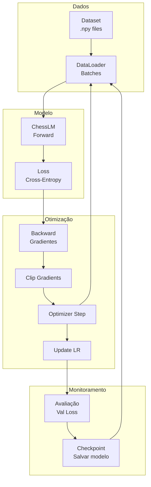
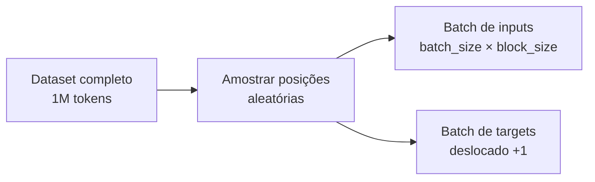
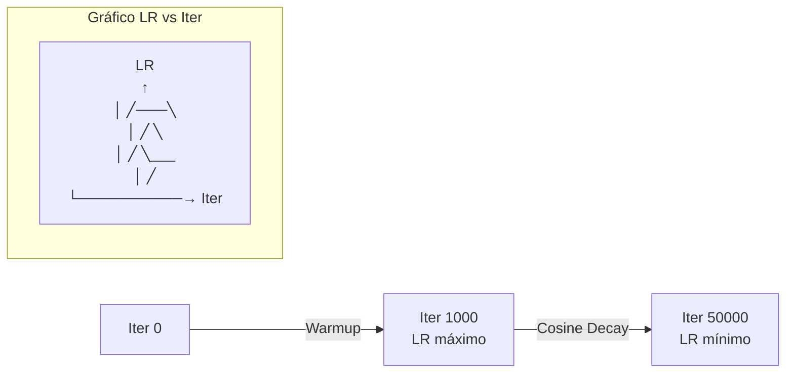
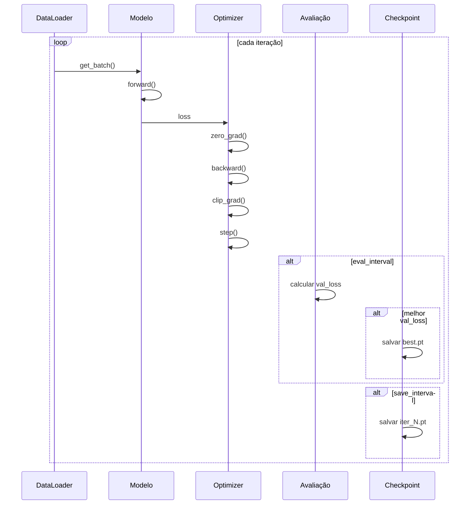
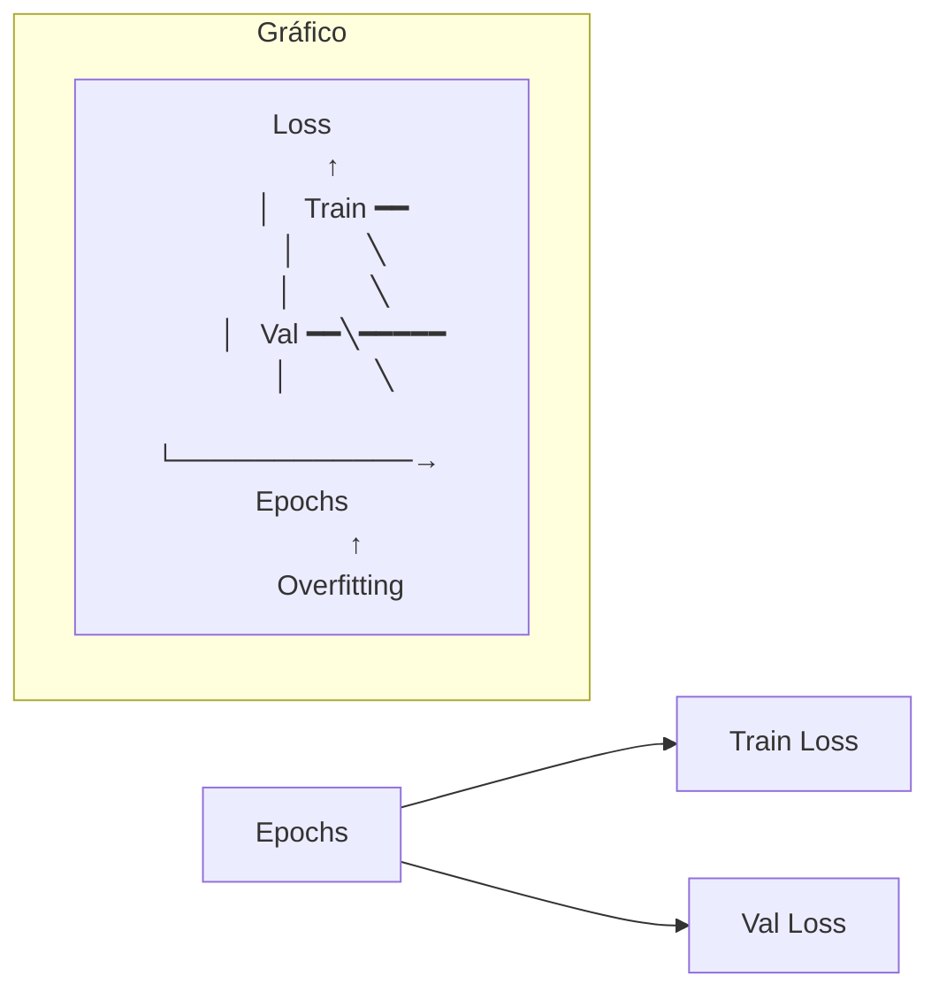
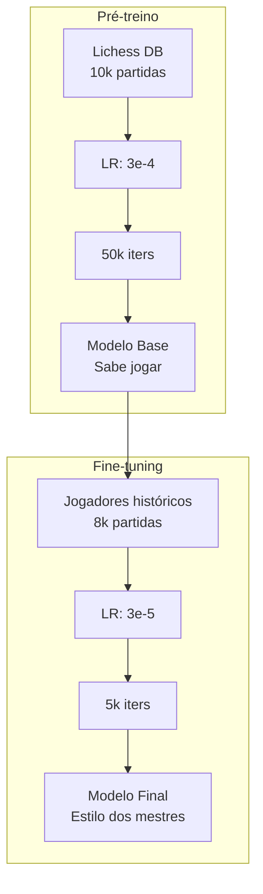

# Visão Geral - Treinamento

> O processo de ensinar o modelo a prever movimentos de xadrez.

## Objetivo

Explicar o loop de treinamento, otimização e técnicas para treinar o ChessLM de forma eficiente.

---

## Pipeline de Treinamento



---

## Componentes do Treinamento

### 1. DataLoader



```python
class DataLoader:
    def __init__(self, data, block_size, batch_size, device):
        self.data = torch.from_numpy(data.astype(np.int64))
        self.block_size = block_size
        self.batch_size = batch_size
    
    def get_batch(self):
        # Amostra posições iniciais aleatórias
        ix = torch.randint(len(self.data) - self.block_size, (self.batch_size,))
        
        # Input: tokens[i : i+block_size]
        x = torch.stack([self.data[i:i+self.block_size] for i in ix])
        
        # Target: tokens[i+1 : i+block_size+1] (deslocado 1 posição)
        y = torch.stack([self.data[i+1:i+self.block_size+1] for i in ix])
        
        return x.to(device), y.to(device)
```

### 2. Forward Pass

```python
x, y = loader.get_batch()        # Pega batch
logits, loss = model(x, y)       # Forward pass
```

### 3. Backward Pass

```python
optimizer.zero_grad()            # Zera gradientes
loss.backward()                  # Calcula gradientes
torch.nn.utils.clip_grad_norm_(model.parameters(), 1.0)  # Clip
optimizer.step()                 # Atualiza pesos
```

---

## Learning Rate Schedule



### Fórmula

```python
def get_lr(iteration: int, cfg: TrainConfig) -> float:
    # Fase 1: Warmup linear
    if iteration < cfg.warmup_iters:
        return cfg.learning_rate * iteration / cfg.warmup_iters
    
    # Fase 2: Já decaiu ao mínimo
    if iteration > cfg.lr_decay_iters:
        return cfg.min_lr
    
    # Fase 3: Cosine decay
    progress = (iteration - cfg.warmup_iters) / \
               (cfg.lr_decay_iters - cfg.warmup_iters)
    coeff = 0.5 * (1.0 + math.cos(math.pi * progress))
    
    return cfg.min_lr + coeff * (cfg.learning_rate - cfg.min_lr)
```

### Por que esse schedule?

| Fase | Objetivo |
|------|----------|
| **Warmup** | Evitar instabilidade no início |
| **Cosine Decay** | Reduzir LR suavemente para convergência |
| **Min LR** | Manter algum aprendizado no final |

---

## Mixed Precision Training

```python
# Com autocast, operações usam float16/bfloat16 quando seguro
ctx = torch.amp.autocast(device_type="cuda", dtype=torch.bfloat16)

with ctx:
    logits, loss = model(x, y)

# GradScaler para float16 (bfloat16 não precisa)
scaler = torch.cuda.GradScaler()
scaler.scale(loss).backward()
scaler.step(optimizer)
scaler.update()
```

### Benefícios

| Precisão | Memória | Velocidade | Estabilidade |
|----------|---------|------------|--------------|
| float32 | Alta | Base | Excelente |
| float16 | Baixa | Rápido | Precisa scaler |
| bfloat16 | Baixa | Rápido | Boa |

---

## Loop de Treinamento



---

## Checkpoints

### O que é salvo

```python
checkpoint = {
    "iter": iteration,
    "model": model.state_dict(),
    "optimizer": optimizer.state_dict(),
    "val_loss": val_loss,
    "cfg_model": cfg_model.__dict__,
    "cfg_train": cfg_train.__dict__,
}
torch.save(checkpoint, path)
```

### Tipos de checkpoints

| Arquivo | Quando salvar | Uso |
|---------|--------------|-----|
| `pretrain_best.pt` | Val loss recorde | Melhor modelo |
| `pretrain_iterN.pt` | A cada N iters | Retomar treino |
| `pretrain_final.pt` | Fim do treino | Modelo final |

### Carregar checkpoint

```python
ckpt = torch.load("checkpoint.pt")
model.load_state_dict(ckpt["model"])
optimizer.load_state_dict(ckpt["optimizer"])
start_iter = ckpt["iter"] + 1
```

---

## Métricas

### Loss

- **Cross-entropy negativa**
- Mede qualidade das previsões
- Menor = melhor

```python
loss = F.cross_entropy(logits.view(-1, vocab_size), targets.view(-1))
```

### Perplexity

```python
perplexity = math.exp(loss)
```

Interpretação:
- PPL = 10 → Modelo incerto entre ~10 tokens
- PPL = 2 → Modelo muito confiante (bom se correto)

### Exemplo de evolução

```
iter      0 | train 4.2000 | val 4.2100 | lr 0.00e+00 | 0.0s
iter    500 | train 2.8500 | val 2.9200 | lr 1.50e-04 | 45.2s
iter   1000 | train 2.1000 | val 2.1500 | lr 3.00e-04 | 90.1s
iter   2000 | train 1.6500 | val 1.7000 | lr 2.85e-04 | 180.4s
iter   5000 | train 1.2000 | val 1.2800 | lr 2.40e-04 | 450.2s
...
iter  50000 | train 0.8500 | val 0.9500 | lr 3.00e-05 | 4500.0s
```

---

## Overfitting e Regularização



### Sinais de overfitting

- Train loss continua diminuindo
- Val loss para de diminuir ou aumenta
- Diferença entre train/val cresce

### Técnicas de regularização

| Técnica | Como ajuda |
|---------|------------|
| **Dropout** | Desliga neurônios aleatoriamente |
| **Weight decay** | Penaliza pesos grandes |
| **Early stopping** | Para quando val loss piora |
| **Menos épocas** | Previne memorização |

---

## Pré-treino vs Fine-tuning



### Diferenças

| Aspecto | Pré-treino | Fine-tuning |
|---------|------------|-------------|
| **Dados** | Lichess (genérico) | Mestres (estilo) |
| **Quantidade** | Grande | Menor |
| **Learning rate** | Alto (3e-4) | Baixo (3e-5) |
| **Iterações** | Muitas (50k) | Poucas (5k) |
| **Objetivo** | Aprender base | Incorporar estilo |

---

## Hardware e Performance

### Consumo de Memória

| Config | VRAM Estimada |
|--------|---------------|
| n_embd=256, bs=64 | ~4 GB |
| n_embd=384, bs=32 | ~6 GB |
| n_embd=512, bs=16 | ~8 GB |

### Dicas de Otimização

- **Batch size menor**: Menos VRAM, mais lento
- **Gradient accumulation**: Batch virtual maior com menos VRAM
- **torch.compile**: 20-50% mais rápido (PyTorch 2.0+)
- **bfloat16**: Menos VRAM sem instabilidade

---

## Para Ir Mais Longe

### Logging Avançado

```python
import wandb

wandb.init(project="chesslm")
wandb.config.update(cfg.__dict__)

# Log durante treino
wandb.log({"train_loss": loss.item(), "lr": lr, "iter": iter})
```

### Gradient Accumulation

```python
accumulation_steps = 4

for i, (x, y) in enumerate(dataloader):
    with ctx:
        logits, loss = model(x, y)
        loss = loss / accumulation_steps
    
    loss.backward()
    
    if (i + 1) % accumulation_steps == 0:
        optimizer.step()
        optimizer.zero_grad()
```

### Early Stopping

```python
patience = 10
no_improve = 0

if val_loss < best_val_loss:
    best_val_loss = val_loss
    no_improve = 0
    save_best()
else:
    no_improve += 1
    if no_improve >= patience:
        print("Early stopping!")
        break
```

---

## Links Relacionados

- [[03-Treinamento/train|train.py detalhado]]
- [[03-Treinamento/finetune|finetune.py detalhado]]
- [[02-Modelo/model|Arquitetura do modelo]]
- [[exercicios/exercicio-03-training-loop|Exercício: Training Loop]]
