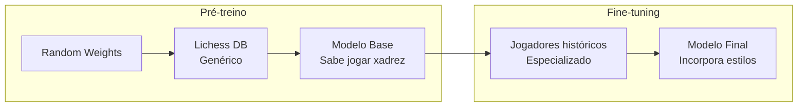
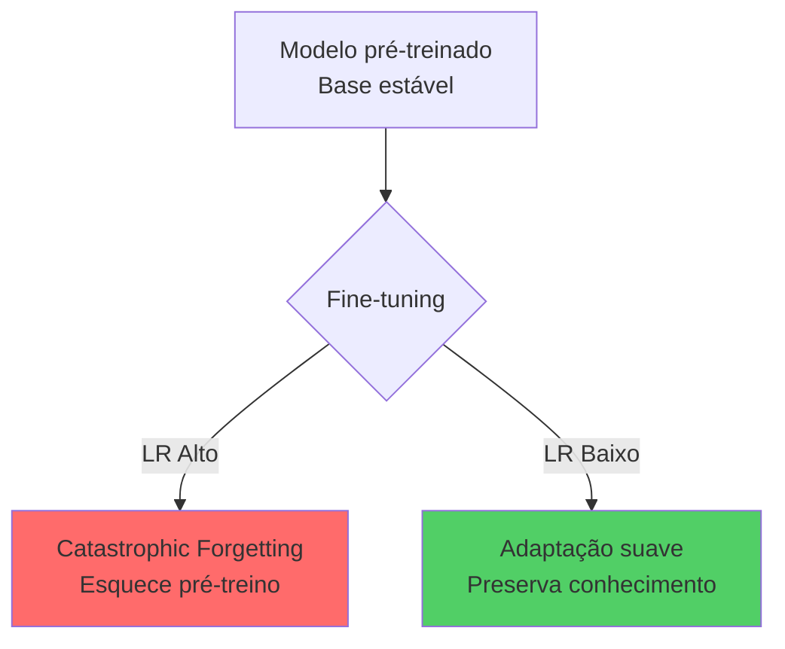
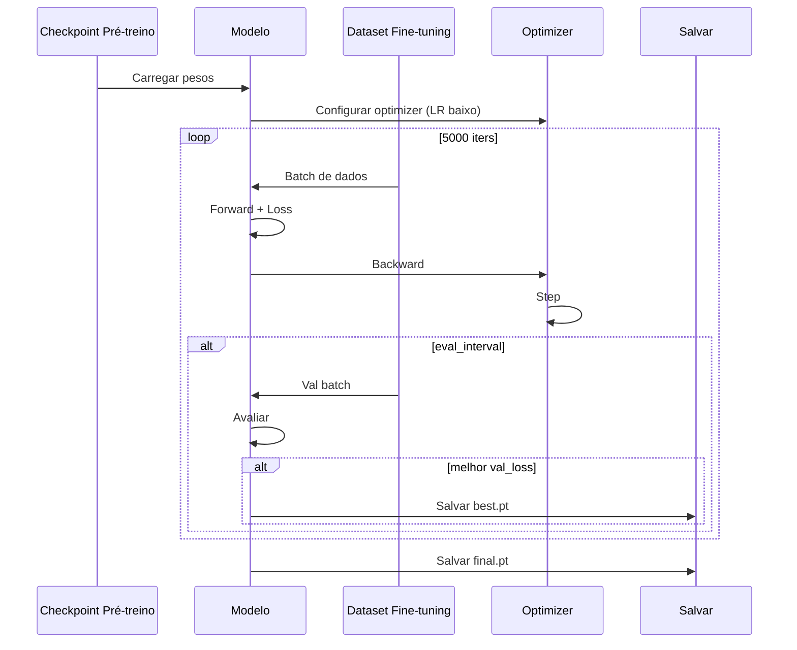
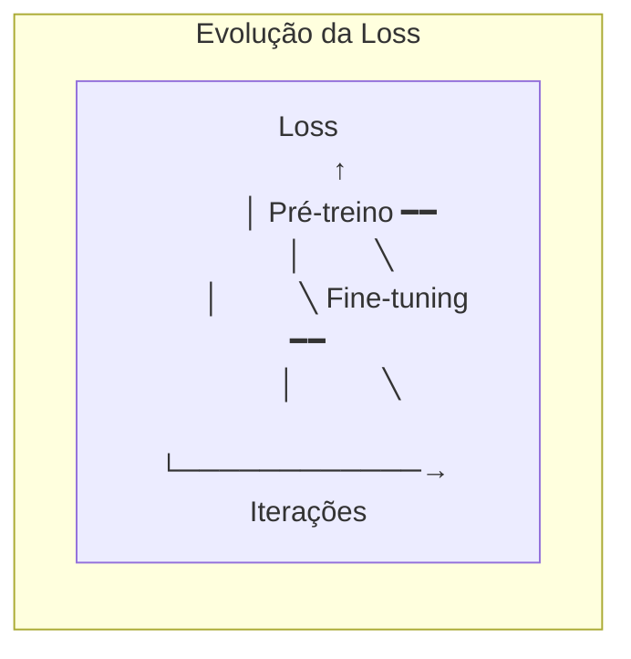

# finetune.py - Fine-tuning

> Adaptar o modelo pré-treinado para jogar no estilo dos grandes mestres.

## Objetivo

Carregar um modelo pré-treinado e continuar o treinamento com learning rate menor no dataset dos jogadores históricos.

---

## Conceitos

### Transfer Learning



### Por que LR menor?



**Learning rate 10x menor** (3e-5 vs 3e-4) para:
- Preservar conhecimento do pré-treino
- Fazer ajustes finos
- Incorporar estilo sem destruir base

---

## Diferenças vs Pré-treino

| Aspecto | Pré-treino | Fine-tuning |
|---------|------------|-------------|
| **Dados** | Lichess (genérico) | Mestres (estilo) |
| **LR inicial** | 3e-4 | 3e-5 |
| **LR mínimo** | 3e-5 | 3e-6 |
| **Warmup** | 1000 iters | 100 iters |
| **Total iters** | 50,000 | 5,000 |
| **Checkpoints** | A cada 2000 | A cada 500 |

---

## Código Explicado

### 1. Carregar Modelo Pré-treinado

```python
def load_pretrained(checkpoint_path: str, device: str) -> tuple[ChessLM, ModelConfig]:
    """Carrega modelo pré-treinado de um checkpoint."""
    print(f"Carregando checkpoint: {checkpoint_path}")
    ckpt = torch.load(checkpoint_path, map_location=device, weights_only=False)
    
    # Reconstrói config
    cfg_model = ModelConfig(**ckpt["cfg_model"])
    
    # Instancia modelo
    model = ChessLM(cfg_model).to(device)
    
    # Carrega pesos (trata torch.compile se necessário)
    state_dict = ckpt["model"]
    if any(k.startswith("_orig_mod.") for k in state_dict.keys()):
        state_dict = {k.replace("_orig_mod.", ""): v 
                      for k, v in state_dict.items()}
    model.load_state_dict(state_dict)
    
    print(f"  Checkpoint iter: {ckpt['iter']}")
    print(f"  Val loss pré-treino: {ckpt['val_loss']:.4f}")
    
    return model, cfg_model
```

### 2. Configuração de Fine-tuning

```python
@dataclass
class FinetuneConfig(TrainConfig):
    # Override do dataset
    dataset_name: str = "finetune"
    checkpoint_name: str = "finetune"
    
    # LR muito menor
    learning_rate: float = 3e-5
    min_lr: float = 3e-6
    
    # Warmup menor (dataset menor)
    warmup_iters: int = 100
    max_iters: int = 5_000
    lr_decay_iters: int = 5_000
    save_interval: int = 500
    
    # Checkpoint de pré-treino
    pretrain_checkpoint: str = "checkpoints/pretrain_final.pt"
```

### 3. Loop de Fine-tuning

```python
def finetune(checkpoint_path: str, cfg: FinetuneConfig):
    device = cfg.device
    if device == "cuda" and not torch.cuda.is_available():
        device = "cpu"
        cfg.device = "cpu"
    
    # Carrega modelo pré-treinado
    model, cfg_model = load_pretrained(checkpoint_path, device)
    
    print(f"\nIniciando fine-tuning...")
    print(f"  Dataset: {cfg.dataset_name}")
    print(f"  LR: {cfg.learning_rate} (min: {cfg.min_lr})")
    print(f"  Iters: {cfg.max_iters}")
    
    # Carrega dados de fine-tuning
    train_data = np.load(f"data/{cfg.dataset_name}_train.npy")
    val_data = np.load(f"data/{cfg.dataset_name}_val.npy")
    
    train_loader = DataLoader(train_data, cfg_model.block_size, cfg.batch_size, device)
    val_loader = DataLoader(val_data, cfg_model.block_size, cfg.batch_size, device)
    
    # Otimizador com LR menor
    optimizer = model.configure_optimizers(cfg)
    
    # Setup
    dtype_map = {"float32": torch.float32, "bfloat16": torch.bfloat16}
    dtype = dtype_map.get(cfg.dtype, torch.float32)
    ctx = torch.amp.autocast(device_type=device, dtype=dtype)
    
    best_val_loss = float("inf")
    model.train()
    t0 = time.time()
    
    # Loop
    for it in range(cfg.max_iters + 1):
        lr = get_lr(it, cfg)
        for group in optimizer.param_groups:
            group["lr"] = lr
        
        # Avaliação
        if it % cfg.eval_interval == 0:
            model.eval()
            train_losses, val_losses = [], []
            
            with torch.no_grad():
                for _ in range(cfg.eval_iters):
                    x, y = train_loader.get_batch()
                    with ctx:
                        _, loss = model(x, y)
                    train_losses.append(loss.item())
                
                for _ in range(cfg.eval_iters):
                    x, y = val_loader.get_batch()
                    with ctx:
                        _, loss = model(x, y)
                    val_losses.append(loss.item())
            
            tl = sum(train_losses) / len(train_losses)
            vl = sum(val_losses) / len(val_losses)
            
            print(f"iter {it:5d} | train {tl:.4f} | val {vl:.4f} "
                  f"| lr {lr:.2e} | {time.time()-t0:.1f}s")
            
            if vl < best_val_loss:
                best_val_loss = vl
                save_checkpoint(model, optimizer, it, vl, cfg, cfg_model, "best")
            
            model.train()
        
        if it == cfg.max_iters:
            break
        
        # Treino
        x, y = train_loader.get_batch()
        with ctx:
            _, loss = model(x, y)
        
        optimizer.zero_grad()
        loss.backward()
        torch.nn.utils.clip_grad_norm_(model.parameters(), cfg.grad_clip)
        optimizer.step()
        
        if it % cfg.log_interval == 0:
            print(f"  step {it:5d} | loss {loss.item():.4f}")
    
    # Salva final
    save_checkpoint(model, optimizer, cfg.max_iters, best_val_loss, 
                    cfg, cfg_model, "final")
    print(f"\nFine-tuning concluído.")
```

---

## Execução

### Uso Básico

```bash
python training/finetune.py
```

### Especificar Checkpoint

```bash
python training/finetune.py --checkpoint checkpoints/pretrain_final.pt
```

### Parâmetros

```bash
python training/finetune.py \
    --checkpoint checkpoints/pretrain_final.pt \  # Checkpoint de pré-treino
    --device cuda \                               # Dispositivo
    --max-iters 5000 \                            # Iterações
    --lr 3e-5                                     # Learning rate
```

---

## Saída Esperada

```
Carregando checkpoint: checkpoints/pretrain_final.pt
  Checkpoint iter: 50000
  Val loss pré-treino: 0.9234

Iniciando fine-tuning...
  Dataset: finetune
  LR: 3e-05 (min: 3e-06)
  Iters: 5000

Train: 7,354,236 tokens | Val: 387,065 tokens

iter     0 | train 0.9534 | val 0.9612 | lr 0.00e+00 | 0.0s
  ✓ Checkpoint: checkpoints/finetune_best.pt
  step     0 | loss 0.9534
...
iter  5000 | train 0.7821 | val 0.8123 | lr 3.00e-06 | 523.4s

Fine-tuning concluído. Checkpoint: checkpoints/finetune_final.pt
```

---

## Diagrama de Fluxo



---

## Comparação de Loss



Típico:
- Pré-treino final: val_loss ~0.92
- Fine-tuning final: val_loss ~0.81

---

## Verificar Melhoria

```python
# Comparar modelos
pretrain_ckpt = torch.load("checkpoints/pretrain_final.pt")
finetune_ckpt = torch.load("checkpoints/finetune_best.pt")

print(f"Pré-treino val_loss: {pretrain_ckpt['val_loss']:.4f}")
print(f"Fine-tuning val_loss: {finetune_ckpt['val_loss']:.4f}")
print(f"Melhoria: {(pretrain_ckpt['val_loss'] - finetune_ckpt['val_loss']):.4f}")
```

---

## Para Ir Mais Longe

### LoRA (Low-Rank Adaptation)

```python
# Em vez de retreinar todos os pesos
# Adiciona adaptadores de baixo rank
from peft import LoraConfig, get_peft_model

lora_config = LoraConfig(
    r=8,  # Rank
    lora_alpha=16,
    target_modules=["c_attn", "c_proj"],
    lora_dropout=0.1,
)

model = get_peft_model(model, lora_config)
# Treina apenas ~1% dos parâmetros!
```

### Múltiplos Checkpoints

```python
# Fine-tuning baseado em diferentes pontos do pré-treino
checkpoints = [
    "pretrain_iter20000.pt",
    "pretrain_iter30000.pt",
    "pretrain_final.pt",
]

for ckpt in checkpoints:
    model, cfg = load_pretrained(ckpt, device)
    finetune(model, cfg)
```

### Fine-tuning por Jogador

```python
# Criar datasets individuais por jogador
players = ["fischer", "kasparov", "tal", "magnus"]

for player in players:
    cfg.dataset_name = f"finetune_{player}"
    finetune(checkpoint_path, cfg)
    # Resultado: modelo especializado em cada jogador
```

---

## Links Relacionados

- [[03-Treinamento/train|Pré-treino]]
- [[03-Treinamento/Visao-Geral-Treinamento|Visão Geral]]
- [[04-Inferencia/generate|Inferência]]
- [[exercicios/exercicio-04-melhorias|Exercício: Melhorias]]
