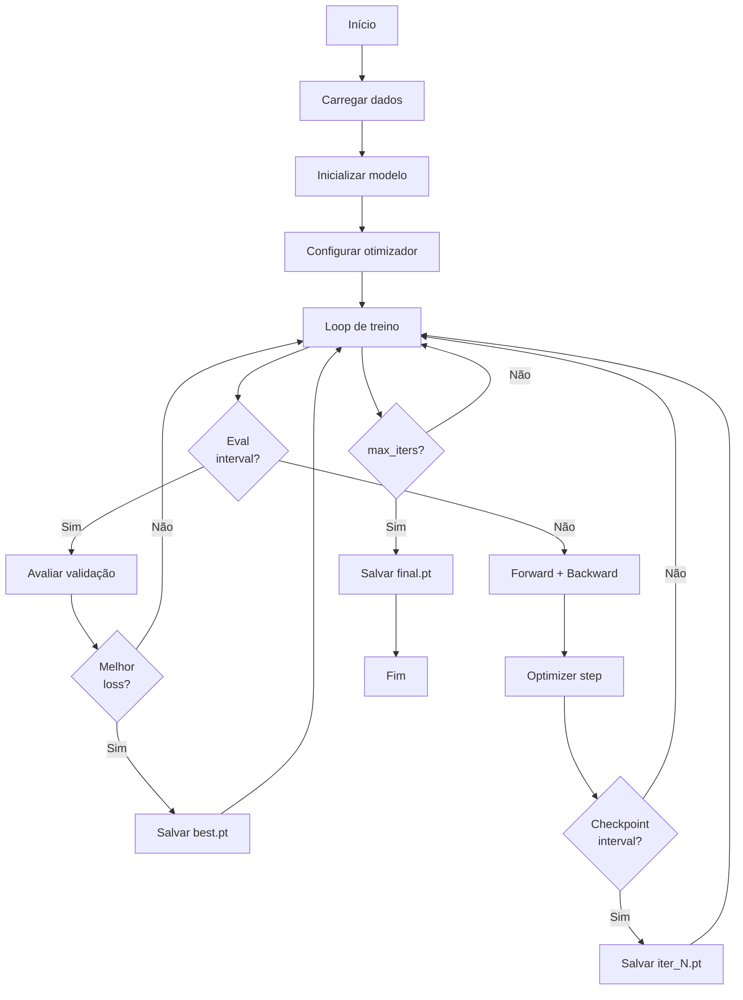
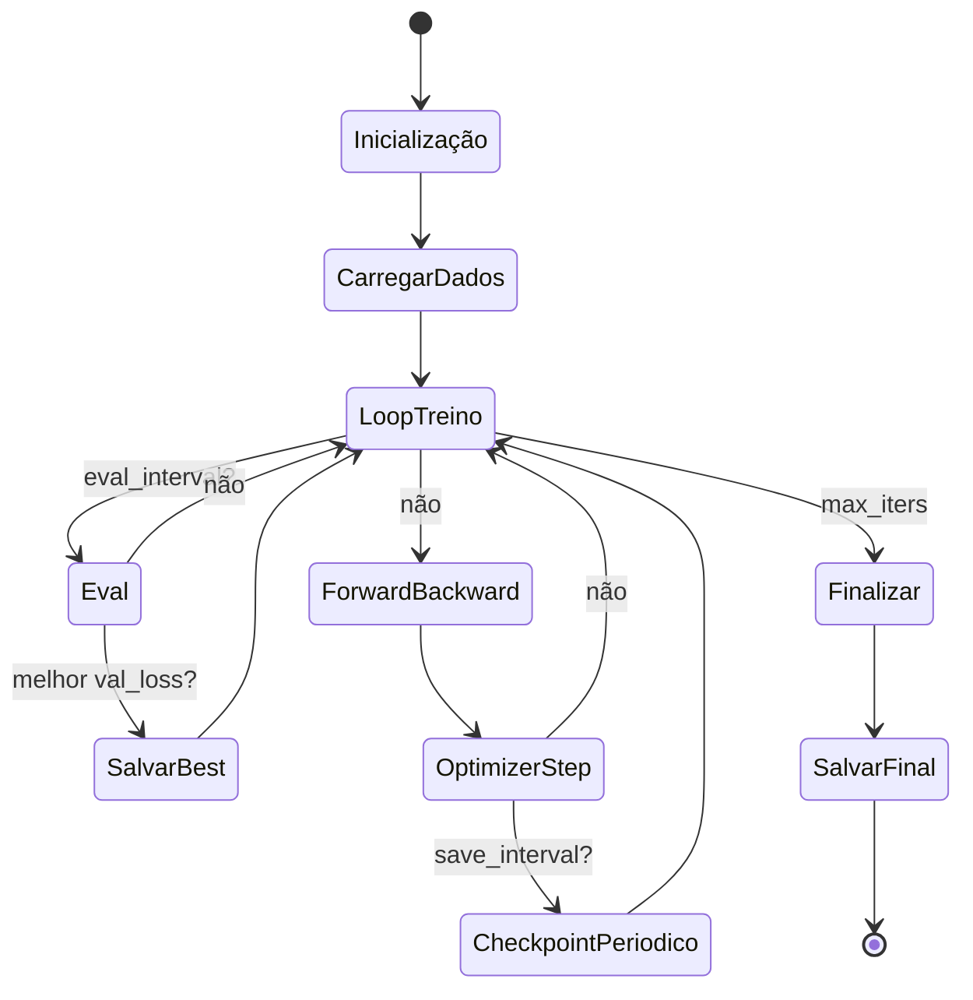

# train.py - Loop de Pré-treino

> O coração do aprendizado: treinar o modelo do zero no dataset Lichess.

## Objetivo

Implementar o loop de treinamento completo para pré-treino do ChessLM.

---

## Visão Geral



---

## Código Explicado

### 1. Setup Inicial

```python
def train(cfg_model: ModelConfig, cfg_train: TrainConfig):
    # Device
    device = cfg_train.device
    if device == "cuda" and not torch.cuda.is_available():
        print("CUDA não disponível, usando CPU")
        device = "cpu"
    
    # Seed para reprodutibilidade
    torch.manual_seed(42)
    if device == "cuda":
        torch.cuda.manual_seed(42)
```

### 2. Configuração de dtype e autocast

```python
    # Mapeia string para dtype
    dtype_map = {
        "float32": torch.float32,
        "float16": torch.float16,
        "bfloat16": torch.bfloat16
    }
    dtype = dtype_map.get(cfg_train.dtype, torch.float32)
    
    # Autocast para mixed precision
    ctx = torch.amp.autocast(device_type=device, dtype=dtype) \
          if device == "cuda" \
          else torch.amp.autocast(device_type="cpu", dtype=torch.float32)
```

### 3. Carregar Dados

```python
    data_dir = Path(cfg_train.data_dir)
    name = cfg_train.dataset_name
    
    train_path = data_dir / f"{name}_train.npy"
    val_path = data_dir / f"{name}_val.npy"
    
    if not train_path.exists() or not val_path.exists():
        print(f"\n✗ Erro: Arquivos de dataset não encontrados!")
        print(f"  Esperado: {train_path} e {val_path}")
        print(f"\n  Rode primeiro:")
        print(f"    python data/prepare_dataset.py --input data/{name}.txt --name {name}")
        sys.exit(1)
    
    train_data = np.load(train_path)
    val_data = np.load(val_path)
    
    print(f"Train: {len(train_data):,} tokens | Val: {len(val_data):,} tokens")
```

### 4. DataLoader Customizado

```python
    class DataLoader:
        def __init__(self, data, block_size, batch_size, device):
            self.data = torch.from_numpy(data.astype(np.int64))
            self.block_size = block_size
            self.batch_size = batch_size
            self.device = device
        
        def get_batch(self):
            # Amostra posições aleatórias
            ix = torch.randint(
                len(self.data) - self.block_size,
                (self.batch_size,)
            )
            
            # Cria input e target
            x = torch.stack([self.data[i:i+self.block_size] for i in ix])
            y = torch.stack([self.data[i+1:i+self.block_size+1] for i in ix])
            
            return x.to(self.device), y.to(self.device)
    
    train_loader = DataLoader(train_data, cfg_model.block_size, cfg_train.batch_size, device)
    val_loader = DataLoader(val_data, cfg_model.block_size, cfg_train.batch_size, device)
```

### 5. Carregar Tokenizador

```python
    tok_path = data_dir / "tokenizer.json"
    if not tok_path.exists():
        print(f"\n✗ Erro: Tokenizador não encontrado: {tok_path}")
        sys.exit(1)
    
    tok = ChessTokenizer.load(str(tok_path))
    cfg_model.vocab_size = tok.vocab_size
```

### 6. Inicializar Modelo

```python
    model = ChessLM(cfg_model).to(device)
    
    # torch.compile para otimização (PyTorch 2.0+)
    if cfg_train.compile and device == "cuda":
        print("Compilando modelo com torch.compile...")
        model = torch.compile(model)
    
    # Otimizador
    optimizer = model.configure_optimizers(cfg_train)
    
    # GradScaler para float16
    scaler = torch.cuda.GradScaler() \
             if device == "cuda" and dtype == torch.float16 \
             else None
```

### 7. Learning Rate Schedule

```python
def get_lr(it: int, cfg: TrainConfig) -> float:
    """Cosine decay com linear warmup."""
    if it < cfg.warmup_iters:
        return cfg.learning_rate * it / cfg.warmup_iters
    
    if it > cfg.lr_decay_iters:
        return cfg.min_lr
    
    progress = (it - cfg.warmup_iters) / (cfg.lr_decay_iters - cfg.warmup_iters)
    coeff = 0.5 * (1.0 + math.cos(math.pi * progress))
    
    return cfg.min_lr + coeff * (cfg.learning_rate - cfg.min_lr)
```

### 8. Diretório de Checkpoints

```python
    ckpt_dir = Path(cfg_train.checkpoint_dir)
    ckpt_dir.mkdir(parents=True, exist_ok=True)
```

### 9. Loop Principal

```python
    best_val_loss = float("inf")
    t0 = time.time()
    
    for it in range(cfg_train.max_iters + 1):
        # Atualiza learning rate
        lr = get_lr(it, cfg_train)
        for group in optimizer.param_groups:
            group["lr"] = lr
        
        # ── Avaliação ──
        if it % cfg_train.eval_interval == 0:
            model.eval()
            losses = {"train": [], "val": []}
            
            with torch.no_grad():
                for split, loader in [("train", train_loader), ("val", val_loader)]:
                    for _ in range(cfg_train.eval_iters):
                        x, y = loader.get_batch()
                        with ctx:
                            _, loss = model(x, y)
                        losses[split].append(loss.item())
            
            train_loss = sum(losses["train"]) / len(losses["train"])
            val_loss = sum(losses["val"]) / len(losses["val"])
            elapsed = time.time() - t0
            
            print(f"iter {it:6d} | train {train_loss:.4f} | val {val_loss:.4f} "
                  f"| lr {lr:.2e} | {elapsed:.1f}s")
            
            # Salva melhor modelo
            if val_loss < best_val_loss:
                best_val_loss = val_loss
                ckpt = {
                    "iter": it,
                    "model": model.state_dict(),
                    "optimizer": optimizer.state_dict(),
                    "val_loss": val_loss,
                    "cfg_model": cfg_model.__dict__,
                    "cfg_train": cfg_train.__dict__,
                }
                path = ckpt_dir / f"{cfg_train.checkpoint_name}_best.pt"
                torch.save(ckpt, path)
                print(f"  ✓ Checkpoint salvo: {path}")
            
            model.train()
        
        if it == cfg_train.max_iters:
            break
        
        # ── Passo de treino ──
        x, y = train_loader.get_batch()
        
        with ctx:
            _, loss = model(x, y)
        
        optimizer.zero_grad(set_to_none=True)
        
        if scaler:
            # Com mixed precision scaler
            scaler.scale(loss).backward()
            scaler.unscale_(optimizer)
            torch.nn.utils.clip_grad_norm_(model.parameters(), cfg_train.grad_clip)
            scaler.step(optimizer)
            scaler.update()
        else:
            # Sem scaler (bfloat16 ou float32)
            loss.backward()
            torch.nn.utils.clip_grad_norm_(model.parameters(), cfg_train.grad_clip)
            optimizer.step()
        
        # Log periódico
        if it % cfg_train.log_interval == 0:
            print(f"  step {it:6d} | loss {loss.item():.4f} | lr {lr:.2e}")
        
        # Checkpoint periódico
        if it > 0 and it % cfg_train.save_interval == 0:
            ckpt = {
                "iter": it,
                "model": model.state_dict(),
                "optimizer": optimizer.state_dict(),
                "val_loss": None,
                "cfg_model": cfg_model.__dict__,
                "cfg_train": cfg_train.__dict__,
            }
            path = ckpt_dir / f"{cfg_train.checkpoint_name}_iter{it}.pt"
            torch.save(ckpt, path)
```

### 10. Salvar Checkpoint Final

```python
    ckpt = {
        "iter": cfg_train.max_iters,
        "model": model.state_dict(),
        "optimizer": optimizer.state_dict(),
        "val_loss": best_val_loss,
        "cfg_model": cfg_model.__dict__,
        "cfg_train": cfg_train.__dict__,
    }
    path = ckpt_dir / f"{cfg_train.checkpoint_name}_final.pt"
    torch.save(ckpt, path)
    print(f"\nTreino concluído. Checkpoint final: {path}")
```

---

## Execução

### Uso Básico

```bash
python training/train.py
```

### Parâmetros de Linha de Comando

```bash
python training/train.py \
    --device cuda \        # "cuda" ou "cpu"
    --batch-size 64 \      # Tamanho do batch
    --max-iters 50000 \    # Iterações totais
    --no-compile           # Desativar torch.compile
```

---

## Saída Esperada

```
Train: 4,359,865 tokens | Val: 229,467 tokens
ChessLM inicializado — 5.2M parâmetros

iter      0 | train 4.1598 | val 4.1602 | lr 0.00e+00 | 0.0s
  ✓ Checkpoint salvo: checkpoints/pretrain_best.pt
  step      0 | loss 4.1598 | lr 0.00e+00
  step    100 | loss 3.8234 | lr 3.00e-04
  step    200 | loss 3.4521 | lr 3.00e-04
...
iter    500 | train 2.8934 | val 2.9456 | lr 1.50e-04 | 45.2s
  ✓ Checkpoint salvo: checkpoints/pretrain_best.pt
...
iter  50000 | train 0.8534 | val 0.9234 | lr 3.00e-05 | 4521.3s

Treino concluído. Checkpoint final: checkpoints/pretrain_final.pt
```

---

## Diagrama de Estados



---

## Retomar Treinamento

```python
# Carregar checkpoint e continuar
ckpt = torch.load("checkpoints/pretrain_iter10000.pt")
model.load_state_dict(ckpt["model"])
optimizer.load_state_dict(ckpt["optimizer"])
start_iter = ckpt["iter"] + 1

# Continuar loop
for it in range(start_iter, max_iters):
    ...
```

---

## Monitoramento

### Progresso Rápido

```python
# Loss decrescendo bem
train: 4.1 → 2.8 → 1.5 → 0.8
val:   4.2 → 2.9 → 1.6 → 0.9
```

### Problemas Comuns

```python
# Loss não diminui
→ Learning rate muito alto ou muito baixo
→ Verificar dados e tokenização

# Val loss aumenta
→ Overfitting
→ Aumentar dropout ou weight decay
→ Usar early stopping

# NaN loss
→ Learning rate muito alto
→ Usar gradient clipping (já implementado)
```

---

## Para Ir Mais Longe

### WandB Logging

```python
import wandb

wandb.init(project="chesslm", name="pretrain")
wandb.config.update(cfg_train.__dict__)

# No loop
wandb.log({
    "train_loss": train_loss,
    "val_loss": val_loss,
    "lr": lr,
    "iter": it,
})
```

### Gradient Accumulation

```python
accumulation_steps = 4
effective_batch_size = batch_size * accumulation_steps

for i in range(accumulation_steps):
    x, y = loader.get_batch()
    with ctx:
        _, loss = model(x, y)
        loss = loss / accumulation_steps
    scaler.scale(loss).backward()

scaler.step(optimizer)
scaler.update()
optimizer.zero_grad()
```

### Distributed Training (DDP)

```python
import torch.distributed as dist
from torch.nn.parallel import DistributedDataParallel as DDP

dist.init_process_group("nccl")
model = DDP(model, device_ids=[local_rank])
```

---

## Links Relacionados

- [[03-Treinamento/Visao-Geral-Treinamento|Visão Geral]]
- [[03-Treinamento/finetune|Fine-tuning]]
- [[02-Modelo/model|Arquitetura]]
- [[02-Modelo/config|Configurações]]
