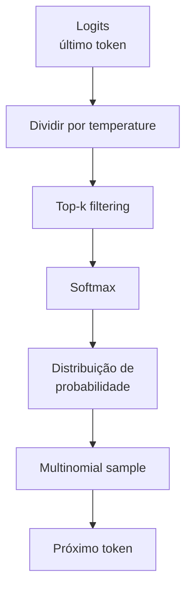
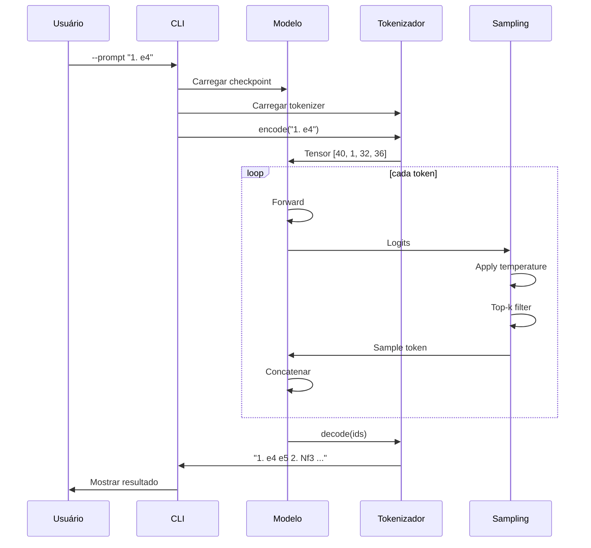

# generate.py - Geração de Movimentos

> A recompensa: usar o modelo treinado para gerar movimentos de xadrez.

## Objetivo

Carregar um modelo treinado e gerar movimentos de xadrez a partir de uma posição inicial (prompt PGN).

---

## Conceitos

### Geração Autoregressiva

```mermaid
graph LR
    A[Contexto:<br/>"1. e4"] --> B[Modelo]
    B --> C[Logits]
    C --> D[Sample]
    D --> E["e5"]
    E --> F["Contexto:<br/>1. e4 e5"]
    F --> B
```

O modelo gera **um token por vez**, usando a saída como parte do contexto para o próximo token.

### Sampling



---

## Parâmetros de Geração

### Temperature

Controla a "criatividade" do modelo:

| Valor | Efeito | Uso |
|-------|--------|-----|
| 0.3 | Determinístico, repete padrões | Partidas conservadoras |
| 0.8 | Balanceado | Padrão |
| 1.2 | Criativo, imprevisível | Exploração |
| 2.0 | Caótico | Debug/teste |

```python
logits = logits / temperature  # >1 = mais uniforme, <1 = mais picos
```

### Top-k

Limita aos K tokens mais prováveis:

```python
if top_k is not None:
    v, _ = torch.topk(logits, top_k)
    logits[logits < v[:, [-1]]] = float("-inf")
```

| Valor | Efeito |
|-------|--------|
| 1 | Greedy (sempre o mais provável) |
| 5-10 | Conservador |
| 50 | Amplo |
| None | Sem filtro |

---

## Código Explicado

### 1. Carregar Modelo

```python
def load_model(checkpoint_path: str, device: str) -> tuple[ChessLM, ChessTokenizer]:
    """Carrega modelo e tokenizador de um checkpoint."""
    ckpt = torch.load(checkpoint_path, map_location=device, weights_only=False)
    
    # Reconstrói modelo
    cfg = ModelConfig(**ckpt["cfg_model"])
    model = ChessLM(cfg).to(device)
    model.load_state_dict(ckpt["model"])
    model.eval()
    
    # Carrega tokenizador
    ckpt_dir = Path(checkpoint_path).parent
    tok_path = ckpt_dir.parent / "data" / "tokenizer.json"
    
    if tok_path.exists():
        tok = ChessTokenizer.load(str(tok_path))
    else:
        tok = ChessTokenizer()
        print("Aviso: tokenizer.json não encontrado, usando padrão")
    
    return model, tok
```

### 2. Gerar Movimentos

```python
def generate_moves(
    model: ChessLM,
    tok: ChessTokenizer,
    prompt: str,
    num_moves: int = 5,
    temperature: float = 1.0,
    top_k: int = 10,
    device: str = "cpu",
) -> str:
    """
    Gera `num_moves` movimentos a partir do prompt.
    
    Estratégia: gera caractere por caractere até detectar
    num_moves movimentos completos (separados por espaço
    após os números de movimento).
    """
    import re
    
    # Conta quantos movimentos já existem no prompt
    existing = len(re.findall(r'\d+\.', prompt))
    target = existing + num_moves
    
    # Tokeniza prompt
    ids = tok.encode(prompt)
    idx = torch.tensor([ids], dtype=torch.long, device=device)
    
    generated = prompt
    max_chars = num_moves * 15  # Estimativa conservadora
    
    with torch.no_grad():
        for _ in range(max_chars):
            # Gera um token
            idx_gen = model.generate(
                idx,
                max_new_tokens=1,
                temperature=temperature,
                top_k=top_k
            )
            
            # Extrai novo caractere
            new_id = idx_gen[0, -1].item()
            char = tok.decode([new_id])
            generated += char
            idx = idx_gen
            
            # Verifica se atingiu número de movimentos alvo
            current = len(re.findall(r'\d+\.', generated))
            if current > target:
                # Remove último número de movimento incompleto
                generated = generated[:generated.rfind(str(current) + ".")].rstrip()
                break
    
    return generated
```

### 3. Modo Interativo

```python
def interactive_mode(model: ChessLM, tok: ChessTokenizer, device: str):
    """Modo interativo: usuário digita a partida, modelo responde."""
    print("\n" + "═" * 60)
    print("  ChessLM — Modo Interativo")
    print("  Digite a partida em PGN ou 'sair' para encerrar")
    print("═" * 60)
    
    while True:
        try:
            prompt = input("\nPartida > ").strip()
        except (KeyboardInterrupt, EOFError):
            break
        
        if prompt.lower() in ("sair", "exit", "quit", "q"):
            break
        
        if not prompt:
            prompt = "1."
        
        print("Gerando...", end=" ", flush=True)
        result = generate_moves(model, tok, prompt, num_moves=3, device=device)
        print("\n" + result)
```

---

## Execução

### Uso Básico

```bash
python inference/generate.py --prompt "1. e4"
```

Saída:
```
Carregando checkpoints/finetune_best.pt...
Modelo carregado — 5.2M params

Prompt:    1. e4
Gerando 5 movimentos (temp=0.8, top_k=10)...

Resultado:
1. e4 e5 2. Nf3 Nc6 3. Bb5 a6 4. Ba4 Nf6 5. O-O Be7
```

### Especificar Checkpoint

```bash
python inference/generate.py \
    --checkpoint checkpoints/pretrain_final.pt \
    --prompt "1. d4 d5 2. c4"
```

### Parâmetros de Geração

```bash
python inference/generate.py \
    --prompt "1. e4 e5 2. Nf3" \
    --moves 10 \           # Número de movimentos
    --temperature 0.7 \    # Menos aleatório
    --top-k 5              # Mais conservador
```

### Modo Interativo

```bash
python inference/generate.py --interactive
```

```
════════════════════════════════════════════════════════════
  ChessLM — Modo Interativo
  Digite a partida em PGN ou 'sair' para encerrar
════════════════════════════════════════════════════════════

Partida > 1. e4
Gerando... 
1. e4 c5 2. Nf3 d6 3. d4 cxd4

Partida > 1. d4
Gerando... 
1. d4 Nf6 2. c4 e6 3. Nc3 d5

Partida > sair
```

---

## Diagrama de Fluxo



---

## Exemplos de Geração

### Abertura Ruy Lopez

```
Prompt: 1. e4 e5 2. Nf3 Nc6 3. Bb5
Output: 1. e4 e5 2. Nf3 Nc6 3. Bb5 a6 4. Ba4 Nf6 5. O-O Be7 6. Re1 b5 7. Bb3 d6 8. c3 O-O
```

### Defesa Siciliana

```
Prompt: 1. e4 c5
Output: 1. e4 c5 2. Nf3 d6 3. d4 cxd4 4. Nxd4 Nf6 5. Nc3 a6 6. Be2 e5 7. Nb3 Be7 8. O-O O-O
```

### Abertura do Peão Dama

```
Prompt: 1. d4 d5 2. c4
Output: 1. d4 d5 2. c4 e6 3. Nc3 Nf6 4. Bg5 Be7 5. e3 O-O 6. Nf3 h6 7. Bh4 b6 8. cxd5 Nxd5
```

---

## Diferenças por Modelo

### Modelo Pré-treinado

```
Prompt: 1. e4
Output: 1. e4 e5 2. Nf3 Nc6 3. Bc4 Bc5 4. c3 Nf6 5. d4 exd4
```

Características:
- Movimentos legais
- Aberturas padrão
- Menos "estilo" definido

### Modelo Fine-tuned

```
Prompt: 1. e4
Output: 1. e4 c5 2. Nf3 d6 3. d4 cxd4 4. Nxd4 Nf6 5. Nc3 a6 6. Be2 e5 7. Nb3 Be7
```

Características:
- Preferências específicas (Siciliana)
- Estilos dos mestres
- Mais refinado

---

## Validação de Movimentos

```python
import chess

def validate_move_sequence(pgn: str) -> tuple[bool, str]:
    """Verifica se todos os movimentos são legais."""
    board = chess.Board()
    
    # Parse PGN simples
    tokens = pgn.replace(".", " ").split()
    
    for token in tokens:
        if token[0].isdigit():  # Número de movimento
            continue
        
        try:
            move = board.parse_san(token)
            if move not in board.legal_moves:
                return False, f"Movimento ilegal: {token}"
            board.push(move)
        except Exception as e:
            return False, f"Erro: {e}"
    
    return True, "OK"
```

---

## Para Ir Mais Longe

### Beam Search

```python
def beam_search(model, tok, prompt, beam_width=5, max_tokens=50):
    """Gera com beam search ao invés de sampling."""
    # Implementação mais determinística
    # Mantém beam_width melhores sequências
    pass
```

### Validar com Stockfish

```python
import chess.engine

engine = chess.engine.SimpleEngine.popen_uci("stockfish")

def evaluate_position(fen: str) -> float:
    """Avalia posição com Stockfish."""
    board = chess.Board(fen)
    info = engine.analyse(board, chess.engine.Limit(depth=15))
    return info["score"].relative.score()
```

### Interface Gráfica

```python
import pygame

# Criar tabuleiro visual
# Mostrar peças
# Highlight movimentos gerados
```

### API REST

```python
from fastapi import FastAPI

app = FastAPI()

@app.post("/generate")
def generate(prompt: str, moves: int = 5):
    result = generate_moves(model, tok, prompt, moves)
    return {"pgn": result}
```

---

## Links Relacionados

- [[03-Treinamento/finetune|Fine-tuning]]
- [[02-Modelo/model|Arquitetura]]
- [[02-Modelo/tokenizer|Tokenizador]]
