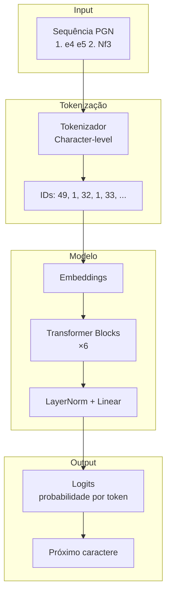
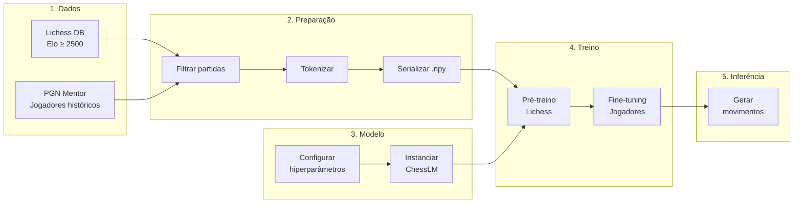
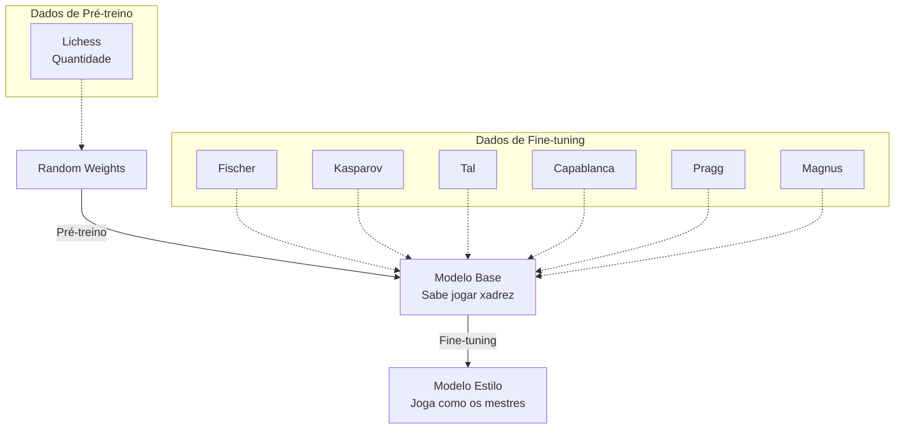

# ChessLM - Language Model para Xadrez

> Um projeto educacional para construir um Tiny Language Model do zero, usando xadrez como domínio de aplicação.

## Visão Geral

**ChessLM** é um Language Model (modelo de linguagem) treinado para jogar xadrez no estilo dos grandes mestres da história. Através deste projeto, você vai aprender todos os passos para construir um modelo de linguagem do zero.

### Por que Xadrez?

O xadrez é um domínio excelente para aprender sobre Language Models porque:

- **Domínio restrito**: Vocabulário pequeno e bem definido (~50 caracteres)
- **Avaliação objetiva**: Movimentos podem ser validados por engines
- **Estilos distintos**: Cada jogador tem um "sotaque" reconhecível
- **Dados abundantes**: Milhões de partidas disponíveis publicamente

### O que o Modelo Faz

Dado o início de uma partida em notação PGN:

```
1. e4 e5 2. Nf3 Nc6 3. Bb5
```

O modelo prevê os próximos caracteres (movimentos) de forma autoregressiva, aprendendo padrões de jogo dos grandes mestres.

---

## Arquitetura

O ChessLM é um **Transformer Decoder-Only**, mesma arquitetura do GPT.



### Especificações

| Componente | Valor |
|------------|-------|
| **Arquitetura** | Decoder-only Transformer |
| **Parâmetros** | ~5 milhões |
| **Tokenização** | Character-level (~50 tokens) |
| **Contexto máximo** | 512 tokens |
| **Camadas** | 6 blocos transformer |
| **Dimensão** | 256 (embeddings) |
| **Atenção** | 8 cabeças |

---

## Pipeline Completo



---

## Estratégia de Treino

O treino acontece em duas fases:

### 1. Pré-treino (Pretraining)
- **Dados**: ~10.000 partidas do Lichess (Elo ≥ 2500, apenas vitórias)
- **Objetivo**: Aprender as regras implícitas do xadrez
- **Learning rate**: 3e-4

### 2. Fine-tuning
- **Dados**: Partidas de Fischer, Kasparov, Tal, Capablanca, Pragg e Magnus
- **Objetivo**: Incorporar estilos dos grandes mestres
- **Learning rate**: 3e-5 (menor para não destruir o pré-treino)



---

## Estrutura do Código

```
chesslm/
├── data/                      # Pipeline de dados
│   ├── download_lichess.py   # Download do Lichess DB
│   ├── download_players.py   # Download dos mestres
│   ├── prepare_dataset.py    # Tokenização e serialização
│   └── tokenizer.json        # Vocabulário salvo
│
├── model/                     # Arquitetura do modelo
│   ├── config.py             # Hiperparâmetros
│   ├── tokenizer.py          # Tokenizador character-level
│   └── model.py              # Transformer decoder-only
│
├── training/                  # Treinamento
│   ├── train.py              # Loop de pré-treino
│   └── finetune.py           # Fine-tuning
│
├── inference/                 # Inferência
│   └── generate.py           # Geração de movimentos
│
└── utils/                     # Utilitários
    └── pgn_utils.py          # Parsing de PGN
```

---

## Como Navegar Este Vault

### Para Iniciantes

Comece pelos conceitos fundamentais:

1. [[00-Conceitos-Fundamentais/O-que-e-um-Language-Model|O que é um Language Model?]]
2. [[00-Conceitos-Fundamentais/Arquitetura-Transformer|Como funciona um Transformer?]]
3. [[00-Conceitos-Fundamentais/Tokenizacao|Por que tokenizar?]]

### Para Quem Quer Ver Código

Vá direto ao ponto:

- [[01-Data-Pipeline/download_lichess|Download de dados]] → [[01-Data-Pipeline/prepare_dataset|Preparação]]
- [[02-Modelo/model|Arquitetura]] → [[03-Treinamento/train|Treino]] → [[04-Inferencia/generate|Inferência]]

### Para Praticar

Faça os exercícios:

1. [[exercicios/exercicio-01-tokenizador|Exercício 1: Tokenizador]]
2. [[exercicios/exercicio-02-atencao|Exercício 2: Atenção]]
3. [[exercicios/exercicio-03-training-loop|Exercício 3: Training Loop]]
4. [[exercicios/exercicio-04-melhorias|Exercício 4: Melhorias]]

---

## Links Principais

### Conceitos
- [[00-Conceitos-Fundamentais/O-que-e-um-Language-Model]]
- [[00-Conceitos-Fundamentais/Arquitetura-Transformer]]
- [[00-Conceitos-Fundamentais/Tokenizacao]]

### Implementação
- [[01-Data-Pipeline/Visao-Geral-Dados|Data Pipeline]]
- [[02-Modelo/Visao-Geral-Modelo|Modelo]]
- [[03-Treinamento/Visao-Geral-Treinamento|Treinamento]]

### Prática
- [[exercicios/exercicio-01-tokenizador|Exercícios]]

---

## Resultados

Após o treinamento completo, o modelo é capaz de:

- Gerar movimentos legais de xadrez
- Seguir padrões de abertura reconhecíveis
- Demonstrar preferências posicionais similares aos mestres

### Exemplo de Geração

```
Prompt: 1. e4
Output: 1. e4 e5 2. Nf3 Nc6 3. Bb5 a6 4. Ba4 Nf6 5. O-O Be7 6. Re1 b5 7. Bb3 d6 8. c3 O-O
```

---

## Para Ir Mais Longe

Este projeto é um ponto de partida. Algumas direções para explorar:

- [ ] Aumentar o tamanho do modelo (10M, 50M, 100M parâmetros)
- [ ] Experimentar tokenização BPE ao invés de character-level
- [ ] Treinar em mais dados (outros meses do Lichess, mais jogadores)
- [ ] Implementar técnicas modernas (RoPE, Flash Attention)
- [ ] Avaliar qualidade dos movimentos com engine (Stockfish)
- [ ] Criar interface gráfica para jogar contra o modelo
- [ ] Fine-tuning personalizado por jogador (modelo "estilo Fischer")
- [ ] Publicar modelo no Hugging Face Hub

---

## Referências e Inspiração

- [nanoGPT](https://github.com/karpathy/nanogpt) - Andrej Karpathy
- [Attention is All You Need](https://arxiv.org/abs/1706.03762) - Paper original do Transformer
- [Lichess Database](https://database.lichess.org/) - Fonte de dados
- [PGN Mentor](https://www.pgnmentor.com/) - Partidas de jogadores históricos
